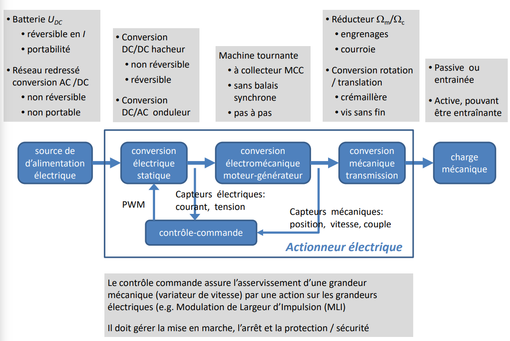
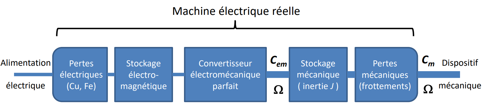

## Régime des grandeurs électriques rencontrées

Régime continu ou quasi-continu avec ondulation périodique valeur moyenne $< x > = \dfrac{1}{T} \int \limits_0^{\infty} x(t) dt$

Régime sinusoïdal, valeur efficace $X = (\dfrac{1}{T}\int \limits_0^\infty x^2(t)dt)^{\frac{1}{2}}$

Régime quelconque périodique, décomposition en série de Fourier d'un signal $x(t)$, $T$ périodique. $x(t) = X_0 + \sum \limits_{k=1}^\infty (A_k \cos{k\omega t}+B_k \sin{k \omega t})$ où $\omega = 2 \pi f$ la pulsation du fondamental, $k$ le rang de l'harmonique, $X_k$ la valeur efficace, $\phi_k$ déphasage.

## Régime sinusoïdal (monophasé)

Soit les caractéristiques de la grandeur sinusoïdale $x$ : amplitude $X_m$ (ou $\hat{x}, X_p$), phase $\omega t + \phi_x$, phase à l'origine $\phi_x$, sa valeur efficace est $$X = \dfrac{X_m}{\sqrt{2}}$$

### Principe de la correspondance expression temporelle / amplitude complexe

$$
\text{Grandeur instantanée} \Leftrightarrow \text{Grandeur complexe} \Leftrightarrow \text{Phaseur}
x(t) = X_m \cos(\omega t + \phi_x) \Leftrightarrow \underline{x} = X_m e^{j(\omega t + \phi_x) = X \sqrt{2} e^{j \omega t} e^{j \phi x}} \Leftrightarrow \underline{X} = X e^{j \phi x}

$$

## Définition et utilisation des puissances

+ Puissance instantanée $p(t) = u(t) i(t) [W]$
+ Puissance active $P = <p(t)> = \dfrac{1}{T} \int \limits_0^T p(t) dt [W]$. En régime sinusoïdal $P = UI \cos \phi$
+ Puissance apparente $S = UI$ [VA]
+ Facteur de puissance $F_P = \dfrac{P}{S}$. En régime sinusoïdal $F_P = \cos \phi$
+ Puissance réactive $Q = UI \sin \phi [VAR]$. En régime sinusoïdal $S = \sqrt{P^2 + Q^2}$, $\tan \phi = \dfrac{Q}{P}$, $\cos \phi = \dfrac{P}{S}$, $\sin \phi = \dfrac{Q}{S}$
+ Puissance apparente complexe $\underline{S} = \underline{U} \underline{I}^\ast = P + jQ$ soit $P=Re(\underline{S})$, $Q = Im(\underline{S})$ et $S = \| \underline{S} \|$.

## Actionneur électrique

### Focus sur la conversion électromécanique

### Équations mécaniques

Principe fondamental de la dynamique en translation $\sum \vec{F} = M.\vec{\gamma}$ avec $\gamma = \dot{v} = \ddot{x}$ expression de la puissance $P = F.v$. Dans le cas d'un actionneur électrique, même pour un besoin en translation, on utilisera très majoritairement une machine tournante. Le principe fondamental de la dynamique en rotation devient alors $\Sigma \vec{C} = J . \dfrac{d\Omega}{dt} = C_m - C_r$ avec $\gamma = \dot{\Omega} - \ddot{theta}$ expression de la puissance est $P = C . \Omega$. Le besoin en entrainement se définira donc dans le plan mécanique couple - vitesse où on représentera le couple moteur $C_m$ et le couple résistant $C_r$.
