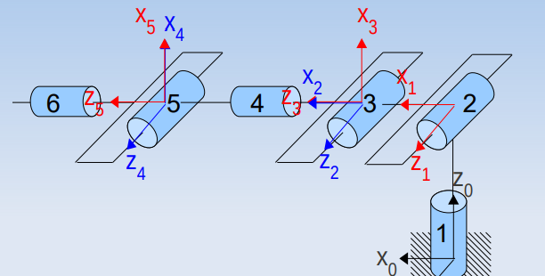

## Modèle géométrique direct

Connaître le modèle géométrique direct (MGD) d'un robot correspond à pouvoir exprimer :

- à partir des coordonnées d'un point vecteur **exprimées dans le repère effecteur** du robot
- les coordonnées du même point / vecteur **exprimées dans le repère de travail** du robot
- en fonction des coordonnées articulaires

La MGD se ramène donc à la matrice de transformation homogène ${}^0T_f$, lors du calcul du MGD sur un robot nous pouvons faire face à des calculs de grande complexité oou très redondants. Il est donc nécessaire de choisir un langage commun pour la faire transparaître. Ce langage est la normalisation de **Denavit-Hartenberg**. :

- Règles imposées de choix des axes et origines
- Unicité des transformations homogènes
- Un et un seul repère lié à chaque articulation

Sur l'exemple du robot ABB ci dessous la formalisme de Denavit-Hartenberg est utilisé pour exprimer les transformations homogènes : ${}^iT_{i+1} = Rot_{z, \theta_{i+1}} . Trans_{a_i + 1, 0, d_{i+1}} . Rot_{X, \alpha_{i+1}}$

Ce formalisme se résume par le tableau de Denavit-Hartenberg

| $i,i+1$ | $rot_{z_i}$ | $trans_{x_{i+1}}$ | $trans_{z_i}$ | $rot_{x_{i+1}}$   |
|:--------|:------------|:------------------|:--------------|:------------------|
| 0,1     | $\theta_1$  |                   | $d_1$         | $\alpha_1 = -90°$ |
| 1,2     | $\theta_2$  | $a_2$             |               |                   |
| 2,3     | $\theta_3$  |                   |               | $\alpha_3 = -90°$ |
| 3,4     | $\theta_4$  |                   | $d_4$         | $\alpha_4 = 90°$  |
| 4,5     | $\theta_5$  |                   |               | $\alpha_5 = -90°$ |
| 5,6     | $\theta_6$  |                   | $d_6$         |                   |

### Modèle géométrique inverse

Le MGD permet de déterminer l'orientation et la position de l'effecteur du robot, en fonction des variables articulaires $\theta_i, d_i$. Le MGI permet de déterminer les variables articulaires $\theta_i, d_i$ en fonction de l'orientation et la position de l'effecteur du robot. Le MGI n'est pas l'inversion de la matrice ${}^0T_f$ !

Le calcul direct est trop complexe, en effet pour obtenir la posture désirée du robot, il suffit d'écrire l'égalité entre :
- ${}^0T_f(q_i)$ exprimée en fonction des coordonnées articulaire ($q_i = \theta_i, d_i$)
- La posture désirée $U_0 = [{}^0T_f]_{\text{désirée}}$

#### Méthode de PAUL

Nous faisons le constat que l'équation $U_0 = {}^0T_f(q_1,q_f)$ est composé d'une expression souvent simple à gauche et souvent très complexe à droite. Le but de la méthode de Paul est de simplifier cette expression à droite. Plus particulièrement, il s'agit de les exprimer dans un autre repère que 0 pour permettre aux $q_i$ de n'appaître qu'une seule fois dans l'équation. Certaines équations sont caractéristiques et forment 8 types facile à résoudre présent en annexe.
