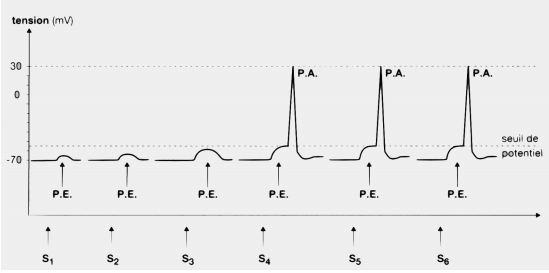

Que signifie apprendre à partir des informations sensorielles et des moteurs ? L'objectif de cette partie sera d'apprendre des catégories, des concepts et des règles permettant d'évoluer en autonomie.

## Neurones et modèles de neurones

Apprendre c'est augmenter l'efficacité synaptique.

Modèle général d'un neurone : $\tau_i \dfrac{dU_i}{dt} + U_i = S_i (\sum_{j} w_{ij} U_j)$.
L'activation d'un neurone n'est pas un processus continu, il ne s'active que si un certain nombre de potentiels d'excitation est atteint.

L'étude des neurones humains permet de discriminer deux cas pour établir un modèle, d'une part les neurones sensoriels qui s'activent selon une gaussienne. En revanche les neurones moteurs vont être représentés par une fonction sigmoïde. Attention, ce modèle est vrai pour des neurones "primaires", plus l'on va évoluer vers des neurones "abstraits", plus ce modèle sera faussé.

Pour passer de la modélisation d'un neurone à une structure il faut étudier les connexions entres les neurones. Actuellement les neurones sont organisés selon certaines dispositions, soit en couches interconnectées (structure laminaire), soit en noyaux.

L'**apprentissage
** peut être considéré comme la capacité d'extraction des invariants dans le monde multimodal et sensorimoteur. L'apprentissage est renforcé par nos connaissances initiales ou les connaissances que nous acquérons, ce qui nous permet de nous adapter à notre environnement. Pour réaliser de l'apprentissage il est nécessaire de réduire la quantité importante d'informations reçues en réduisant le nombre de données, la dimension ou en réalisant des traitements spécifiques.

## Apprendre des règles

La théorie de Hebb est souvent résumée par la formule "des neurones qui s'excitent ensemble se lient entre eux". C'est une règle d'apprentissage des réseaux de neurones artificiels dans le contexte de l'étude d'assemblées de neurones. Elle est basée sur une hypothèse scientifique en neurosciences, elle décrit les changements d'aadaptation neuronale dans le cerveau ou dans un réseau des neurones pendant un processus d'apprentissage. Elle décrit un mécanisme basique de plasticité synaptique dans laquelle l'efficacité synaptique augmente lors d'une stimulation présynaptique répétée et persistante de la cellule postsynaptique. Cette règle suggère que lrosque deux neurones sont excités conjointement, il se cré ou renforce un lien les unissant. Cette théorie tente d'expliquer l'apprenitssage associatif, dans lequel une association est faite par la répétition de deux stimuli. La répétition d'un stimulus seul entraîne le rappel de l'autre stimulus.
