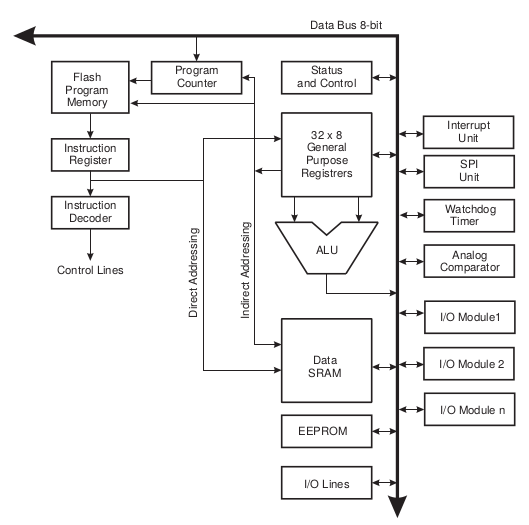

## Programmer un microcontrolleur

Un microcontrolleur peut posséder plusieurs types de mémoire : la RAM (Volatile, rapide), la flash (ROM persistant, lent) et l'EEEPROM. La mémoire est divisé en plusieurs registres permettant de communiquer des ordres avec le processeur.

Ces registres seront accessibles via une adresse. Le processeur va utiliser ces adresses pour modifier et analyser les différents bus de données en utilisant une architecture similaire à la suivante

	

Les processeurs lisent de manière séquentielle les instruction puis les executent, chaque instruction dépend du langage de la machine. 