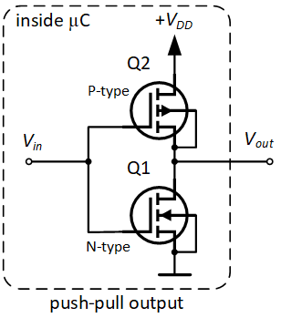
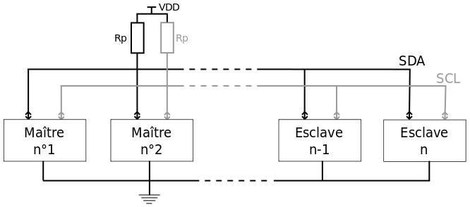
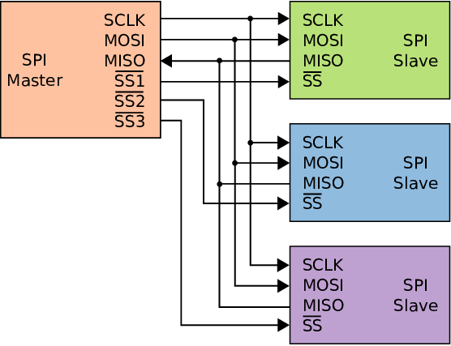

Les bus de communication standard sont nés de la nécessité de faire communiquer ensemble MCU et IC, nous allons pendant ce cours en présenter quelques-uns.

Avant de parler des bus, voyons comment fonctionnent les lignes électroniques physiques. Contrairement à la vision des informaticiens, une ligne électronique n'est pas seulement un 0 ou un 1 mais elle est à un niveau de tension donné et une certainne impédance. Une ligne peut être pilotée à basse impédance en utilisant des transistors push/pull

Symboliquement, cela peut être représenté avec un triangle et appelé un controller de ligne

Lorsqu'une ligne est une entrée en haute impédance et que rien n'est branché (la ligne est flottante), n'importe quelle tension peut être lue à cause de toutes les interférences. Si l'on veut imposer un niveau logique par défaut il est nécessaire d'utiliser les résistances dites pull-up/down.

## UART

UART, souvent appelé "série" est l'un des bus de communication les plus connus, c'est une bus asynchrone ce qui implique qu'il existe une fréquence de communication appelée baudrate. Les bytes sont transmis bit par bit et sont précédés et suivis de bits de début et des bits de fin ce qui permet de conserver la synchronisation entre les messages.

## I2C / TWI

I2C (Inter-Integrated Circuit), ou TWI (Two Wire Interface) est un type de bus qui utilise deux fils, il est synchrone et semi-duplex. Ces lignes sont portées ) un niveau de tension élévées et pilotées par des drains ouverts.

I2C est basé sur un protocole avec adresse, arbitrage et accusés de réception. Si plusieurs maîtres commencent une trame simultanément, l'arbitrage est mis en œuvre en surveillant le niveau de la ligne (si LOW est lu lorsque le drain ouvert est ouvert, la trame est arrêtée en raison d'une collision). Ainsi, les adresses avec le plus de 0 dans la partie haute ont plus de priorité dans l'arbitrage.

### SPI

SPI (Serial Peripheral Interface) est un bus synchrone et full-duplex. Sur un bus SPI, il y a un maître et plusieurs esclases. Il utilise 4 lignes :

- SCK : l'horloge indiquant quand les bis sont transmis
- MOSI et MISO : respectivement sortie maître / entrée esclave et entrée maître / sortie esclave
- CS : indiquant à un esclave s'il est activé

  
