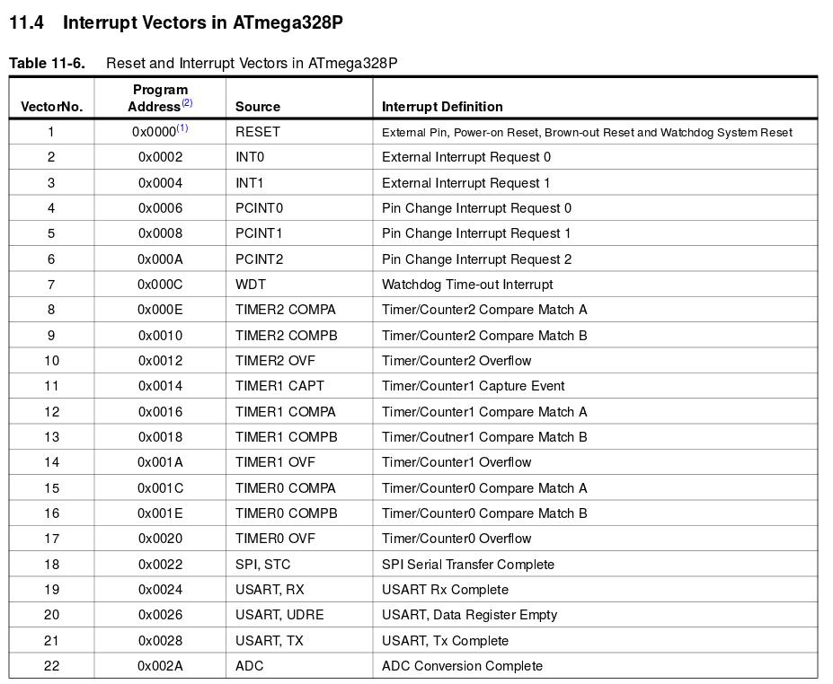
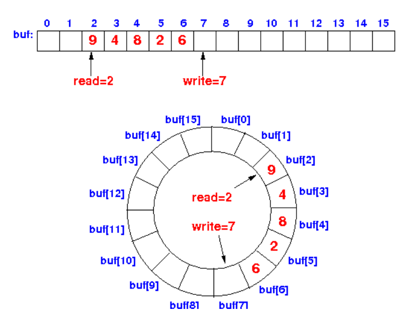

## Problème

Considérons le code suivant

```c
void uart_send(char *str) {
    while (*str != '\0') {
        // Waits to be ready to send next byte
        while (UCSR0A & _BV(UDRE0));
        // Sends the next byte
        UDRE0 = *(str++);
    }
}
```

Ce code fonctionne correctement mais il consomme beaucoup de ressources.

## Ordonnancement

### Comment réaliser différents tâches simultanéments

Le problème peut être résolu en utilisant un ordonnanceur, c'est-à-dire un système qui permet de définir l'ordre d'exécution des tâches. Cependant il est aussi possible de réaliser des tâches simultanément en utilisant de l'ordonnancement coopératif.

```c
int main() {
    setup();

    while (1) {
        usart_tick();
        leds_tick();
    }
}
```

Ici `usart_tick()` et `leds_tick()` sont des méthodes coopératives, elles effectueront des calculs et rendront l'exécution en retournant rapidement les données. Voici une façon d'organiser le code précédent en utilisant l'ordonnancement.

```c
static char buffer[128];
static size_t position = 0;
static size_t length = 0;

void uart_send(char *str) {
    position = 0;
    length = strlen(str);
    memcpy(buffer, str, length);
}

void uart_tick() {
    if (position < length) {
        if (UCSR0A & _BV(UDRE0)) {
            UDRE0 = buffer[position];
            position += 1;
        }
    }
}
```

## Polling et interuptions

Dans le premier exemple, nous attendions activement que le buffer soit disponible avec une boucle, c'est ce que nous appelons `polling`

Ensuite, nous avons introduit le concept simple de l'ordonnancement manuel, mais le microcontrôleur passera toujours beaucoup de temps à exécuter des tests qui sont pour la plupart faux.

Une caractéristique des microcontrôleurs peut nous aider ici : les interruptions. Il s'agit simplement de routines exécutées lorsqu'un événement quelconque se produit. Il suffit alors au processeur de "sauter" automatiquement à une méthode donnée.

Le code binaire que nous téléchargeons commence par une table de vecteurs d'interruption. Chaque entrée de cette table correspond à un type d'interruption et donne une adresse cible pour la routine à exécuter.



## Ring buffer

Pour gérer l'envoi et la réception de données à l'aide d'un bus comme l'UART, nous pouvons utiliser un buffer en anneau, permettant de stocker les données qui ne sont pas encore traitées.

Il peut s'agir soit de données TX qui n'ont pas encore été envoyées, soit de données RX qui n'ont pas été lues par le code.



Le principe est de stocker un tableau en mémoire avec deux index, le premier étant le prochain élément à lire, et le second le prochain élément à écrire.

Lorsque les index sont incrémentés, ils débordent sur la longueur du buffer (en revenant au début lorsqu'ils atteignent la fin).

Nous pouvons vérifier s'il y a des données à lire en comparant les index.