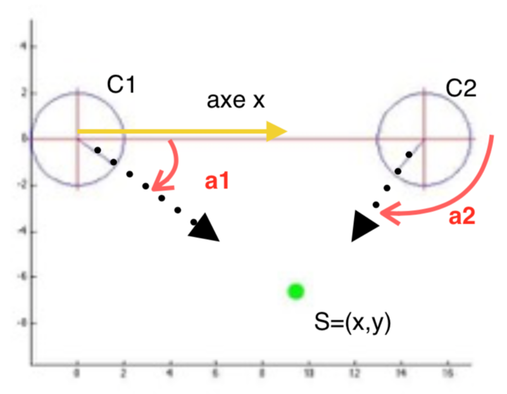

À partir d'une position initiale, le robot tourne de $\theta$ puis avance de $t$ puis tourne de $\alpha$ puis avance de $d$. Donner son positionnement dans le repère $(x,y,\theta)$.

- Le robot tourne de $\theta$ puis avance de $t$. Dans le repère $\Omega_O = (O, \vec{i}, \vec{j})$ :

$$
\vec{T}_{\Omega_O} = \begin{pmatrix} u\\ v \end{pmatrix} = t. \begin{pmatrix} \cos{\theta} \\ \sin{\theta} \end{pmatrix}
$$

- Puis, le robot tourne de $\alpha$ puis avance de $d$. Dans le repère $\Omega_C = (C, \vec{x}, \vec{y})$ :

$$
\vec{D}_{\Omega_C} = \begin{pmatrix} p\\ q \end{pmatrix} = d. \begin{pmatrix} \cos{\alpha} \\ \sin{\alpha} \end{pmatrix}
$$

## Modèles directe / inverse

 </img>

- **Dans quel espace ?** : Le mécanisme à 3 degrés de liberté
- **Quels sont les variables ?** : Les entrées vont être le tuple de $\theta$ ainsi que les longueurs des 3 paramètres $t$
- **Poser le problème
  ** : Dans le modèle directe on souhaite trouver les coordonées cartésiennes en fonction des $\theta$ et des longueurs $t$. Le modèle inverse lui fournit la position des différents joints $\theta$ en fonction de la position cartésienne de l'effecteur.

### Modèles direct : sorties en fonction des entrées

Enchainer le changement de repère revient à ajouter la matrice de rotation multiplié par celle des translations.

$$
\mathcal{X} = \begin{pmatrix} t_1. \cos{\theta} + t_2 . \cos(\theta_1 + \theta_2) + t_3 . \cos(\theta_1 + \theta_2 + \theta_3) \\ t_1 . \sin{\theta} + t_2 . \sin(\theta_1 + \theta_2) + t_3 . \sin(\theta_1 + \theta_2 + \theta_3) \\ \theta_1 + \theta_2 + \theta_3 \end{pmatrix}
$$

### Modèles inverse : entrées en fonction des sorties

Calculer le MGI revient à déterminer : $[\theta_1, \theta_2, \theta_3] = \mathcal{F}_{MGI}(X_1, X_2, X_3)$

Lorsqu'il y a plusieurs solutions dans un problème nous sommes face à un système non linéaire

Posons le système d'équations

$$
\begin{cases}
t_1 .\cos{\theta_1} + t_2 \cos(\theta_1 + \theta_2) + t_3 \cos{\theta_1 + \theta_2 + \theta_3} - X_1 = 0 \\
t_1 . \sin{\theta_1} + t_2 \sin(\theta_1 + \theta_2) + t_3 \sin(\theta_1 + \theta_2 + \theta_3) - X_2 = 0 \\
\theta_1 + \theta_2 + \theta_3 = X_3
\end{cases}
$$

Pour résoudre ce problème nous pouvons poser $\theta_3 = X_3 - \theta_1 - \theta_2$.

#### Résolution numérique : méthode de Newton

Nous cherchons à déterminer $x$ tel que $f(x) = 0$. Nous connaissons une approximation de $x$ noté $x_0$. Nous avons $f(x_0) - f(x) = f'(x_0).(x_0-x)$ avec $f(x) = 0$ nous obtenons :
$$
x = x_0 - \dfrac{f(x_0)}{f'(x_0)}
$$

Le schéma de Newton est donc
$$
x_{k+1} = x_k - \dfrac{f(x_k)}{f'(x_k)}
$$

$C_1$ et $C_2$ sont les positions des goniomètres, $a_1$ et $a_2$ sont les mesures angulaires et $S$ la position du robot.

### Un exemple simple

Nous pouvons déterminer les équations suivantes

$$
\begin{align*}
M_1 &= \begin{pmatrix} u_1 \\ v_1 \end{pmatrix} = \begin{pmatrix} \cos{a_1} \\ \sin{a_1} \end{pmatrix} \\
M_2 &= \begin{pmatrix} u_2 \\ v_2 \end{pmatrix} = \begin{pmatrix} \cos{a_2} \\ \sin{a_2} \end{pmatrix} \\
\begin{pmatrix} x - c_{1_x} \\ y - c_{1_y} \end{pmatrix} \begin{pmatrix} \cos{\pi/2} & - \sin{\pi/2} \\ \sin{\pi / 2} & \cos{\pi / 2} \end{pmatrix} \begin{pmatrix} u_1 \\ v_1 \end{pmatrix} &= 0\\
\begin{pmatrix} x - c_{2_x} \\ y - c_{2_y} \end{pmatrix} \begin{pmatrix} \cos{\pi/2} & - \sin{\pi/2} \\ \sin{\pi / 2} & \cos{\pi / 2} \end{pmatrix} \begin{pmatrix} u_2 \\ v_2 \end{pmatrix} &= 0 \\
\begin{pmatrix} \sin{a_1} & - \cos{a_1} \\ \sin{a_2} & - \cos{a_2} \end{pmatrix} \begin{pmatrix} x \\ y \end{pmatrix} &= \begin{pmatrix} \sin{a_1}.c_{1_x} - \cos{a_1} c_{1_y} \\ \sin{a_2}.c_{2_x} - \cos{a_2} c_{2_y} \end{pmatrix} \\
A.S &= B
\end{align*}
$$

Nous cherchons donc à résoudre l'équation $A.x = b$ cependant la résolution avec $x = A^{-1}.b$ peut s'avérer trop complexe dans certaines situations. Nous allons donc utiliser une décomposition SVD pour résoudre l'équation, la décomposition s'écrit alors $svd(A) = U.S.V^{T}$. [Détails sur la décomposition SVG](./img/svd.pdf)

### Résolution de systèmes sous contraints

Soit le système $A_{n \times m} . x_{m \times 1} = b_{n \times 1}$ avec $n < m$. Par exemple $x_1 + x_2 = 4$ est un système sous contraints. Il existe une infinité de solution et nous cherchons à en carctériser une. La résolution va se réaliser en résoluvant $arg min H(x)$ avec $H(x) = x^{T} x + \lambda^T (Ax-b)$.

Pour résoudre des systèmes sosus contraints nous allons avoir besoin d'une notion supplémentaire : la pseudo inverse. La pseudo inverse (droite) se définit comme : $A^+_{R} = A^T (AA^T)^{-1} = \sum
\limits_{i=1}^N \sigma^{-1} v_i u_i^T$.

La solution d'un système linéaire sous contraint est donc $x = A^+_R b + \sum
\limits_{i=n+1}^m \alpha_i v_i \forall \alpha_i = A^+_R b + [I - A^+_RA] \omega$. Nous pouvons remaquer que $Ax=b \Leftrightarrow A(x+z) = b$ avec $Az =0$, $z$ est donc choisi dans le noyau de la matrice $A$.
