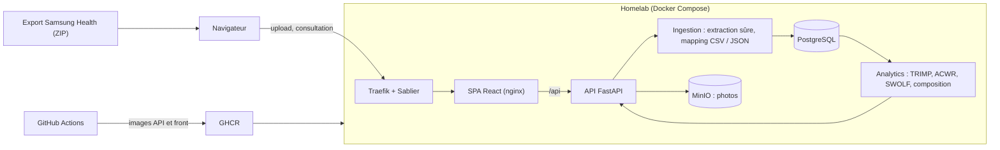

import Tabs from '@theme/Tabs';
import TabItem from '@theme/TabItem';

<ProjectMeta
  start="2023"
  end="2026"
  role="Auteur (projet solo)"
  domain="Analyse de données, quantified self"
  stack={["FastAPI", "React", "PostgreSQL", "MinIO", "Docker"]}
/>

## Contexte

Samsung Health exporte des CSV et fichiers d'activité bruts, sans aucune visualisation exploitable. Passer par une application tierce aurait signifié confier des données de santé (poids, composition corporelle, fréquence cardiaque, photos de suivi) à un service externe. J'ai construit la chaîne moi-même (ingestion, modélisation, analytics, interface), déployée sur mon infrastructure personnelle et alimentée en continu de 2023 à 2026.

Le projet a été réécrit en 2026 : la version initiale était une application Streamlit monolithique ; la version finale sépare une API FastAPI et une SPA React, avec une persistance PostgreSQL et un stockage objet MinIO pour les photos.

## Aperçu

Les captures ci-dessous ont été réalisées sur une instance locale alimentée par un export Samsung Health fictif de quatre mois, importé par la même chaîne d'ingestion que les données réelles.

<Tabs>
  <TabItem value="dashboard" label="Aujourd'hui">
    

    Vue d'ensemble de la phase en cours : progression vers chaque objectif, calories moyennes et recomposition (masse grasse contre masse maigre).
  </TabItem>
  <TabItem value="entrainement" label="Entraînement">
    

    Calendrier, totaux, records personnels et charge d'entraînement : TRIMP cumulé sur 7 jours (charge aiguë) et sur 28 jours (charge chronique).
  </TabItem>
  <TabItem value="natation" label="Natation">
    

    Détail d'une séance de natation : SWOLF moyen par nage, puis chaque longueur restituée avec sa durée, sa nage et les repos entre les séries.
  </TabItem>
  <TabItem value="recuperation" label="Récupération">
    

    Signaux nocturnes de la dernière nuit (FC, VFC, score d'énergie), hypnogramme et répartition des phases de sommeil sur 90 jours.
  </TabItem>
  <TabItem value="composition" label="Composition corporelle">
    

    Poids, masse grasse, masse musculaire, masse maigre et eau, avec les phases (maintien puis sèche) superposées en bandes de couleur.
  </TabItem>
</Tabs>

## Stack technique

  

    
Backend

    
Python, FastAPI, SQLAlchemy (async), Pydantic, Alembic, uv

  

  

    
Frontend

    
React, TypeScript, Vite

  

  

    
Données

    
PostgreSQL, MinIO (stockage objet S3)

  

  

    
Traitement d'image

    
Pillow

  

  

    
Conteneurisation

    
Docker, Docker Compose

  

  

    
CI/CD

    
GitHub Actions, GitHub Container Registry

  

  

    
Qualité

    
pytest, Vitest, Ruff, pre-commit

  

## Architecture

L'export ZIP est envoyé depuis le navigateur, ingéré en tâche de fond par l'API, puis restitué par le module d'analytics à la SPA.

## Ingestion des exports Samsung Health

L'export Samsung Health est une archive ZIP volumineuse (1,3 Go décompressés pour l'export réel de ce projet, environ 88 000 fichiers) et non fiable par construction : c'est une entrée utilisateur, pas un format contrôlé. L'extraction vérifie donc les chemins de chaque entrée avant d'écrire le moindre octet, pour bloquer une évasion de répertoire (zip-slip), et suit le volume décompressé en continu pendant l'écriture plutôt que de se fier à la taille déclarée dans les métadonnées de l'archive, qu'un fichier malveillant contrôle entièrement. Le nombre d'entrées est également plafonné, pour se prémunir d'une bombe de décompression.

Les CSV eux-mêmes varient selon la version de l'application source : champs absents, dates mal formées, types numériques instables. Chaque module d'ingestion valide et normalise sa source avant de la faire entrer dans le modèle relationnel, plutôt que de laisser une exception de parsing interrompre silencieusement le traitement d'une ligne.

Le format réel de l'export s'est révélé différent de celui des fixtures de test sur plusieurs points, sans qu'aucune erreur ne le signale. Une archive zippée depuis le téléphone place tout son contenu sous un dossier racine horodaté : l'import ne trouvait aucun fichier reconnu et se terminait en succès avec zéro ligne. Il descend désormais dans ce dossier, et un import sans aucune source reconnue est marqué en échec plutôt qu'en succès vide. De même, des colonnes préfixées dans les CSV de fréquence cardiaque et de SpO₂, un fichier d'histogramme lu à la place du stress et des JSON de variabilité cardiaque cherchés hors de leur sous-dossier faisaient perdre ces signaux en entier. Les fixtures reprennent maintenant la structure exacte d'un export réel, pour que les tests échouent sur ce type d'écart.

## Récupération et sommeil

Une page Récupération rassemble les signaux nocturnes et de repos que l'ingestion ignorait jusque-là : hypnogramme et phases de sommeil, fréquence cardiaque, SpO₂ et ronflement nocturnes, variabilité cardiaque, score d'énergie, fréquence cardiaque de récupération après effort. Chaque séance est aussi replacée dans son contexte (météo notamment) et comparée aux meilleures performances enregistrées.

## Analytics d'entraînement

Le module `analytics/` du backend est délibérément isolé de la base de données et du framework web : chaque fonction prend des structures de données en entrée et retourne des structures en sortie, ce qui les rend testables sans infrastructure. Il couvre plusieurs métriques issues de la physiologie de l'effort :

- **TRIMP** (Training Impulse) : charge d'un entraînement calculée par intégration de la réserve de fréquence cardiaque sur la durée de la séance, pondérée par une fonction exponentielle qui accorde plus de poids aux efforts proches du maximum.
- **Charge aiguë/chronique (ACWR)** : rapport entre la charge d'entraînement moyenne sur 7 jours et sur 28 jours, indicateur de risque de blessure par sur-sollicitation quand ce ratio s'éloigne trop de 1.
- **Dérive cardiaque** : écart de fréquence cardiaque moyenne entre la première et la seconde moitié d'une séance à effort comparable, signe de fatigue ou de perte d'économie de course.
- **Zones de fréquence cardiaque** : répartition du temps d'entraînement par zone (récupération à maximal), calculée à partir des échantillons de fréquence cardiaque et de la fréquence maximale de l'utilisateur.

D'autres modules du même dossier couvrent la composition corporelle, la nutrition, les records personnels et les phases (bulk, cut, maintien), chacun avec sa propre logique de calcul mais la même contrainte d'isolation. La VO₂max estimée par la montre est suivie dans le temps.

Le détail de séance dépend du sport. Samsung Health enregistre chaque exercice d'une routine de musculation comme une séance distincte : une heure de salle apparaissait comme une dizaine de séances, ce qui faussait le calendrier et les statistiques. Les routines sont désormais ingérées et chaque exercice rattaché à la sienne ; une routine compte pour une séance, et sa page détaille échauffement, exercices, séries et volume. Pour la natation, chaque longueur est restituée (durée, nage, nombre de mouvements, SWOLF, repos) sous forme de barres colorées par nage. Pour la course, le bloc principal est isolé de l'échauffement et du retour au calme.

## Photos et confidentialité

Les photos de suivi corporel sont par nature privées. Elles sont stockées dans MinIO plutôt que sur le système de fichiers de l'application, à travers un client dédié qui centralise tous les appels au SDK S3 : le reste du backend ne connaît jamais MinIO directement, ce qui permet de le substituer par un double de test dans la suite unitaire.

Le traitement d'image ne fait confiance ni à l'extension du fichier envoyé ni au `Content-Type` déclaré par le client : le type réel est déterminé en inspectant les premiers octets du fichier. L'orientation est corrigée à partir du tag EXIF plutôt que d'une heuristique sur les dimensions de l'image, ce qui corrige un bug de l'ancienne version qui retournait à tort toute photo réellement prise en format paysage. En mode confidentiel, chaque photo est floutée par filtre gaussien à la volée, sans jamais mettre en cache le rendu flouté : l'original stocké reste la seule version durable.

## Déploiement

L'application se compose de quatre services orchestrés par Docker Compose : PostgreSQL, MinIO, l'API FastAPI et le frontend, complétés par une seconde instance PostgreSQL dédiée aux tests d'intégration, pour que la suite de tests ne touche jamais aux données réelles. Le frontend a deux profils distincts : un service de développement (Node + Vite, rechargement à chaud) actif par défaut, et une image de production (build statique servi par nginx, sans runtime Node) qui ne démarre que sur demande explicite via un profil Compose, pour valider l'image avant bascule sans interrompre l'environnement de développement.

Le conteneur de l'API applique les migrations Alembic à son démarrage, avant de lancer le serveur. Ce n'était pas le cas au départ : une nouvelle image déployée sur une base restée à l'ancien schéma échouait sur ses nouvelles tables. Lier la migration au démarrage garantit que le schéma suit toujours la version du code déployée.

Le workflow GitHub Actions construit et publie les deux images (API et frontend) sur GitHub Container Registry à chaque push sur `master`, chacune taguée à la fois `latest` et par SHA de commit. En production, l'application a tourné sur mon [homelab](homelab.md) : utilisée quelques minutes par semaine, elle était arrêtée par Sablier après 30 minutes d'inactivité et redémarrée à la première requête, ce qui libérait la mémoire occupée au repos par ses conteneurs.

L'interface suit la charte graphique commune aux applications de mon homelab : thème sombre, un seul accent de couleur, nom de l'application en deux tons, libellés en français.

## Tests

La suite de tests backend compte 58 fichiers et près de 350 fonctions de test, réparties entre tests unitaires (calcul des métriques d'analytics, traitement d'image, sécurité de l'extraction ZIP) et tests d'intégration sur les services exposés par l'API. Le frontend dispose de sa propre suite Vitest.

## Liens

- 💻 Code source : [github.com/sedelpeuch/body_analysis](https://github.com/sedelpeuch/body_analysis)
- [HomeLab](homelab.md) : infrastructure qui héberge l'application
