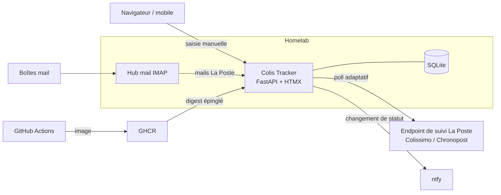

import Tabs from '@theme/Tabs';
import TabItem from '@theme/TabItem';

<ProjectMeta
  start="2026"
  end="2026"
  role="Auteur (projet solo)"
  domain="Application web auto-hébergée, suivi de colis"
  stack={["Python", "FastAPI", "HTMX", "SQLite", "Docker", "GitHub Actions", "uv"]}
/>

## Contexte

Suivre ses colis sans compte professionnel ni service tiers payant (17TRACK, AfterShip) n'a pas de solution simple : ni La Poste ni les marchands n'exposent d'API de suivi grand public. Or la quasi-totalité des livraisons reçues passe par le groupe La Poste, y compris une partie des commandes Amazon. J'ai donc écrit une petite application qui interroge directement le suivi de La Poste, sans dépendance externe, et la fait tourner sur mon [homelab](homelab.md).

Le besoin était double : voir d'un coup d'œil l'état de tous les colis en cours, et ne plus avoir à recopier les numéros de suivi à la main.

## Aperçu

Captures réalisées sur une instance locale peuplée de colis fictifs.

<Tabs>
  <TabItem value="liste" label="Liste des colis">
    

    Les colis sont groupés en trois sections (en cours, livrés, en erreur), avec un voyant d'état, le dernier libellé du transporteur et l'expéditeur.
  </TabItem>
  <TabItem value="detail" label="Détail d'un colis">
    

    La page de détail réunit les métadonnées du colis, son historique complet tel que renvoyé par La Poste et le code-barres Code 128 du numéro de suivi.
  </TabItem>
  <TabItem value="ajout" label="Ajout d'un colis">
    

    L'ajout manuel ne demande que le numéro de suivi, le nom est facultatif et peut être modifié ensuite depuis la page de détail.
  </TabItem>
  <TabItem value="mobile" label="Vue mobile">
    

      
      
    

    L'interface s'adapte au téléphone, ce qui permet de présenter le code-barres directement au guichet du point relais.
  </TabItem>
</Tabs>

## Stack technique

  

    
Backend

    
Python, FastAPI, httpx (asynchrone), Jinja2

  

  

    
Frontend

    
HTMX, rendu serveur

  

  

    
Données

    
SQLite (fichier unique, aucune base externe)

  

  

    
Notifications

    
ntfy

  

  

    
Conteneurisation

    
Docker, Docker Compose

  

  

    
CI/CD

    
GitHub Actions, GitHub Container Registry

  

  

    
Qualité

    
pytest, ty (vérification de types), uv

  

## Architecture

## Suivi par l'endpoint public de La Poste

La page de suivi de laposte.fr interroge elle-même, depuis le navigateur, un endpoint qui renvoie l'historique complet d'un colis en JSON, sans authentification. L'application appelle ce même endpoint, sur le principe déjà employé par une intégration Home Assistant existante. Ce n'est pas un contrat d'API documenté : il peut changer sans préavis, et le client est écrit pour échouer proprement plutôt que d'afficher un état faux. Une réponse `429` est traitée en respectant l'en-tête `Retry-After`, et un colis en erreur est rangé dans sa propre section, après les colis livrés, avec le message retourné.

Les codes d'événement diffèrent entre Colissimo et Chronopost : chaque transporteur a sa table de correspondance vers un jeu de statuts commun (pris en charge, en transit, en livraison, livré, en erreur). Comme La Poste renvoie toute la chronologie à chaque appel, l'historique affiché est complet, et pas seulement la suite des changements observés depuis l'ajout du colis.

L'interrogation est adaptative : toutes les 15 minutes pour un colis en cours de livraison le jour même, toutes les 45 minutes sinon, aucune la nuit, et plus du tout une fois le colis livré. Chaque changement de statut peut déclencher une notification ntfy. La page de détail affiche aussi le numéro de suivi en code-barres Code 128, présentable en point relais depuis le téléphone ; la première version n'était pas lisible par les scanners, faute de zone de silence suffisante autour du code et de résolution suffisante des barres.

## Import automatique depuis les mails

Recopier un numéro de suivi depuis un mail d'expédition est la tâche que l'application devait supprimer. Un module optionnel surveille une boîte mail en IMAP, à intervalle régulier :

- seuls les mails dont l'expéditeur appartient à une liste blanche de domaines La Poste sont analysés, la recherche IMAP filtre déjà côté serveur, et l'en-tête `From` est revérifié côté application ;
- le numéro de suivi est extrait du corps du mail, d'abord après un libellé connu, puis à défaut par la forme du code lui-même ;
- chaque colis trouvé est créé et interrogé immédiatement, sans attendre le cycle suivant ;
- tout mail traité, numéro trouvé ou non, est déplacé dans un dossier dédié pour ne jamais être analysé deux fois.

L'analyse des mails est écrite en fonctions pures (liste blanche, extraction, décodage du corps), testées indépendamment du serveur IMAP, que les tests d'intégration remplacent par un double. L'accès se fait en IMAP standard avec un mot de passe d'application dédié, sans OAuth ni API propriétaire.

## Déploiement

La CI GitHub Actions vérifie les types, exécute les tests et construit l'image à chaque push et pull request ; un second workflow publie l'image sur GitHub Container Registry. Sur le homelab, l'image est épinglée par digest, comme celle des autres services.

L'intégration au homelab a fait évoluer la relève des mails : l'application interrogeait d'abord directement la boîte du fournisseur ; elle relève désormais le hub mail local du homelab, qui centralise toutes les boîtes. Les identifiants du fournisseur ne sont ainsi stockés qu'à un seul endroit. L'interface suit la charte graphique commune aux applications du homelab.

## Résultats

- **Plus de saisie manuelle** : un mail d'expédition La Poste suffit à créer le colis et à lancer son suivi.
- **Suivi Colissimo et Chronopost sans compte ni clé API**, avec l'historique complet de chaque colis et non les seuls changements observés.
- **Notification à chaque changement de statut** sur ntfy, avec une fréquence d'interrogation adaptée à l'état du colis.
- **Code-barres présentable en point relais** depuis le téléphone, lisible par les scanners.
- **Intégration au homelab** : image épinglée par digest, relève sur le hub mail local, identifiants du fournisseur stockés à un seul endroit.

## Limites connues

- Seuls Colissimo et Chronopost sont couverts : pas de Mondial Relay, DPD ni GLS.
- L'import par mail ne reconnaît que les mails La Poste, pas les confirmations d'expédition des marchands eux-mêmes.
- L'application dépend d'un endpoint non documenté : une évolution du site de La Poste peut la rendre inopérante jusqu'à adaptation du client.

## Liens

- 💻 Code source : [github.com/sedelpeuch/colis-tracker](https://github.com/sedelpeuch/colis-tracker)
- [HomeLab](homelab.md) : infrastructure qui héberge l'application
