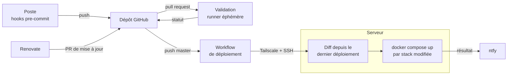
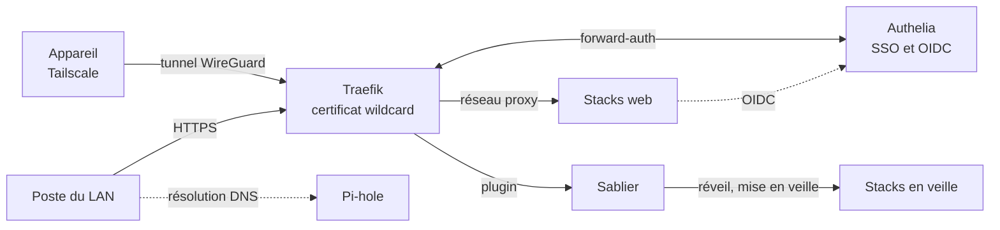
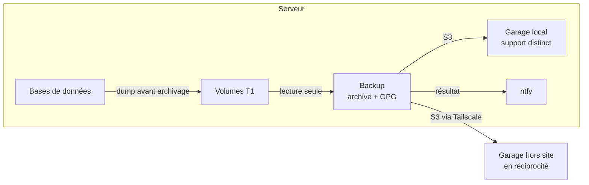
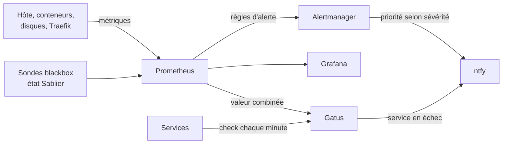

import Tabs from '@theme/Tabs';
import TabItem from '@theme/TabItem';

<ProjectMeta
  start="2023"
  role="Concepteur et mainteneur"
  domain="Homelab, auto-hébergement, GitOps"
  stack={["Docker Compose", "Traefik", "Authelia", "Tailscale", "GitHub Actions", "Renovate", "Prometheus", "git-crypt"]}
/>

## Le contexte

HomeLab est le nom du serveur domestique qui héberge mes services personnels : domotique, photos, mots de passe, documents administratifs, mails, recettes, musique, médias. Ce qui a commencé comme quelques conteneurs sur une machine est devenu une infrastructure qui porte des données que je ne peux pas me permettre de perdre, dont un coffre-fort de mots de passe, une bibliothèque de photos et une base domotique. La question a changé de nature : il ne s'agit plus de faire tourner des conteneurs, mais de le faire avec le niveau de rigueur attendu d'une infrastructure professionnelle, versionnée, reproductible, avec des secrets qui ne traînent jamais en clair, des mises à jour maîtrisées et des sauvegardes qui survivent à la perte de la machine.

Le dépôt est structuré en GitOps : un dossier par service, chacun avec son `compose.yml` et sa documentation, déployé automatiquement sur push. Rien ne se configure à la main sur le serveur, tout part du repo.

## Les services hébergés

Une trentaine de stacks, organisées en quatre familles :

<Tabs>
  <TabItem value="infra" label="Plateforme">
    Le socle ne rend aucun service à l'utilisateur final : il fait fonctionner tout le reste.

    - **Traefik** encaisse tout le trafic HTTPS entrant et le route vers le bon service, avec des certificats wildcard obtenus par challenge DNS.
    - **Authelia** s'intercale devant les services web pour l'authentification unique, et sert de fournisseur OpenID Connect.
    - **Sablier** met en veille les services web lourds à usage sporadique et les réveille à la première requête.
    - **Backup** fait écrire un dump cohérent à chaque base de données, puis chiffre et exporte chaque nuit les volumes critiques vers deux destinations S3.
    - **Garage** porte le stockage objet S3 auto-hébergé de la copie locale des sauvegardes, avec une interface web derrière Authelia.
    - **Pi-hole** est le DNS et le DHCP du réseau local : blocage de la publicité et du pistage pour tous les appareils, y compris ceux sans Tailscale, et résolution des sous-domaines du homelab vers l'adresse locale du serveur.
    - **VPN exit node** publie sur le réseau Tailscale un nœud de sortie dont tout le trafic passe par un VPN commercial (Gluetun) : n'importe quel appareil peut l'emprunter à la demande, sans perdre l'accès au homelab, là où un téléphone ne peut faire tourner qu'un seul VPN système à la fois.
    - **Portainer** donne une vue d'ensemble des conteneurs sans passer par le CLI.
    - **Docs** compile la documentation du repo en un site consultable.
  </TabItem>
  <TabItem value="monitoring" label="Supervision">
    De quoi repérer une dérive avant qu'elle ne devienne un incident, et être prévenu quand elle arrive.

    - **Prometheus** collecte les métriques de l'hôte, des conteneurs, des disques (S.M.A.R.T.) et de Traefik ; **Alertmanager** route les alertes.
    - **Grafana** met ces métriques en forme dans des dashboards.
    - **Gatus** vérifie chaque minute que chaque service répond, et publie une page de statut.
    - **ntfy** est le canal de notification push unique de toute l'infrastructure : alertes, échecs de déploiement, résultats de sauvegarde.
    - **Dozzle** affiche les logs de n'importe quel conteneur depuis le navigateur, sans SSH, avec une connexion OIDC.
  </TabItem>
  <TabItem value="media" label="Médias & fichiers">
    - **Jellyfin** diffuse films et séries.
    - **Immich** reprend le rôle de Google Photos, avec sauvegarde automatique de la pellicule mobile.
    - **Navidrome** sert la bibliothèque musicale aux clients Subsonic du téléphone et du PC, en remplacement d'un abonnement de streaming.
    - **[Recallarr](recallarr.md)**, une application que j'ai développée, tient le journal de ce qui a été regardé et décide du devenir de chaque titre de la médiathèque.
    - **Calibre-Web** sert de bibliothèque d'ebooks.
    - **Samba** expose la médiathèque en partage réseau pour les appareils qui ne parlent pas HTTP.
    - **qBittorrent** télécharge en tunnel VPN forcé, premier maillon d'une future chaîne d'automatisation média.
    - **Stirling PDF** rassemble les outils PDF (fusion, OCR, conversion) en une seule boîte à outils web.
  </TabItem>
  <TabItem value="perso" label="Domotique & productivité">
    - **Home Assistant** pilote la domotique de la maison.
    - **Frigate** épaule Home Assistant pour la détection d'objets sur les flux caméra.
    - **Vaultwarden** sert de coffre-fort de mots de passe.
    - **Paperless-ngx** archive et indexe les documents scannés (OCR, recherche plein texte), ainsi que les mails entiers et leurs pièces jointes grâce à Gotenberg et Tika.
    - **Mail** regroupe les boîtes personnelles dans un hub local (section dédiée plus bas).
    - **Mealie** centralise les recettes et les listes de courses.
    - **Ghostfolio** suit le portefeuille (PEA, assurance-vie) par import manuel.
    - **[Body Analysis](body_analysis.md)** et **[Colis Tracker](colis-tracker.md)**, deux applications que j'ai développées, suivent respectivement la composition corporelle et les colis La Poste.
    - **Dashy** fait office de page d'accueil qui centralise l'accès à tout le reste.
  </TabItem>
</Tabs>

## De Swarm à Compose standalone

Le serveur tournait à l'origine sur [Docker Swarm](/blog/2026/02/15/06-orchestration/docker-swarm), orchestré via Portainer. J'ai migré vers du Compose standalone pur, déployé par CI/CD plutôt que par un agent tiers. La décision tient à un constat : Swarm apporte des fonctionnalités multi-hôte (réseau overlay, répartition `deploy.mode: global`, contraintes de placement) qui n'ont jamais été exploitées sur un homelab **mono-nœud**. Payer la complexité d'un orchestrateur distribué pour un seul nœud n'avait pas de justification technique.

Ce qui ne change pas dans la bascule : le redéploiement automatique sur push, les healthchecks, les labels Traefik, la logique des réseaux externes partagés. Ce qui disparaît réellement : `docker secret` (les secrets passent en variables d'environnement, compensé par le chiffrement du repo, voir plus bas) et le rollback automatique intégré (`update_config` / `rollback_config`), un compromis jugé acceptable en usage solo, où un rollback via `git revert` reste rapide.

La migration a aussi été l'occasion de rattraper une dette assumée depuis longtemps : pin des versions d'images (tout tournait en `:latest`), sortie des identifiants codés en dur vers des variables d'environnement, et remplacement des IP fixes par des noms de service résolus par le réseau Docker. Elle s'est faite en même temps qu'un changement de machine, les deux serveurs tournant en parallèle le temps de la bascule.

## GitOps sans agent tiers

Un push sur `master` déclenche un [workflow GitHub Actions](/blog/2026/08/23/04-ci-cd/github-actions-deploiement-compose) qui calcule les dossiers modifiés depuis le dernier déploiement réussi (un run annulé ou en échec est ainsi rattrapé par le suivant), rejoint le réseau **Tailscale** avec un nœud éphémère restreint par ACL, puis relance `docker compose up -d --build` (ou `down` si un dossier a été supprimé) pour chaque stack concernée, et elles seules. Chaque déploiement, réussi ou non, est notifié sur ntfy.

Deux points techniques peu évidents ont structuré le workflow :

- **L'ordre de déploiement.** Certaines stacks référencent le volume Docker d'une autre en `external: true` (le partage réseau référence la médiathèque, la sauvegarde référence les volumes de presque tout le monde). Le workflow encode un ordre explicite, les propriétaires de volumes en premier et la sauvegarde en dernier, plutôt que de laisser échouer un `up` sur un volume introuvable.
- **Les fichiers de configuration montés en bind mount.** Docker Compose ne recrée pas un conteneur quand seul le contenu d'un fichier monté change : une modification de configuration poussée restait sans effet. Un hook pre-commit calcule le hash des fichiers de configuration de la stack et l'injecte en variable d'environnement dans son `compose.yml`, ce qui force la recréation, sur le même principe que l'annotation `checksum/config` des charts Helm.

Chaque pull request est validée avant fusion sur un runner éphémère : syntaxe Compose, déchiffrement des secrets, démarrage réel des stacks modifiées et contrôle de leur état de santé.

## Mises à jour maîtrisées avec Renovate

Avec une trentaine de stacks, suivre les nouvelles versions d'images à la main n'est pas tenable. [Renovate](/blog/2026/08/16/04-ci-cd/github-actions-renovate), exécuté en self-hosted dans GitHub Actions et authentifié par une GitHub App dédiée, ouvre une pull request par mise à jour, avec images pinnées par digest.

La décision structurante est de classer chaque stack par niveau de risque plutôt que d'appliquer une politique unique :

- **Tier 1, majeures relues** : le périmètre de confiance (Traefik, Authelia, Vaultwarden, sauvegarde, Garage), Home Assistant, Pi-hole qui porte le DNS et le DHCP de la maison, le hub mail dont la synchronisation écrit chez les fournisseurs, et les stacks dont la base de données porte des données irremplaçables avec des migrations de schéma connues pour être délicates (Immich, Paperless). Les versions majeures y ouvrent une pull request à relire ; les versions mineures, correctifs et digests sont fusionnés automatiquement.
- **Tier 2, fusion automatique** : tout le reste, majeures comprises, dès que la validation de pull request passe au vert et trois jours après la publication de la version, ce qui laisse le temps à une version cassée d'être retirée. Une casse y est soit bloquée par la validation, soit rattrapable sans perte de données.

La première version de cette politique gardait toutes les mises à jour du tier 1 en revue manuelle : les pull requests de correctifs s'accumulaient sans apporter d'information, puisque la relecture d'un changement de digest se résumait à vérifier que la validation était verte. Seules les majeures, susceptibles de changer la configuration ou le schéma, justifient une lecture humaine.

Les bases de données restent exclues de Renovate et sont montées de version à la main. La limite est assumée et documentée : la validation détecte un conteneur qui ne démarre pas, pas une régression silencieuse.

## SSO centralisé, avec des exceptions assumées

Traefik route le trafic HTTPS entrant, et [Authelia s'intercale devant en forward-auth](/blog/2026/08/02/02-network/authelia-forward-auth) : un service protégé redirige vers le portail si la session n'est pas authentifiée, sans que le service lui-même n'ait besoin de gérer l'authentification. La politique d'accès refuse tout par défaut et n'ouvre que ce qui est explicitement prévu.

Le DNS public résout les sous-domaines vers l'adresse Tailscale du serveur, Pi-hole vers son adresse locale : le même nom fonctionne depuis le tailnet et depuis le LAN.

Ce modèle a une limite connue : les applications mobiles (clients Bitwarden, Immich, Paperless) ne savent pas suivre une redirection vers un portail web, elles parlent directement à l'API du service. Plutôt que de casser ces clients, deux solutions sont employées selon le cas : un bypass ciblé sur les seules routes d'API concernées, ou un sous-domaine dédié aux clients natifs sans forward-auth. Chaque exception est justifiée par l'authentification applicative propre au service (chiffrement de bout en bout côté Vaultwarden, jetons côté Immich et Paperless), jamais par un service laissé nu par défaut. La mise au point de ces règles a demandé de relever les URL réellement appelées par chaque client, les expressions régulières de bypass échouant silencieusement sur des cas comme une query string ou une liste de valeurs dans un même segment.

Pour les applications qui implémentent OpenID Connect (Vaultwarden, Immich, Paperless, Mealie, Grafana, Ghostfolio, Jellyfin, Portainer), [Authelia sert aussi de fournisseur d'identité](/blog/2026/08/09/02-network/authelia-oidc) : l'application connaît l'utilisateur et ses groupes, et Grafana en déduit le rôle administrateur. Pour un usage navigateur, le forward-auth est conservé devant l'OIDC natif : la double couche est transparente, la session Authelia étant déjà ouverte. Dozzle, SOGo et l'interface de Garage ont rejoint cette liste.

Le niveau d'authentification dépend de ce que le service permet de faire. Ceux qui donnent la main sur l'hôte ou le réseau, ou qui permettraient de reprendre les autres comptes par réinitialisation de mot de passe (Portainer, le webmail, Pi-hole), exigent un second facteur par passkey WebAuthn ; le TOTP est désactivé. Deux passkeys sont enrôlées, chacune servant de secours à l'autre.

Le contournement le plus discret d'un reverse proxy est un port publié directement sur l'hôte : Docker l'ouvre sur toutes les interfaces, Tailscale compris, sans passer par Traefik ni Authelia. J'ai fait la revue de tous les ports publiés : ceux qui ne servent qu'à une intégration locale (Home Assistant qui interroge Frigate, Mealie ou Gatus) sont désormais liés au loopback, les autres sont retirés au profit du routage par labels Traefik.

## Un hub mail local

Trois boîtes personnelles chez trois fournisseurs se lisaient dans trois interfaces, chacune avec son tri et sa recherche. Plutôt qu'héberger un serveur mail complet, avec les enjeux de délivrabilité et un port 25 ouvert, j'ai construit un hub qui laisse la réception et l'envoi chez les fournisseurs et centralise la lecture :

- **mbsync** synchronise chaque boîte dans un **Dovecot** local, dans les deux sens mais sans jamais propager une suppression, et un client IMAP IDLE déclenche la synchronisation à l'arrivée d'un mail plutôt que par interrogation périodique ;
- des règles **Sieve** trient les nouveaux mails par catégorie, et un tri rétroactif a rangé l'historique ; boîte de réception, envoyés et brouillons sont unifiés pour tous les comptes ;
- la **recherche plein texte**, indexée avec une analyse linguistique française, couvre toutes les boîtes ;
- **SOGo** sert de webmail et de carnet de contacts, avec une connexion OIDC par Authelia et une mise en veille par Sablier ; les contacts Google y sont copiés pour en garder une version locale ;
- l'envoi passe par un Postfix interne, isolé sur un réseau propre à la stack, qui relaie vers le SMTP du fournisseur selon l'expéditeur. Les notifications des autres services (Authelia, Vaultwarden, Paperless) empruntent le même chemin avec un compte limité à l'envoi.

Le hub est aussi devenu une brique pour les autres services : [Colis Tracker](colis-tracker.md) y relève les mails d'expédition au lieu d'interroger une boîte du fournisseur, et Paperless y importe des mails entiers. Le hub est sauvegardé comme les autres données T1 ; la synchronisation est suspendue pendant l'archivage, pour qu'un verrou de mbsync ne soit pas supprimé en pleine lecture.

## Scale-to-zero pour les services lourds

Plusieurs services consomment de la mémoire au repos pour un usage de quelques minutes par semaine : Grafana, Ghostfolio avec sa base et son cache, Body Analysis et ses quatre conteneurs, Stirling PDF et sa JVM. [Sablier](/blog/2026/08/30/06-orchestration/traefik-sablier), branché comme plugin Traefik, les arrête après 30 minutes d'inactivité et les redémarre à la première requête, derrière une page d'attente.

La difficulté n'était pas la mise en veille mais la supervision : un service endormi apparaît « en panne » pour un check d'uptime classique. J'ai déplacé le calcul dans Prometheus, qui combine l'état du groupe Sablier et une sonde blackbox en une seule valeur (0 si le service dort ou répond, 1 s'il est réveillé mais ne répond pas), que Gatus n'a plus qu'à comparer à zéro. La mise en veille a aussi révélé qu'un `docker system prune` après déploiement supprimait les conteneurs endormis, rendant leur réveil impossible : le nettoyage est désormais limité aux images et au cache de build.

## Secrets versionnés, jamais en clair

Tout le repo est versionné dans Git, secrets compris, mais aucun secret n'y est lisible. Chaque fichier `.env` est chiffré avec [git-crypt](/blog/2026/07/26/08-iac/git-crypt) (clé symétrique) : dans le repo distant, c'est du binaire opaque ; sur la machine de déploiement comme sur mon poste, la clé débloque un déchiffrement transparent à chaque `git pull`. La validation de pull request déchiffre les secrets à la volée avec la même clé, stockée en secret GitHub Actions.

Le choix de git-crypt plutôt qu'un gestionnaire de secrets dédié (Vault, SOPS avec KMS) est délibéré : la complexité opérationnelle d'un vault ne se justifie pas pour un homelab mono-utilisateur, alors que git-crypt donne exactement la propriété recherchée, un secret jamais en clair dans l'historique Git, pour une seule clé à protéger et sans service supplémentaire à maintenir. Sa limite principale, l'absence de révocation, est sans objet pour un périmètre de confiance d'une seule personne.

## Stockage et sauvegardes 3-2-1

J'ai généralisé la règle 3-2-1 en un profil de protection par classe de données, noté X-Y-Z (copies vivantes, supports différents, copies hors site), et classé chacun des volumes selon ce profil :

- **T1, protection complète (3-2-1)** : les données irremplaçables et de taille raisonnable (configuration SSO, coffre-fort, bases applicatives, documents, photos). Elles sont [sauvegardées chaque nuit](/blog/2026/09/13/03-containerization/docker-volume-backup) : montage en lecture seule, archive compressée, chiffrement **GPG côté client**, puis envoi vers deux destinations S3 : une instance [Garage](/blog/2026/09/06/05-cloud/s3-garage) locale sur un support distinct, et une instance Garage hors site hébergée chez un ami, en réciprocité (chacun est client S3 de l'autre). Le chiffrement côté client protège même d'un accès de l'hébergeur au bucket : il ne voit que les noms, tailles et horaires des archives. Les bases de données (Paperless, Ghostfolio, Immich, Home Assistant, webmail) ne sont pas archivées par simple copie de leur répertoire de données, que `tar` ne lit pas à un instant unique : chacune écrit un dump cohérent juste avant l'archivage, déclenché par un label du conteneur, sans interrompre le service. Un dump en échec fait échouer tout le run et le notifie.
- **T2, RAID seul** : les gros volumes régénérables (médiathèque, enregistrements vidéo). Ils vivent sur une baie de disques protégée par RAID logiciel, qui résiste à une panne de disque mais n'est pas une sauvegarde.
- **T3, aucune protection** : caches, métriques, certificats, état transitoire.

La baie de stockage (DAS 4 baies, sans contrôleur RAID matériel) est montée en RAID logiciel `mdadm` selon une séquence choisie pour exploiter chaque disque dès sa réception, les disques étant achetés un par un sur plusieurs mois : RAID1 dégradé avec un disque, miroir complet au deuxième, puis conversion en RAID5 et extension à trois et quatre disques, sans aucune migration destructrice. Le montage est ordonné avant Docker par systemd, pour qu'un disque absent ne se traduise jamais par des écritures silencieuses sur le disque système. L'état de l'array, les attributs S.M.A.R.T. et le résultat du scrub mensuel sont surveillés et alertent sur ntfy.

:::info Copie hors site en réciprocité
Le fournisseur S3 commercial qui portait la copie hors site a été remplacé fin septembre 2026 par l'instance Garage hébergée chez un ami, jointe par Tailscale. Le quota du fournisseur excluait la bibliothèque photo, qui n'avait jusque-là que sa copie locale : toutes les données T1 disposent désormais de leurs deux copies hors production. Les archives ont été déchiffrées et leur contenu vérifié avant la bascule, et ce test se refait à la main.
:::

## Supervision et alerting

Prometheus collecte les métriques de l'hôte, des conteneurs (cAdvisor), des disques (smartctl_exporter) et de Traefik, et évalue une trentaine de règles d'alerte transmises à [Alertmanager](/blog/2026/09/20/07-monitoring/prometheus-alertmanager), puis à ntfy avec une priorité dépendant de la sévérité. La conception des règles a été revue à partir de l'usage réel. La première version alertait sur la consommation CPU et mémoire des conteneurs et sur chaque palier de 5 % d'usage disque : environ 140 notifications en 30 jours, dont aucune ne correspondait à un vrai problème. La mesure mémoire des conteneurs comptait en plus le cache de pages, que le noyau libère à la demande. Les règles ne portent plus que sur l'hôte et les événements qui demandent une action : deux seuils disque (85 et 95 %), RAID dégradé, attributs S.M.A.R.T., exporter injoignable, certificat proche de l'expiration, redémarrage inattendu du serveur. La disponibilité des services reste couverte par Gatus, sans doublon. cAdvisor a demandé une configuration spécifique pour lire les conteneurs via containerd, le handler Docker échouant avec le containerd snapshotter.

## Incident : kernel panics à répétition

En septembre 2026, le serveur a planté trois fois en quelques jours, sans aucune trace dans les journaux. Le diagnostic a été mené en plusieurs étapes :

- **Rendre le crash observable.** Les journaux s'arrêtaient net : l'erreur restait en mémoire. J'ai mis en place kdump, qui démarre un noyau de capture et écrit la trace du panic sur disque. Premier obstacle : le noyau de capture désactive l'USB, donc la baie de stockage, déclarée obligatoire au démarrage, bloquait le système en mode urgence avant l'écriture du dump. L'option `nofail` sur ce montage a débloqué la capture, l'ordre vis-à-vis de Docker restant garanti par systemd.
- **Rendre le serveur autonome.** Redémarrage automatique après un panic, panics déclenchés sur blocage CPU, watchdog matériel armé par systemd pour couvrir les gels complets, et alerte Prometheus à chaque redémarrage pour qu'un crash suivi d'une reprise automatique ne passe pas inaperçu. Un panic volontaire a validé la chaîne : retour en service sans intervention en une quarantaine de secondes.
- **Identifier la cause.** La trace du panic suivant désignait le pilote GPU `amdgpu` : une régression connue en amont, arrivée avec la dernière mise à jour du noyau Ubuntu et déclenchée par le transcodage vidéo de Jellyfin. Le transcodage matériel est désactivé en contournement, en attendant un noyau qui intègre le correctif.

## Documentation générée depuis le code

Chaque service a son propre fichier de documentation dans le repo : rôle, architecture, domaine d'accès, volumes et leur classe de protection, variables d'environnement, tier de mise à jour, risques connus. Cette documentation est compilée en un site navigable (MkDocs), généré au build à partir de ces mêmes fichiers : aucune duplication, aucun contenu à maintenir à deux endroits. Le site est entièrement régénéré à chaque déploiement, à partir du repo qui fait foi. Les idées de services évaluées puis écartées y sont conservées avec la raison de leur rejet, pour ne pas rouvrir le même débat six mois plus tard.

Une charte graphique commune, documentée sur ce même site, s'applique au site de documentation, au tableau de bord, aux applications que j'ai développées ([Body Analysis](body_analysis.md), [Colis Tracker](colis-tracker.md), [Recallarr](recallarr.md)) et aux applications tierces qui acceptent un thème (Sablier, Gatus, Mealie) : un thème sombre de type synoptique, un seul accent de couleur réservé à ce qui est actif, des libellés et des codes de repère identiques d'une interface à l'autre.

## Résultats

- **Zéro déploiement manuel** : chaque changement passe par un commit et un push, jamais par une commande tapée à la main sur le serveur.
- **Zéro secret en clair versionné** : ni dans l'historique Git, ni sur le disque du repo distant.
- **Mises à jour continues sans effort manuel** : les images des stacks à faible risque sont mises à jour et déployées automatiquement après validation, les stacks critiques passent par une revue.
- **Migration Swarm vers Compose sans interruption de service perçue** : bascule progressive stack par stack, deux serveurs en parallèle le temps de la transition.
- **Données critiques en double copie chiffrée hors production**, sur des supports et des sites distincts, bases comprises sous forme de dumps cohérents, et classement explicite de chaque volume selon sa valeur.
- **Incidents diagnostiqués et absorbés** : un crash noyau redémarre désormais le serveur seul, notifie, et laisse une trace exploitable.
- **Alertes utiles** : passage d'environ 140 notifications par mois sans action associée à des alertes qui correspondent chacune à une intervention.
- **Surface d'exposition réduite** : aucun port de service publié hors loopback en dehors de Traefik, second facteur sur les services sensibles.
- **Dette technique documentée plutôt que cachée** : les compromis (rollback manuel, socket Docker monté pour les dumps, bypass d'authentification) sont écrits noir sur blanc dans le repo.

Rien de tout ça n'est exposé publiquement : l'ensemble n'est accessible que via mon réseau privé Tailscale, sans port ouvert sur le routeur domestique.
