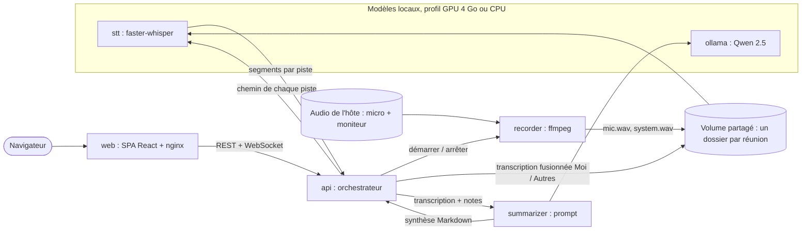

import Tabs from '@theme/Tabs';
import TabItem from '@theme/TabItem';

<ProjectMeta
  start="2026"
  end="2026"
  role="Auteur (projet solo)"
  domain="Transcription et synthèse de réunions, IA locale"
  stack={["Python", "FastAPI", "React", "TypeScript", "faster-whisper", "Ollama", "Docker Compose"]}
/>

## Contexte

Rédiger le compte rendu d'une réunion prend du temps, et les outils qui l'automatisent envoient l'audio à un service cloud pour la transcription et la synthèse. Le contenu des réunions de travail (clients, chiffrages, décisions internes) ne doit pas sortir de la machine. J'ai donc construit un enregistreur qui fait toute la chaîne en local, de la capture audio au compte rendu, sans aucun appel réseau vers un service tiers : les modèles de transcription et de langage tournent sur le poste, dans des conteneurs.

L'outil devait aussi rester invisible pendant la réunion : aucun bot à inviter, aucun plugin dans le logiciel de visioconférence, seulement l'audio de la machine.

## Aperçu

Captures réalisées sur une instance locale peuplée de réunions fictives.

<Tabs>
  <TabItem value="accueil" label="Accueil">
    

    Le tableau de bord signale la réunion en cours et les synthèses en attente de relecture ou en échec.
  </TabItem>
  <TabItem value="reunion" label="Réunion en cours">
    

    Pendant la capture, un vumètre par piste (micro et sortie son) et un éditeur de notes enregistrées automatiquement.
  </TabItem>
  <TabItem value="session" label="Synthèse">
    

    La synthèse générée se modifie avant validation ; pistes, transcription et notes se téléchargent séparément ou en archive.
  </TabItem>
  <TabItem value="transcript" label="Transcription">
    

    Les segments des deux pistes, fusionnés par ordre chronologique et étiquetés Moi ou Autres.
  </TabItem>
  <TabItem value="historique" label="Historique">
    

    L'historique, nommé par les titres proposés par le modèle ; une session en erreur se relance depuis l'étape fautive.
  </TabItem>
</Tabs>

## Stack technique

  

    
Services

    
Python, FastAPI, Pydantic, httpx, WebSocket

  

  

    
Audio

    
ffmpeg, PulseAudio / PipeWire

  

  

    
IA locale

    
faster-whisper (transcription), Ollama et Qwen 2.5 Instruct (synthèse)

  

  

    
Frontend

    
React, TypeScript, Vite, servi par nginx

  

  

    
Conteneurisation

    
Docker Compose, profils GPU (NVIDIA Container Toolkit) et CPU

  

  

    
Qualité

    
pytest, Vitest, Testing Library, uv

  

## Architecture

Chaque responsabilité technique est isolée dans son propre conteneur, et seul l'orchestrateur porte un état :

| Service | Rôle |
|---|---|
| `web` | SPA React servie par nginx, qui relaie `/api` vers l'orchestrateur |
| `api` | Orchestrateur : API REST, WebSocket de statut, état des sessions, téléchargements |
| `recorder` | Capture des deux pistes audio avec ffmpeg, par le socket audio de l'hôte |
| `stt` | Transcription avec faster-whisper |
| `summarizer` | Construction du prompt et appel du modèle de langage |
| `ollama` | Serveur de modèles de langage |

Les services s'appellent en HTTP JSON, mais les fichiers audio ne transitent jamais par HTTP : ils s'échangent des chemins relatifs à un volume partagé. Il n'y a pas de base de données : chaque réunion est un dossier (deux pistes WAV, transcription JSON et Markdown, synthèse, fichier de statut), et l'historique se construit en listant les dossiers.

## Deux pistes plutôt qu'un modèle de diarisation

Le recorder enregistre en parallèle le micro et le moniteur de la sortie son, c'est-à-dire les autres participants. Chaque piste est transcrite séparément, puis les segments sont fusionnés par ordre chronologique et étiquetés « Moi » ou « Autres ». Cette séparation physique remplace un modèle de diarisation (attribution des paroles à des locuteurs) : elle est exacte par construction pour la distinction qui compte dans un compte rendu, savoir qui a pris un engagement, sans ajouter un modèle supplémentaire à faire tenir en mémoire. Elle ne distingue pas les participants distants entre eux.

## Pipeline et reprise sur erreur

Le pipeline se déroule en étapes explicites : enregistrement, transcription, synthèse, relecture, validé. L'interface suit l'avancement en direct par WebSocket et affiche le niveau de chaque piste pendant l'enregistrement. Toute défaillance d'un worker (GPU saturé, Ollama arrêté) fait passer la session en erreur en mémorisant l'étape fautive ; le bouton **Relancer** reprend le pipeline à cette étape, sans perdre l'audio déjà capturé. Un enregistrement silencieux ne déclenche pas la synthèse, pour ne pas laisser le modèle produire un compte rendu à partir de rien.

La synthèse (résumé, décisions, actions attribuées) est éditable avant validation. Le modèle propose aussi un titre propre à la réunion, qui sert à nommer la session dans l'historique. Chaque fichier se télécharge séparément, ou la session entière en archive ZIP.

## Notes de réunion

Pendant la réunion et après, un éditeur de notes enregistre automatiquement ce qui est saisi. Les notes priment sur la transcription en cas de contradiction : un nom propre mal transcrit ou un chiffre mal entendu se corrige d'une ligne. À la validation, les notes ajoutées depuis la dernière synthèse y sont fusionnées en arrière-plan ; une fusion en échec ramène la session en relecture sans toucher à la synthèse existante.

Deux points ont demandé un soin particulier. Côté interface, l'éditeur reste verrouillé tant que les notes déjà enregistrées ne sont pas chargées, sinon une saisie précoce aurait été écrasée, et l'indicateur d'enregistrement n'annonce jamais une sauvegarde avant la réponse du serveur. Côté prompt, les notes sont du texte libre insérées dans une instruction au modèle : elles sont délimitées par un séparateur qu'elles ne peuvent pas contenir, et leur taille est plafonnée.

## Faire tenir les modèles sur 4 Go de VRAM

Le profil GPU vise une carte de portable à 4 Go de mémoire vidéo. La transcription (`large-v3-turbo` quantifié en `int8_float16`, environ 1 Go) et la synthèse (Qwen 2.5 7B, environ 4,7 Go de poids) ne tiennent pas ensemble sur la carte. Le pipeline étant séquentiel, chaque modèle libère la mémoire vidéo dès qu'il a fini : le service de transcription décharge Whisper après chaque piste, et Ollama décharge le modèle de langage après chaque requête. Le modèle 7B déborde malgré tout en partie sur la RAM ; c'est accepté, la synthèse arrivant après la réunion, et il résume nettement mieux que la version 3B. Un profil CPU, avec des modèles réduits, valide le pipeline de bout en bout sur une machine sans carte graphique ; les deux profils partagent le même code et ne diffèrent que par l'image de transcription, les variables d'environnement et les réservations de périphériques.

Un piège est apparu en faisant tourner la pile sur une vraie réunion. Sans paramètre `num_ctx` explicite, Ollama utilisait une fenêtre de contexte d'environ 2 000 tokens : la transcription d'une réunion d'une heure, autour de 25 000 tokens, était tronquée sans erreur, et la synthèse ne portait que sur un fragment. La taille de contexte est désormais envoyée à chaque requête, et un prompt qui ne tient pas dans la fenêtre fait échouer l'étape de synthèse au lieu d'être tronqué en silence.

## Tests

Chaque service a sa suite pytest, le frontend la sienne avec Vitest et Testing Library, et un test vérifie la cohérence des fichiers Compose entre les deux profils : environ 235 tests au total. Le développement a été découpé en tâches indépendantes, chacune relue avant fusion ; plusieurs corrections viennent de ces revues (verrouillage de l'éditeur, sessions supprimées pendant un traitement, diffusion WebSocket bornée).

## Limites connues

- Le profil GPU a été dimensionné et validé statiquement pour la carte cible, sans mesure de performance sur ce matériel.
- La distinction des locuteurs s'arrête à « Moi » et « Autres ».
- La qualité de synthèse est bornée par la taille du modèle qui tient en mémoire, pas par la puissance de calcul.

Le dépôt est privé.
