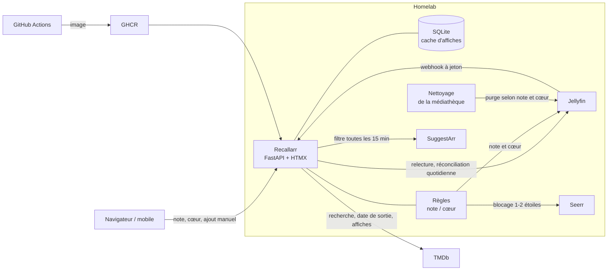

import Tabs from '@theme/Tabs';
import TabItem from '@theme/TabItem';

<ProjectMeta
  start="2026"
  end="2026"
  role="Auteur (projet solo)"
  domain="Médiathèque personnelle, application web auto-hébergée"
  stack={["Python", "FastAPI", "HTMX", "SQLite", "Jellyfin", "Docker", "GitHub Actions"]}
/>

## Contexte

La médiathèque de mon [homelab](homelab.md) est servie par Jellyfin, et nettoyée automatiquement : un titre regardé depuis longtemps et peu apprécié finit par être supprimé pour libérer de la place. Jellyfin oublie alors tout de lui, y compris le fait qu'il a été vu et la note qui lui avait été donnée. Ce qui manquait était une mémoire : savoir ce qui a déjà été regardé, ce qui a plu, et éviter qu'un titre déjà vu et mal noté revienne.

Les outils de suivi existants ont été évalués puis écartés : l'un dupliquait les fonctions de découverte et de demande déjà assurées ailleurs sans pouvoir les masquer, l'autre ne lisait ni la note ni l'historique de Jellyfin. J'ai donc écrit une application limitée à ce besoin, spécifiée, planifiée et livrée en une journée, en trois versions successives.

## Aperçu

Captures réalisées sur une instance locale peuplée de films du domaine public et de séries fictives ; les affiches sont des visuels générés pour l'occasion.

<Tabs>
  <TabItem value="journal" label="Journal">
    

    Chaque carte réunit l'affiche, la date de dernière lecture, la note en étoiles, le cœur et le devenir du titre, avec des filtres par état et par type.
  </TabItem>
  <TabItem value="devenir" label="Devenir des titres">
    

    Le filtre "À purger" liste les titres que le nettoyage retirera, avec la date prévue et la mention "puis bloqué" pour ceux notés 1 ou 2 étoiles.
  </TabItem>
  <TabItem value="purges" label="Purgés et bloqués">
    

    Un titre purgé reste dans le journal avec sa note et peut être redemandé ou bloqué ; un titre bloqué ne sera plus proposé.
  </TabItem>
  <TabItem value="ajout" label="Ajout d'un titre">
    

    Un titre vu hors de la médiathèque se retrouve par une recherche TMDb et s'ajoute avec sa date de visionnage, ou sa date de sortie si elle est inconnue.
  </TabItem>
  <TabItem value="mobile" label="Vue mobile">
    

    La grille passe à deux colonnes sur téléphone, où la note et le cœur se modifient au doigt.
  </TabItem>
</Tabs>

## Stack technique

  

    
Backend

    
Python, FastAPI, httpx, Jinja2

  

  

    
Frontend

    
HTMX, rendu serveur, lisible sur téléphone

  

  

    
Données

    
SQLite, cache disque des affiches

  

  

    
Intégrations

    
API Jellyfin (webhook et lecture), TMDb, outil de demandes de la médiathèque

  

  

    
CI/CD

    
GitHub Actions, GitHub Container Registry, Docker

  

  

    
Qualité

    
pytest, ty (vérification de types), uv

  

## Architecture

## Synchronisation : webhook et réconciliation

Le **webhook** de Jellyfin est la source principale : fin de lecture, modification des données utilisateur (note, favori), suppression d'un élément. Seuls l'identifiant et le type de l'élément sont lus dans la charge utile ; l'application relit ensuite l'élément dans l'API Jellyfin, ce qui la rend indépendante du format du webhook et garantit qu'elle travaille sur l'état réel. Le webhook est protégé par un jeton.

Un webhook peut se perdre (application arrêtée, redémarrage de Jellyfin). Une **réconciliation** au démarrage puis chaque nuit rattrape les événements manqués et détecte les titres sortis de la bibliothèque. Elle est écrite pour ne jamais conclure à tort : si Jellyfin répond vide ou en erreur, aucun titre n'est marqué comme purgé, faute de quoi une panne passagère effacerait tout le journal. Les séries sont suivies comme un tout et datées par leurs épisodes. Un verrou commun sérialise le traitement des webhooks et les modifications faites depuis l'interface.

## Règles de note et de favori

La note (en étoiles) et le favori de Jellyfin sont tenus cohérents par un petit jeu de règles, isolé dans son propre module et testé indépendamment :

- **5 étoiles** : le titre est un favori et reste dans la médiathèque ;
- **3 ou 4 étoiles** : le titre sera retiré au prochain nettoyage ;
- **1 ou 2 étoiles** : le titre est retiré puis bloqué dans l'outil de demandes (Seerr), pour qu'il ne soit plus jamais proposé ;
- le favori l'emporte sur la note : marquer un favori donne 5 étoiles, et une note plus basse est refusée tant que le favori est posé.

Chaque carte affiche le **devenir** du titre selon ces règles et la date de dernière lecture : gardé, retiré à telle date, ou bloqué. La note et le favori se modifient depuis l'interface, ce qui sert devant les clients TV qui n'affichent pas les notes : l'écriture se fait dans Jellyfin si le titre y est encore, dans le journal sinon, avec les mêmes règles.

## Titres vus ailleurs et suggestions

Un titre vu hors de la médiathèque (au cinéma, sur une autre plateforme) s'ajoute par une recherche TMDb, avec sa date de visionnage et une note facultative. Si la date est inconnue, la date de sortie est retenue, ou celle du dernier épisode diffusé pour une série. Les affiches sont cherchées dans un cache disque, puis dans Jellyfin, puis dans TMDb, et restent visibles après le retrait d'un titre ; la clé TMDb reste côté serveur.

Le journal sert aussi de filtre : toutes les 15 minutes, les suggestions automatiques en attente qui portent sur un titre déjà vu sont rejetées, et celles qui portent sur un titre mal noté ou bloqué sont écartées définitivement. Un titre inconnu du journal reste soumis à une validation manuelle.

## Déploiement

L'application tourne en conteneur sur le homelab, à côté de Jellyfin, et ne dépend d'aucune base externe. La CI GitHub Actions vérifie les types, exécute la centaine de tests (règles, synchronisation, clients d'API remplacés par des doubles, routes web) et publie l'image sur GitHub Container Registry. L'interface suit la charte graphique commune aux applications du homelab : thème sombre, un seul accent de couleur, nom en deux tons.

Un client d'API tiers reste une dépendance mouvante : une montée de version de l'outil de demandes a rendu obligatoire l'auteur d'un blocage, ce qui a cassé le blocage automatique jusqu'à la correction du client.

Le dépôt est privé.
