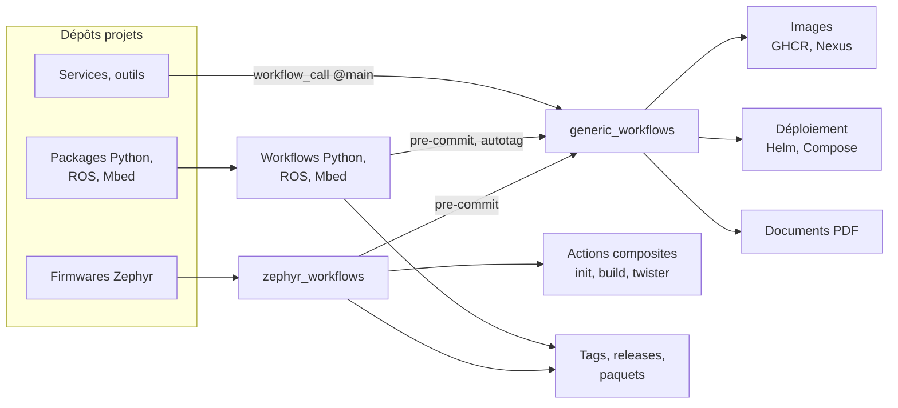
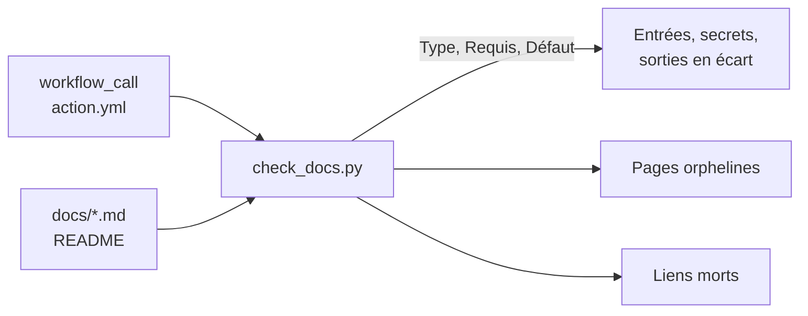

import Tabs from '@theme/Tabs';
import TabItem from '@theme/TabItem';

<ProjectMeta
  start="2024"
  role="Concepteur et mainteneur principal"
  domain="CI/CD mutualisée, standardisation"
  stack={["GitHub Actions", "Docker", "Helm", "Python", "ROS", "Zephyr"]}
/>

## Contexte

La migration des dépôts du CATIE de GitLab vers GitHub a posé une question concrète : comment éviter que chaque équipe réécrive ses propres pipelines CI/CD ? Le risque était d'obtenir autant de variantes de workflows que de projets, chacune légèrement différente et à maintenir séparément. J'ai conçu et mis en place une bibliothèque de **workflows réutilisables** GitHub Actions, organisée par domaine technologique, que tous les projets de l'organisation peuvent appeler avec quelques lignes de configuration.

## Approche : un workflow central, des dizaines de projets appelants

GitHub Actions propose le déclencheur `workflow_call`, qui permet à un workflow d'être appelé depuis un autre dépôt. La logique CI/CD vit ainsi à un seul endroit : quand un workflow est mis à jour (nouvelle version d'un outil, correction d'un bug, ajout d'une fonctionnalité), tous les projets qui l'appellent sur la branche principale en bénéficient au prochain déclenchement, sans toucher à leur propre code. La contrepartie est qu'une régression se propage aussi vite qu'une correction : aucun tag de version n'est publié et tous les projets suivent la branche principale, ce qui fait de la revue par pull request le principal garde-fou.

Les projets consommateurs n'ont qu'à préciser le workflow à appeler et quelques paramètres propres à leur contexte. Le reste (étapes, choix des runners, gestion des secrets) est centralisé. Les jobs s'exécutent sur les [runners auto-hébergés ARC](github-arc-kubeadm.md) du cluster interne.

Les workflows de famille ne réimplémentent pas les briques transverses : le pre-commit et le tag automatique viennent de `generic_workflows`, appelé à son tour par workflow réutilisable.

## Les domaines couverts

<Tabs>
  <TabItem value="generic" label="Generic">
    Le dépôt générique couvre les besoins transverses à toute technologie : publication d'images Docker sur GHCR et Nexus, déploiement via Helm ou Docker Compose, versionnage automatique par tag, exécution et mise à jour des hooks pre-commit, test de génération des [templates Cookiecutter](standards-python.md), et génération de PDF depuis Markdown avec Pandoc. Le workflow `docker-test` passe les Dockerfile au linter hadolint, qui échoue dès le niveau `warning` ; les règles trop strictes pour un contexte donné s'ignorent une par une plutôt qu'en baissant le seuil. Depuis octobre 2026, `docker-ghcr` peut publier en plus un tag immuable `sha-<commit>`, que le [cluster interne](sonu-k8s-cluster.md) utilise pour déployer un build précis au lieu du tag de branche.
  </TabItem>
  <TabItem value="python" label="Python">
    Les workflows Python couvrent le cycle de vie d'un package : tests avec pytest, publication sur un serveur SFTPGo interne, et tag automatique à partir de la version déclarée dans le manifeste. Le dépôt a évolué avec les pratiques de l'équipe : des équivalents uv des workflows Poetry ont été ajoutés au fil de la migration des projets Python.
  </TabItem>
  <TabItem value="ros" label="ROS">
    Les workflows ROS couvrent ROS 1 Noetic et plusieurs distributions ROS 2. Ils s'appuient sur les outils officiels `ros-tooling` pour la configuration de l'environnement, la compilation et les tests, ainsi qu'une étape optionnelle de lint Python. Ces workflows tournent sur les runners auto-hébergés ARC pour disposer de l'environnement ROS sans l'installer à chaque job.
  </TabItem>
  <TabItem value="zephyr" label="Zephyr">
    Ce dépôt couvre la compilation et les tests de firmwares Zephyr : applications, bibliothèques, drivers, cartes et shields. Il gère la génération du manifeste `west.yml`, le support multi-cartes et l'accès aux dépôts privés de l'organisation via un jeton d'accès personnel. Je le co-maintiens avec un collègue de l'équipe embarquée, principal contributeur des workflows propres à Zephyr.
  </TabItem>
</Tabs>

## Documentation et vérification doc / code

Fin septembre 2026, la bibliothèque comptait plusieurs dizaines de workflows et d'actions composites, documentés de façon inégale : certains par un README succinct, d'autres pas du tout. Pour un appelant, la seule référence fiable était le YAML lui-même. J'ai documenté l'ensemble des dépôts (`generic_workflows`, `python_workflows`, `ros_workflows`, `mbed_workflows`, `zephyr_workflows` et le banc d'essai `python_package-ci`) au même format : une page par workflow réutilisable et par action composite, avec exemple d'appel, entrées, secrets, sorties, fonctionnement, dépendances et points d'attention. Celle de `zephyr_workflows`, co-maintenu avec l'équipe embarquée, est proposée en pull request et en cours de revue. Règle tenue sur toute la campagne : la documentation décrit le code tel qu'il est, et les anomalies constatées sont signalées, pas corrigées en passant, pour que chaque correction reste une modification relue de son côté.

Au-dessus de ces références par dépôt, un dépôt transverse porte trois documents au format des modes opératoires de l'équipe :

- un **catalogue** de tous les workflows (rôle, runner, appelants connus, statut) et des anomalies relevées à la lecture du code, classées par gravité : sécurité, comportement faux ou trompeur, appels vers des workflows supprimés, dette technique (syntaxe dépréciée, actions en version ancienne) ;
- un **guide** d'utilisation pour les équipes appelantes, dont la gestion des permissions du jeton, plafonnées par celles du job appelant ;
- un **mode opératoire** pour modifier un workflow partagé sans casser ses appelants, puisque tous pointent sur `@main` et reçoivent une modification au run suivant.

Une documentation écrite à la main dérive dès la modification suivante du code. Un script Python, exécuté sur chaque dépôt de workflows, relit les déclarations `workflow_call` et `action.yml` et les compare aux tableaux de la documentation : présence de chaque entrée, secret et sortie, et concordance des colonnes Type, Requis et Défaut. Il signale aussi les pages orphelines, qui documentent un workflow supprimé, et les liens cassés. Il est couvert par sa propre suite de tests.

## Résultats

En septembre 2026, la recherche de code GitHub recense plus de 70 dépôts de l'organisation qui appellent `generic_workflows`, près de 90 pour `zephyr_workflows`, une trentaine pour `python_workflows` et 17 pour `ros_workflows`. Le déploiement de tous les services du [cluster Kubernetes interne](sonu-k8s-cluster.md) passe par le même workflow `deploy-helm`. La campagne de documentation de septembre 2026 a relevé une vingtaine d'anomalies jusque-là invisibles, dont une comparaison de versions qui ne détecte pas le passage de `1.10.0` à `2.0.0` et plusieurs appels vers des workflows supprimés ; elles sont désormais recensées et priorisées dans le catalogue.

## Liens

- [generic_workflows](https://github.com/catie-aq/generic_workflows)
- [ros_workflows](https://github.com/catie-aq/ros_workflows)
- [zephyr_workflows](https://github.com/catie-aq/zephyr_workflows)

`python_workflows`, `mbed_workflows` et le dépôt de documentation transverse sont privés à l'organisation.
