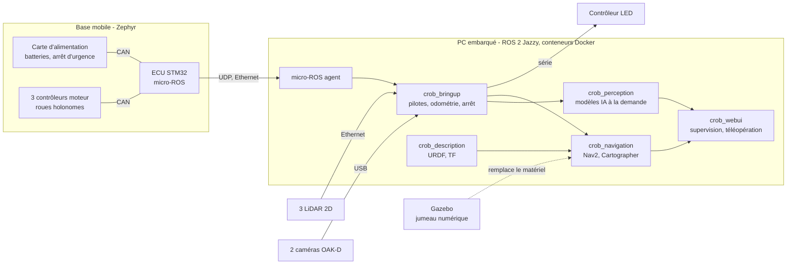

import Tabs from '@theme/Tabs';
import TabItem from '@theme/TabItem';

<ProjectMeta
  start="2024"
  role="Coordination technique, lead ROS 2 (Python)"
  domain="Robotique de service modulaire, architecture distribuée, navigation, perception"
  stack={["ROS 2", "Python", "Zephyr", "micro-ROS", "Nav2", "Gazebo", "Docker", "GitHub Actions"]}
/>

## Contexte

Pendant six ans, l'équipe CATIE Robotics a concouru à la RoboCup@Home avec un TIAGo de PAL Robotics (voir [RoboCup@Home 2023](./robocup-home-2023-catie.md)). Une plateforme commerciale fermée impose ses limites : capteurs et calculateur figés, firmware inaccessible, pièces et évolutions dépendantes du constructeur. Début 2024, le CATIE a lancé un groupe de travail pour concevoir sa propre plateforme : C-Rob, un démonstrateur de robotique de service dont toute la chaîne (mécanique, électronique, firmware, logiciel) est maîtrisée en interne.

Le cahier des charges est issu de l'analyse des épreuves RoboCup@Home et des besoins du CATIE : navigation rapide et précise en intérieur (passage de portes de 70 cm, évitement d'obstacles dynamiques, suivi de personnes), perception de l'environnement à 360°, détection et ré-identification de personnes, et à terme manipulation d'objets. La plateforme est pensée comme un empilement de modules détachables :

- **Base mobile** : trois roues omnidirectionnelles (cinématique holonome), trois LiDAR 2D en couronne, batteries et carte d'alimentation, calculateur temps réel (ECU) sous Zephyr.
- **Module central C2I** : PC embarqué sous ROS 2 Jazzy, caméras RGB-D OAK-D, écran, haut-parleur et bandeaux LED pour l'interaction.
- **Module bras** : prévu dans la spécification, pas encore intégré.

## Aperçu

<Tabs>
  <TabItem value="description" label="Description URDF">
    

    Rendu des maillages de la description URDF/XACRO (base mobile et module C2I), celle utilisée par RViz et par la simulation Gazebo.
  </TabItem>
  <TabItem value="materiel" label="Architecture matérielle">
    

    Schéma d'architecture issu de la phase de spécification (2024) : réseau Ethernet, liaisons capteurs et budget d'alimentation de chaque module.
  </TabItem>
</Tabs>

## Architecture

L'architecture logicielle suit deux niveaux. Les microcontrôleurs de la base mobile, sous Zephyr RTOS, gèrent tout ce qui relève du temps réel et de la sûreté : commande des moteurs, odométrie, alimentation, arrêt d'urgence. Ils dialoguent entre eux sur bus CAN. L'ECU expose la base au reste du robot sous forme de nœud ROS 2 grâce à micro-ROS, sur UDP via Ethernet. Le PC embarqué exécute ROS 2 Jazzy : chaque bloc fonctionnel (bringup matériel, description, navigation, perception, interface web) est un paquet distinct livré dans sa propre image Docker.

## Réalisations

<Tabs>
  <TabItem value="spec" label="Spécification">
    J'ai animé la phase de spécification en 2024 : analyse des besoins par axe (navigation, perception, IA, manipulation), avec pour chaque axe ce qu'exige la RoboCup@Home, ce qui intéresse le CATIE au-delà de la compétition, et les dépendances entre axes. Les états de l'art (roues holonomes, bras collaboratifs, capteurs) ont été menés en équipe. J'ai produit les schémas d'architecture du robot (topologie réseau, liaisons capteurs, découpage en modules détachables), complétés par l'équipe électronique pour le budget d'alimentation. Cette phase a fixé les choix structurants : cinématique holonome, LiDAR en couronne, calculateur temps réel distinct du PC embarqué.
  </TabItem>
  <TabItem value="workspace" label="Workspace et déploiement">
    J'ai conçu l'organisation logicielle : un dépôt par bloc fonctionnel (bringup, description, navigation, perception, messages, interface web), assemblés dans un workspace ROS 2 par sous-modules Git, et un dépôt racine qui référence aussi les firmwares. Le workspace fournit une image de base ROS 2 Jazzy en deux cibles (`dev` pour le devcontainer, `prod` pour le robot) ; chaque paquet construit sa propre image à partir de cette base et la publie sur le registre de conteneurs GitHub. Sur le robot, un fichier Docker Compose assemble les services, chacun doté d'un healthcheck sur son nœud principal et redémarré automatiquement.

    Toute la configuration du robot tient dans un seul fichier YAML (namespace, simulation ou matériel réel, carte, monde Gazebo, paramètres Nav2) monté dans chaque conteneur et désigné par une variable d'environnement. Il est validé par un schéma JSON au lancement : une clé absente ou mal typée arrête le démarrage au lieu de produire un comportement incohérent plus loin.

    Chaque dépôt partage la même chaîne CI : pre-commit, build et tests ROS 2, lint et publication de l'image Docker, publication automatique d'un tag quand la version du paquet change, mise à jour hebdomadaire des hooks.
  </TabItem>
  <TabItem value="simulation" label="Description et simulation">
    J'ai écrit la description du robot en XACRO modulaire : base, module C2I, roues omnidirectionnelles modélisées rouleau par rouleau, deux caméras OAK-D et trois LiDAR, chaque composant étant une macro paramétrée par sa position. Un module Python génère l'URDF puis le SDF à la volée selon le namespace du robot et remonte les erreurs XACRO de façon explicite.

    Le paquet de simulation lance Gazebo, y insère le robot et configure les ponts ROS 2 - Gazebo (commande de vitesse, odométrie, TF, états des articulations, scans LiDAR). Un nœud de post-traitement republie les scans simulés sous les mêmes noms et repères que ceux du robot réel. La navigation se lance donc à l'identique en simulation et sur le robot : seul le fichier de configuration change.
  </TabItem>
  <TabItem value="bringup" label="Bringup matériel">
    Le paquet de bringup regroupe tout ce qui parle au matériel : agent micro-ROS, pilote des LiDAR (acquisition et configuration à distance), pilote des caméras OAK-D, transformation de l'odométrie brute de l'ECU en odométrie ROS 2 avec sa TF, fusion des images des deux caméras en nuage de points, surveillance des caméras avec relance automatique quand un flux se fige. J'ai structuré le paquet, écrit le lancement unifié piloté par le fichier de configuration et la conversion d'odométrie, puis ajouté l'arrêt sécurisé (sur demande de la carte d'alimentation, tous les nœuds passent en état `shutdown`, puis le système s'éteint si l'option est activée) et le pilotage des bandeaux LED par un message ROS 2 dédié (effet, couleurs, luminosité, vitesse). La surveillance des caméras et la fusion d'images ont été développées pendant un stage.
  </TabItem>
  <TabItem value="navigation" label="Navigation">
    J'ai intégré la pile Nav2 : localisation AMCL sur carte, planification globale, contrôleur MPPI, costmaps, collision monitor, navigation par waypoints, et Cartographer pour la cartographie 2D à partir des trois LiDAR et de l'odométrie. Le contrôleur MPPI a été retenu parce qu'il échantillonne directement des commandes en x, y et rotation : il exploite la cinématique holonome de la base, là où un contrôleur pensé pour une base différentielle la brident. Le paquet fournit aussi la téléopération au clavier pour les phases de cartographie.
  </TabItem>
  <TabItem value="perception" label="Perception">
    La perception est un travail d'équipe, dont une large part a été développée lors d'un stage de fin d'études. Un nœud orchestrateur pilote des nœuds d'inférence spécialisés (objets, personnes), qui lancent à leur tour les modèles : YOLOv8 associé à SAM pour la détection et la segmentation d'objets, MoveNet pour la pose, un modèle de ré-identification qui maintient une bibliothèque de signatures des personnes rencontrées. Chaque modèle tourne dans son propre processus, avec ses propres dépendances, en nœud à cycle de vie relancé automatiquement en cas d'arrêt ; les requêtes passent par des actions ROS 2 qui renvoient un retour de progression. J'ai structuré le dépôt, centralisé les interfaces (actions et messages) dans un paquet dédié et mis en place sa CI.
  </TabItem>
  <TabItem value="embarque" label="Embarqué et interface">
    Les firmwares sont le travail de l'équipe électronique et embarqué. L'ECU, sur un STM32H7 sous Zephyr, calcule la cinématique holonome, pilote les trois contrôleurs moteur par CAN, intègre l'odométrie et la publie via micro-ROS, avec les états des deux batteries remontés par la carte d'alimentation. La carte d'alimentation gère la sélection de batterie, l'arrêt d'urgence et la demande d'extinction ; le contrôleur LED pilote les bandeaux à partir de commandes sérialisées. Un module Zephyr commun définit le protocole CAN entre ces cartes. Côté opérateur, une interface web (FastAPI, Bootstrap), développée elle aussi pendant le stage, affiche l'état du robot (batteries, caméras, ré-identification) et permet la téléopération au joystick.
  </TabItem>
</Tabs>

## Décisions techniques

- **Temps réel sur microcontrôleur, intelligence sur PC.** La boucle de commande des moteurs, l'arrêt d'urgence et la gestion des batteries ne dépendent ni de l'ordonnancement de Linux ni de l'état de la pile ROS 2. Un redémarrage du PC embarqué ou d'un conteneur ne laisse pas la base sans contrôle.
- **micro-ROS sur Ethernet plutôt qu'une liaison série propriétaire.** L'ECU apparaît comme un nœud ROS 2 parmi d'autres : ses topics s'inspectent, s'enregistrent et se rejouent avec les outils standard. Le message d'odométrie publié par le microcontrôleur reste volontairement léger (pose horodatée, QoS best effort) ; la conversion en odométrie complète et la TF sont faites côté PC.
- **Un dépôt et une image par bloc fonctionnel.** Chaque bloc se versionne, se teste et se déploie seul, ce qui permet à plusieurs équipes (embarqué, navigation, perception) d'avancer en parallèle sans bloquer les autres. Le workspace par sous-modules fige une combinaison cohérente de versions.
- **Parité simulation / réel.** Mêmes noms de topics, mêmes repères, mêmes fichiers de lancement : le jumeau numérique permet de développer et de tester la navigation sur n'importe quel poste, sans mobiliser le robot.
- **Perception à la demande.** Avec un calcul embarqué limité, les modèles ne tournent pas en permanence : chacun est activé quand la tâche en cours en a besoin, dans un processus isolé dont le crash n'emporte pas le reste de la perception.

## Mon rôle

Sur la coordination technique : animation de la phase de spécification, découpage du robot en modules et en dépôts, définition des interfaces entre équipes (topics, messages, protocole), conventions communes (CI, pre-commit, changelog, documentation de chaque paquet), suivi de l'intégration. Sur le développement, j'ai été le contributeur principal des dépôts ROS 2 Python : workspace et déploiement Docker, bringup, description et simulation, navigation, ainsi que la structuration de la perception et des messages. Les firmwares, les modèles de perception et l'interface web sont le travail de collègues et de stagiaires, que j'ai accompagnés sur l'intégration ROS 2.

## Résultats

- Une plateforme maîtrisée de bout en bout, de la carte d'alimentation jusqu'aux modèles d'IA, conçue et assemblée en interne.
- Une base mobile holonome opérationnelle, pilotée depuis ROS 2 via micro-ROS, avec cartographie, localisation et navigation autonome.
- Un jumeau numérique Gazebo qui reproduit les interfaces du robot réel, utilisé pour le développement et la prise en main par les nouveaux contributeurs.
- Une pile entièrement conteneurisée et versionnée : le déploiement sur le robot consiste à mettre à jour un fichier de configuration et à tirer les images publiées par la CI.
- Une perception modulaire (objets, pose, ré-identification) démontrée sur le robot.

## Limites et suite

Au printemps 2026, plusieurs chantiers restent ouverts. Le module bras, spécifié dès 2024, n'est pas encore intégré. Le déploiement Compose ne couvre pas encore tous les blocs : la perception et la cartographie se lancent à part, et l'image de navigation n'embarque que Nav2. Les costmaps de navigation n'exploitent que les trois LiDAR : un obstacle hors de leur plan de balayage (plateau de table, objet posé en hauteur) n'est pas vu par Nav2 tant que les caméras RGB-D n'y sont pas branchées. Enfin, la chaîne vocale et les machines à états des épreuves RoboCup@Home, qui existaient sur la plateforme précédente, ne figurent pas encore dans le workspace C-Rob.

## Liens

- [Rapport d'activités CATIE 2025 (PDF)](https://www.catie.fr/wp-content/uploads/2026/04/RA2025_web.pdf)
