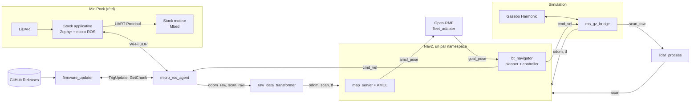

import Tabs from '@theme/Tabs';
import TabItem from '@theme/TabItem';

<ProjectMeta
  start="Septembre 2023"
  end="Décembre 2025"
  role="Développeur principal et mainteneur de la pile ROS 2"
  domain="Robotique mobile, simulation, systèmes multi-robots"
  stack={["ROS 2", "Nav2", "Gazebo", "micro-ROS", "Open-RMF", "Zephyr", "Docker", "GitHub Actions", "Python"]}
/>

## Contexte

Le CATIE développe 6TRON, une famille de cartes électroniques modulaires (cœurs STM32, cartes de puissance, radio, prototypage) destinées à accélérer le prototypage de systèmes embarqués. MiniPock est la plateforme robotique mobile construite sur ces cartes : un châssis hexagonal de 33,5 cm et 3,85 kg, sur batterie 4S, qui sert à la fois de démonstrateur de l'écosystème 6TRON et de base de développement pour des applications ROS 2 (navigation, cartographie, flottes de robots).

Le besoin était double. Côté robot, il fallait une pile logicielle capable de piloter deux cinématiques, différentielle et holonome, sans dupliquer le code. Côté équipe, il fallait pouvoir développer et tester sans robot physique sous la main, puis passer à plusieurs robots partageant le même espace. J'ai porté la partie ROS 2 du projet de septembre 2023 à décembre 2025 : environ 320 des 420 commits du dépôt principal, plus l'ensemble des dépôts initiaux (description, simulation, navigation, bringup) avant leur fusion.

## Aperçu

<Tabs>
  <TabItem value="differentiel" label="Différentiel">
    

    Version différentielle : deux moteurs DC, LiDAR sur platine surélevée, stacks 6TRON applicative et de contrôle moteur sur les flancs.
  </TabItem>
  <TabItem value="holonome" label="Holonome">
    

    Version holonome : trois roues omnidirectionnelles à 120°, même châssis et mêmes stacks électroniques que la version différentielle.
  </TabItem>
  <TabItem value="simulation" label="Simulation multi-robots">
    

    Cinq MiniPock instanciés dans un entrepôt simulé sous Gazebo Harmonic, chacun dans son propre namespace ROS 2, à partir d'un seul fichier de configuration de flotte.
  </TabItem>
  <TabItem value="rmf" label="Navigation de flotte">
    

    Deux MiniPock localisés sur la même carte dans RViz, chacun avec sa propre pile Nav2 et ses costmaps, en configuration Open-RMF.
  </TabItem>
</Tabs>

## Architecture

Le robot embarque deux stacks 6TRON. La stack applicative (Zephyr, micro-ROS) lit le LiDAR, publie l'odométrie et reçoit les commandes de vitesse ; elle les transmet par UART, en Protobuf, à la stack de contrôle moteur (Mbed) qui convertit une consigne en x, y, θ en commande de chaque moteur. Tout le reste tourne sur un poste distant, relié au robot en Wi-Fi par l'agent micro-ROS. La simulation remplace le robot par Gazebo derrière les mêmes topics, ce qui laisse la navigation inchangée entre réel et simulé.

## Réalisations

<Tabs>
  <TabItem value="ros2" label="Pile ROS 2">
    J'ai écrit la description du robot (URDF/xacro paramétrable), le bringup, les ponts Gazebo et le paquet de navigation, d'abord dans des dépôts séparés, puis je les ai fusionnés en un dépôt unique à la version 2.0.0 : les paquets évoluaient toujours ensemble, et la synchronisation de quatre dépôts coûtait plus qu'elle n'apportait.

    La décision structurante a été de centraliser toute la configuration dans un fichier YAML unique (`minipocks.yaml`), validé par un schéma JSON au lancement : namespace, carte, monde de simulation, configuration RViz et, pour chaque robot de la flotte, sa cinématique et sa position initiale. Description, simulation, bringup et navigation lisent tous ce même fichier. Ajouter un robot ou passer un robot de différentiel à holonome revient à modifier une ligne, sans toucher aux fichiers de lancement.

    Les deux cinématiques partagent le même modèle et la même pile, et ne diffèrent que par les plugins Gazebo (diff-drive d'un côté, contrôle de vitesse et publication d'odométrie de l'autre) et par les paramètres Nav2 : modèle de mouvement AMCL omnidirectionnel ou différentiel, vitesse latérale autorisée ou non dans le contrôleur DWB.
  </TabItem>
  <TabItem value="simulation" label="Simulation et multi-robots">
    J'ai construit le jumeau numérique sous Gazebo dès le début du projet, pour développer la navigation en parallèle de la mécanique. Il a été migré en 2024 de ROS 2 Humble vers ROS 2 Jazzy et Gazebo Harmonic.

    Le passage au multi-robots a demandé de préfixer chaque topic, frame TF, paramètre et nœud par le namespace du robot, du modèle URDF jusqu'aux costmaps Nav2. Une collègue a mené ce travail de namespacing en 2024, que j'ai ensuite intégré dans la configuration centralisée. Les robots sans position initiale sont répartis automatiquement en couronnes autour de l'origine, ce qui permet d'instancier une flotte de taille quelconque.

    La cartographie passe par Cartographer, et la téléopération dispose d'un mode clavier classique et d'un mode "FPS" (pilotage par maintien des touches, à la manière d'un jeu vidéo).
  </TabItem>
  <TabItem value="embarque" label="Lien avec l'embarqué">
    Le firmware Zephyr et le contrôle moteur Mbed ont été développés par des collègues de l'équipe ; j'ai travaillé sur leur interface avec ROS 2. L'agent micro-ROS est lancé par le bringup, et le nœud `raw_data_transformer` convertit les messages bruts du microcontrôleur (pose et scan) en odométrie, scan et transformations TF exploitables par Nav2. Un collègue y a ajouté en 2025 une fusion par filtre de Kalman de deux sources d'odométrie.

    La version 2.1.0 a supprimé la Raspberry Pi embarquée : le microcontrôleur communique directement en Wi-Fi avec l'agent micro-ROS du poste distant. Le robot y gagne en simplicité et en autonomie, au prix d'une dépendance au réseau que l'architecture assume.

    Pour mettre à jour une flotte sans câble, j'ai développé `minipock_firmware_updater` et les messages `minipock_msgs` associés : le nœud interroge les releases GitHub du firmware, et le robot télécharge la nouvelle version par segments via deux services ROS 2 (`TrigUpdate`, `GetChunk`), avec somme de contrôle CRC8 par segment. J'ai aussi mis en place la CI de compilation du firmware et contribué à son interface web de configuration (Wi-Fi, namespace, adresse de l'agent).
  </TabItem>
  <TabItem value="rmf" label="Open-RMF">
    Pour la planification de missions sur une flotte, le projet s'est appuyé sur Open-RMF, le framework de gestion de flottes hétérogènes basé sur ROS 2. Une collègue a réalisé la première intégration : carte et graphe de navigation dessinés dans le Traffic Editor, adaptateur de flotte qui lit la pose AMCL de chaque robot et lui envoie ses objectifs sur `goal_pose`, et tâche de patrouille de démonstration.

    J'ai intégré ce travail dans le dépôt (paquet `minipock_fleet_adapter`, dépendances Open-RMF dans l'image Docker), aligné cartes et mondes sur la configuration centralisée, puis complété le mode holonome (plugins Gazebo, paramètres Nav2) pour l'utiliser dans les scénarios de flotte.
  </TabItem>
  <TabItem value="outillage" label="CI, Docker et documentation">
    L'environnement de développement est entièrement conteneurisé : un Dockerfile multi-étapes produit une image de base ROS 2 Jazzy (Nav2, Cartographer, Open-RMF), une image `simulation` (Gazebo Harmonic, ros_gz) et une image `real` (agent micro-ROS), publiées sur GitHub Container Registry et utilisées aussi comme devcontainer. Un fichier Docker Compose lance l'une ou l'autre.

    La CI GitHub Actions s'appuie sur les workflows réutilisables de l'organisation : pre-commit, compilation et tests ROS 2, lint et publication des images Docker, tag automatique à chaque nouvelle version, mise à jour automatique des hooks.

    J'ai écrit l'essentiel de la documentation, regroupée dans un dépôt dédié et versionnée par release (installation, démarrage rapide, bringup, simulation, navigation, SLAM, système embarqué, mise à jour, planification de missions). Chaque version de MiniPock y référence les versions compatibles de la mécanique, du firmware et des paquets ROS, chacun suivant son propre cycle SemVer.
  </TabItem>
</Tabs>

## Équipe

J'ai été l'auteur principal de la pile ROS 2 et de sa documentation. Le firmware Zephyr est essentiellement l'œuvre d'un collègue, qui a aussi contribué au nœud de mise à jour ; une collègue a porté le namespacing multi-robots et la première intégration Open-RMF ; un autre collègue a ajouté la fusion d'odométrie.

## Résultats

- Quatre versions publiées (1.0.0 à 2.2.0), avec changelog et documentation versionnée alignés sur la mécanique et le firmware.
- Une seule pile ROS 2 pour deux cinématiques, différentielle (jusqu'à 2 m/s et 12 rad/s) et holonome, sélectionnées par configuration.
- Une flotte de N robots en simulation ou en réel à partir d'un seul fichier de configuration, avec navigation Nav2 indépendante par robot et coordination par Open-RMF.
- Un environnement reproductible : image Docker et devcontainer prêts à l'emploi, sans installation locale de ROS 2 ni de Gazebo.
- Des robots sans ordinateur embarqué, pilotés et mis à jour à distance par ROS 2 via micro-ROS.

## Liens

- [Dépôt `minipock` (paquets ROS 2)](https://github.com/catie-aq/minipock)
- [Dépôt `minipock_documentation`](https://github.com/catie-aq/minipock_documentation)
- [Dépôt `minipock_zephyr-demo` (firmware Zephyr)](https://github.com/catie-aq/minipock_zephyr-demo)
- [6TRON](https://6tron.io/)
