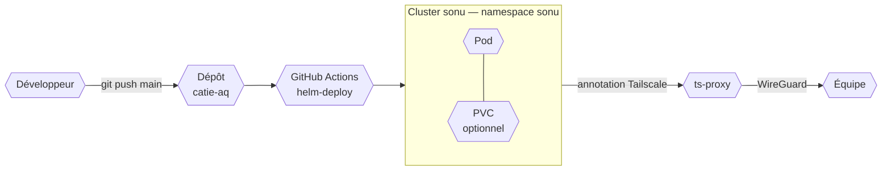

  
📅 2023 – en cours

  
👤 Rôle : Concepteur & mainteneur

  
🛠️ Python · FastAPI · React · Slack API · Kubernetes · Helm

## Le contexte

Dans une petite équipe technique, il y a toujours un tas de tâches récurrentes que personne ne fait parce qu'elles sont ennuyeuses, chronophages, ou tout simplement oubliées. Suivre la charge de travail des projets actifs. Attraper une correction de stock anormale dans l'ERP avant qu'elle ne fausse les prix. Envoyer manuellement un email à chaque demande de téléchargement. Ce sont de petites frictions quotidiennes — individuellement tolérables, collectivement significatives.

Ces outils ne sont pas des projets clients. Ils existent parce qu'un problème concret se répétait et que l'automatiser coûtait moins cher que de continuer à le subir. Tous tournent sur le cluster Kubernetes interne de l'équipe, déployés via Helm, et font partie du quotidien depuis des mois sans nécessiter d'attention particulière.

## Outils développés

### Dashboard de charge Jira

Suivre la charge de travail sur plusieurs projets actifs en parallèle, avec Jira seul, c'est rarement satisfaisant. Les vues natives sont soit trop détaillées, soit pas assez agrégées pour avoir une vue d'ensemble.

Le jira-dashboard est une application FastAPI + React qui expose quelques endpoints simples : tickets par période, heatmap annuelle de charge, répartition par utilisateur. L'interface est minimaliste — pas de configuration, pas de comptes à gérer. C'est une fenêtre de lecture sur les données Jira, pensée pour les revues d'équipe et les bilans mensuels.

### Alertes de mouvement de stock

L'équipe utilise Dolibarr comme ERP pour la gestion des stocks et des commandes. Une correction de stock non documentée — qu'elle soit due à une erreur de saisie ou à un ajustement non annoncé — peut passer inaperçue et créer des incohérences en comptabilité ou dans les commandes fournisseurs.

Un bot surveille l'API Dolibarr en continu et envoie une alerte Slack dès qu'une correction de stock est détectée. Ce n'est pas un contrôle d'accès, c'est une transparence automatique : l'équipe est au courant immédiatement, sans qu'il faille aller regarder les logs manuellement.

### Envoi de ressources 6TRON

La marque matérielle du CATIE, 6TRON, met à disposition des fichiers de conception (Altium, documentation technique) sur son site web. Quand un utilisateur soumet une demande de téléchargement depuis le formulaire, une notification arrive dans Slack — et il fallait ensuite envoyer manuellement l'email avec le lien.

Le bot automatise cette chaîne depuis l'entrée jusqu'à la sortie : il écoute les notifications Slack, récupère l'URL de téléchargement correspondante dans un fichier YAML centralisé, et envoie l'email via Mailjet sans intervention humaine. Un canal Slack reçoit la confirmation d'envoi. Le bot expose des endpoints `/health` et `/ready` que Kubernetes utilise pour décider de redémarrer le pod en cas d'erreur fatale.

### Recherche de composants électroniques

Le bot de recherche de composants a été développé par un collègue. Il répond à un besoin réel de l'équipe : interroger simultanément les API Mouser, DigiKey et Farnell depuis Slack, en envoyant une référence unitaire ou un fichier BOM Excel, et obtenir disponibilité et prix en retour. Mon rôle se limite à la mise en production et à la maintenance infra sur le cluster.

### Site de documentation interne

Un site Docusaurus tourne sur le cluster et expose la documentation de l'équipe SONU sous forme de site web structuré, accessible sur le réseau interne. Le contenu est synchronisé depuis Dropbox avant chaque build. L'infrastructure du déploiement est sous ma responsabilité ; la production du contenu est collective.

## Déploiement : une chaîne uniforme

Ce qui rend cet ensemble maintenable, c'est que tous ces services suivent exactement le même modèle de déploiement. Chaque outil est une application Python gérée par Poetry, packagée dans une image Docker publiée sur le registre `ghcr.io/catie-aq/`. Son dépôt contient un chart Helm qui décrit le déploiement Kubernetes : `Deployment`, `ServiceAccount`, `PersistentVolumeClaim` si nécessaire, et la configuration via `values.yaml`.

Le déploiement est déclenché par un `git push` sur `main`. Le workflow GitHub Actions appelle le workflow réutilisable `helm-deploy` de [`generic_workflows`](/projects/professionnel/cicd), qui injecte le kubeconfig depuis les secrets du dépôt et applique le chart sur le cluster. Résultat : ajouter un nouveau service ou mettre à jour un existant prend quelques minutes, sans accès SSH direct au cluster.

L'exposition réseau est homogène elle aussi : chaque service reçoit une annotation Tailscale et devient accessible sur le réseau de l'équipe via son propre proxy. Pas d'ingress controller, pas de certificats TLS à gérer manuellement.

## Ce que ça représente

Ces outils ont en commun d'être petits, ciblés et maintenables. Chacun résout un problème précis sans essayer d'en résoudre dix. Dans une équipe qui pilote des projets clients, avoir des outils internes bien huilés libère du temps et de l'attention pour le travail qui compte.
