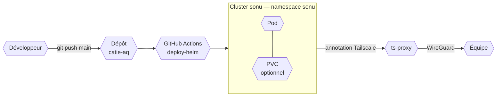

<ProjectMeta
  start="2023"
  role="Concepteur et mainteneur"
  domain="Automatisation interne, bots, outillage d'équipe"
  stack={["Python", "FastAPI", "React", "Slack API", "Kubernetes", "Helm"]}
/>

## Contexte

Dans une petite équipe technique, certaines tâches récurrentes finissent par ne plus être faites, parce qu'elles sont fastidieuses, chronophages ou simplement oubliées : suivre la charge de travail des projets actifs, repérer une correction de stock anormale dans l'ERP avant qu'elle ne fausse les prix, envoyer un e-mail à chaque demande de téléchargement. Individuellement tolérables, ces frictions deviennent significatives une fois cumulées.

Ces outils ne sont pas des projets clients. Chacun existe parce qu'un problème concret se répétait et que l'automatiser coûtait moins cher que de continuer à le traiter à la main. Tous tournent sur le [cluster Kubernetes interne](sonu-k8s-cluster.md) de l'équipe, déployés via Helm, et font partie du quotidien depuis des mois sans demander d'attention particulière.

## Outils développés

### Dashboard de charge Jira

Suivre avec Jira seul la charge de travail de plusieurs projets menés en parallèle est peu commode : les vues natives sont soit trop détaillées, soit pas assez agrégées pour donner une vue d'ensemble.

Le jira-dashboard est une application FastAPI + React qui expose quelques endpoints simples : tickets par période, heatmap annuelle de charge, répartition par utilisateur. L'interface est minimaliste, sans configuration ni comptes à gérer : c'est une fenêtre de lecture sur les données Jira, pensée pour les revues d'équipe et les bilans mensuels.

### Alertes de mouvement de stock

L'équipe utilise Dolibarr comme ERP pour la gestion des stocks et des commandes. Une correction de stock non documentée, qu'elle soit due à une erreur de saisie ou à un ajustement non annoncé, peut passer inaperçue et créer des incohérences en comptabilité ou dans les commandes fournisseurs.

Un bot surveille l'API Dolibarr en continu et envoie une alerte Slack dès qu'une correction de stock est détectée. Il ne s'agit pas d'un contrôle d'accès mais de transparence : l'équipe est informée immédiatement, sans consulter les journaux à la main.

### Envoi de ressources 6TRON

La marque matérielle du CATIE, 6TRON, met à disposition des fichiers de conception (Altium, documentation technique) sur son site web. Quand un utilisateur soumet une demande de téléchargement depuis le formulaire, une notification arrive dans Slack, et il fallait ensuite envoyer manuellement l'e-mail contenant le lien.

Le bot automatise cette chaîne de bout en bout : il écoute les notifications Slack, récupère l'URL de téléchargement correspondante dans un fichier YAML centralisé, et envoie l'e-mail via Mailjet sans intervention humaine. Un canal Slack reçoit la confirmation d'envoi. Le bot expose des endpoints `/health` et `/ready` que Kubernetes utilise pour décider de redémarrer le pod en cas d'erreur fatale.

### Recherche de composants électroniques

Le bot de recherche de composants a été développé par un collègue. Il répond à un besoin réel de l'équipe : interroger simultanément les API Mouser, DigiKey et Farnell depuis Slack, en envoyant une référence unitaire ou un fichier BOM Excel, et obtenir disponibilité et prix en retour. Mon rôle se limite à la mise en production et à la maintenance infra sur le cluster.

### Site de documentation interne

Un site Docusaurus tourne sur le cluster et expose la documentation de l'équipe SONU sous forme de site web structuré, accessible sur le réseau interne. Le contenu est synchronisé depuis Dropbox avant chaque build. L'infrastructure du déploiement est sous ma responsabilité ; la production du contenu est collective.

## Déploiement : une chaîne uniforme

L'ensemble reste maintenable parce que tous ces services suivent le même modèle de déploiement. Chaque outil est une application Python gérée par Poetry, packagée dans une image Docker publiée sur le registre `ghcr.io/catie-aq/`. Son dépôt contient un chart Helm qui décrit le déploiement Kubernetes : `Deployment`, `ServiceAccount`, `PersistentVolumeClaim` si nécessaire, et la configuration via `values.yaml`.

Le déploiement est déclenché par un `git push` sur `main`. Le workflow GitHub Actions appelle le workflow réutilisable `deploy-helm` de [`generic_workflows`](cicd.md), qui injecte le kubeconfig depuis les secrets et applique le chart sur le cluster. Ajouter un nouveau service ou mettre à jour un service existant se fait ainsi sans accès SSH au cluster.

L'exposition réseau est homogène elle aussi : chaque service reçoit une annotation Tailscale et devient accessible sur le réseau de l'équipe via son propre proxy, sans ingress controller ni ouverture de port.

```mermaid
flowchart LR
    dev{{Développeur}} -->|git push main| repo{{Dépôt\ncatie-aq}}
    repo --> gha{{GitHub Actions\ndeploy-helm}}
    gha --> cluster

    subgraph cluster["Cluster sonu — namespace sonu"]
        pod{{Pod}} --- pvc{{PVC\noptionnel}}
    end

    cluster -->|annotation Tailscale| ts{{ts-proxy}}
    ts -->|WireGuard| team{{Équipe}}
```

## Bilan

Ces outils ont en commun d'être petits, ciblés et maintenables : chacun résout un problème précis. Dans une équipe qui pilote des projets clients, ils libèrent du temps et de l'attention pour le travail à valeur ajoutée.

## Liens

- [Cluster Kubernetes interne SONU](sonu-k8s-cluster.md)
- [Workflows GitHub Actions mutualisés](cicd.md)
