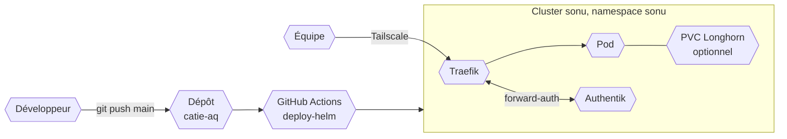

<ProjectMeta
  start="2023"
  role="Concepteur et mainteneur"
  domain="Automatisation interne, bots, outillage d'équipe"
  stack={["Python", "FastAPI", "React", "Slack API", "Kubernetes", "Helm"]}
/>

## Contexte

Dans une petite équipe technique, certaines tâches récurrentes finissent par ne plus être faites, parce qu'elles sont fastidieuses, chronophages ou simplement oubliées : suivre la charge de travail des projets actifs, repérer une correction de stock anormale dans l'ERP avant qu'elle ne fausse les prix, envoyer un e-mail à chaque demande de téléchargement. Individuellement tolérables, ces frictions deviennent significatives une fois cumulées.

Ces outils ne sont pas des projets clients. Chacun existe parce qu'un problème concret se répétait et que l'automatiser coûtait moins cher que de continuer à le traiter à la main. Les premiers étaient déployés en Docker Compose ; tous tournent aujourd'hui sur le [cluster Kubernetes interne](sonu-k8s-cluster.md) de l'équipe, déployés via Helm. Ils ont longtemps tourné sans intervention, avant d'être migrés sur le stockage répliqué Longhorn et durcis avec le reste des charts du cluster en septembre 2026.

## Outils développés

### Plan de charge

Suivre la charge de travail de plusieurs projets menés en parallèle demande une vue d'ensemble que les vues natives de Jira, trop détaillées ou pas assez agrégées, ne donnaient pas.

J'ai d'abord développé un tableau de bord FastAPI + React branché sur Jira : tickets par période, heatmap annuelle de charge, répartition par utilisateur. En octobre 2026, je l'ai remplacé par le plan de charge, qui lit directement les fichiers Excel de planification que l'équipe tient dans Dropbox : plans validés et préliminaires, demandes de ressources, prévisionnel par projet. Ces fichiers étant remplis à la main, rien n'y est lu à une adresse fixe : les tableaux sont retrouvés par leurs repères, les priorités déduites de la couleur des cases, les projets reconnus d'après leurs libellés. Chaque anomalie (valeur illisible, couleur inconnue, doublon) est listée avec son fichier et sa cellule dans une page dédiée. Le service suit les changements du dossier Dropbox et met à jour les navigateurs ouverts quelques secondes après l'enregistrement d'un fichier.

### Alertes de mouvement de stock

L'équipe utilise Dolibarr comme ERP pour la gestion des stocks et des commandes. Une correction de stock non documentée, qu'elle soit due à une erreur de saisie ou à un ajustement non annoncé, peut passer inaperçue et créer des incohérences en comptabilité ou dans les commandes fournisseurs.

J'ai développé un bot qui surveille l'API Dolibarr en continu et envoie une alerte Slack dès qu'une correction de stock est détectée. Il ne s'agit pas d'un contrôle d'accès mais de transparence : l'équipe est informée immédiatement, sans consulter les journaux à la main.

### Envoi de ressources 6TRON

La marque matérielle du CATIE, 6TRON, met à disposition des fichiers de conception (Altium, documentation technique) sur son site web. Quand un utilisateur soumet une demande de téléchargement depuis le formulaire, une notification arrive dans Slack, et il fallait ensuite envoyer manuellement l'e-mail contenant le lien.

Un collègue a écrit le prototype du bot ; je l'ai ensuite packagé, déployé et fait évoluer. Il automatise cette chaîne de bout en bout : il écoute les notifications Slack, récupère l'URL de téléchargement correspondante dans un fichier YAML centralisé, et envoie l'e-mail via Mailjet sans intervention humaine. Un canal Slack reçoit la confirmation d'envoi. Le bot expose des endpoints `/health` et `/ready` que Kubernetes utilise pour décider de redémarrer le pod en cas d'erreur fatale.

### Activité GitHub de l'équipe

J'ai développé une application FastAPI + React qui agrège l'activité GitHub de l'organisation, interrogée en GraphQL au nom d'une GitHub App : classement des contributeurs, pull requests fusionnées et en attente de relecture, releases et nouveaux dépôts, annuaire de l'équipe (qui travaille sur quoi) et état du parc (dépôts portés par une seule personne, dépôts endormis). Les données sont mises en cache en mémoire pendant dix minutes.

### Recherche de composants électroniques

Le bot de recherche de composants a été développé par un collègue. Il répond à un besoin réel de l'équipe : interroger simultanément les API Mouser, DigiKey et Farnell depuis Slack, en envoyant une référence unitaire ou un fichier BOM Excel, et obtenir disponibilité et prix en retour. Mon rôle se limite à la mise en production et à la maintenance infra sur le cluster.

### Site de documentation interne

J'ai refondu sur Docusaurus le site de documentation de l'équipe SONU, qui tourne sur le cluster. Il agrège la documentation stockée dans le Dropbox de l'équipe : un bot suit les changements du dossier partagé, convertit les documents (Word, Paper, Markdown) en pages et publie chaque modification en une à deux minutes. Le site conserve l'historique des versions de chaque page, et affiche une page de fraîcheur par section et une carte des liens entre pages. La production du contenu reste collective.

## Déploiement : une chaîne uniforme

L'ensemble reste maintenable parce que tous ces services suivent le même modèle de déploiement. Les bots et les backends sont des applications Python gérées par Poetry, et le site de documentation une application Docusaurus ; chaque outil est packagé dans une image Docker publiée sur le registre `ghcr.io/catie-aq/`. Son dépôt contient un chart Helm qui décrit le déploiement Kubernetes : `Deployment`, `ServiceAccount`, `PersistentVolumeClaim` si nécessaire, et la configuration via `values.yaml`.

Le déploiement est déclenché par un `git push` sur `main`, ou par une release selon le dépôt. Le workflow GitHub Actions appelle le workflow réutilisable `deploy-helm` de [`generic_workflows`](cicd.md), qui injecte le kubeconfig depuis les secrets et applique le chart sur le cluster. Ajouter un nouveau service ou mettre à jour un service existant se fait ainsi sans accès SSH au cluster.

L'exposition réseau est homogène elle aussi. Les applications web sont servies par l'entrée Traefik unique du cluster, accessible sur le réseau Tailscale de l'équipe, derrière l'authentification Authentik ; les bots n'ont pas d'interface à exposer. Jusqu'en septembre 2026, chaque service recevait une annotation Tailscale et son propre proxy, sans authentification commune.

```mermaid
flowchart LR
    dev{{Développeur}} -->|git push main| repo{{Dépôt\ncatie-aq}}
    repo --> gha{{GitHub Actions\ndeploy-helm}}
    gha --> cluster

    subgraph cluster["Cluster sonu, namespace sonu"]
        traefik{{Traefik}} --> pod{{Pod}}
        traefik <-->|forward-auth| authentik{{Authentik}}
        pod --- pvc{{PVC Longhorn\noptionnel}}
    end

    team{{Équipe}} -->|Tailscale| traefik
```

## Résultats

Chaque outil a supprimé une tâche manuelle ou un angle mort : les demandes de téléchargement 6TRON reçoivent leur e-mail sans intervention, les corrections de stock sont signalées dès leur détection, le plan de charge se met à jour quelques secondes après l'enregistrement d'un fichier et la documentation une à deux minutes après. Tous partagent la même chaîne de déploiement, ce qui a permis d'appliquer en une seule campagne la migration vers Longhorn, le durcissement des charts et le passage à l'authentification commune.

## Liens

- [Cluster Kubernetes interne SONU](sonu-k8s-cluster.md)
- [Workflows GitHub Actions mutualisés](cicd.md)
