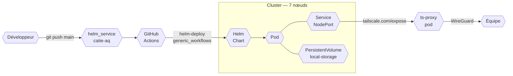

import Tabs from '@theme/Tabs';
import TabItem from '@theme/TabItem';

  
📅 2024 – en cours

  
👤 Rôle : Ingénieur DevOps

  
🛠️ Kubernetes · kubeadm · Calico · Tailscale · Helm · GitHub Actions

## L'origine

Le CATIE disposait de serveurs tour inutilisés. Plutôt que de virtualiser à la va-vite ou de louer du cloud, j'ai monté un cluster Kubernetes à partir de ces machines pour l'équipe. C'était mon premier cluster — pas de k3s pour me faciliter la vie, pas d'EKS pour abstraire les détails. Le choix de kubeadm était délibéré : comprendre le plan de contrôle, câbler le CNI Calico à la main, gérer les certificats et le stockage sans provisioner automatique. Sur un cluster managé, aucun de ces problèmes n'existe. C'est précisément pour ça que j'ai choisi cette voie.

:::info Double objectif
Le cluster héberge des services dont le CATIE a besoin au quotidien. Il sert aussi de terrain d'expérimentation — valider une pratique ici avant de la recommander sur un projet client, c'est la différence entre une conviction testée et une intuition.
:::

## La topologie physique

Le cluster compte sept nœuds avec une convention de nommage inspirée des composants électroniques : `discodiode` est le control-plane, les workers s'appellent `elegantencoder`, `incredibleinductor`, `athleticantenna`, `roaringresistor`, `trustytransistor`, `burningbattery`. Le cluster n'a pas eu cette forme dès le départ — les trois nœuds fondateurs tournent sous Ubuntu 22.04 depuis plus de deux ans, quatre workers ont été ajoutés progressivement sous Ubuntu 24.04 au fur et à mesure que les besoins en capacité augmentaient.

Cette croissance organique est visible dans l'état du cluster : les anciens nœuds portent une version de Kubernetes légèrement différente des nouveaux, le résultat de mises à jour partielles jamais entièrement terminées. Ce n'est pas un problème en production ; c'est une dette technique réelle, documentée, en attente d'une fenêtre de maintenance.

## L'architecture réseau : Tailscale par service

L'exposition des services sur un cluster bare-metal sans IP publique pose une question concrète : comment rendre un service accessible à l'équipe sans ouvrir de ports sur le pare-feu ? La réponse retenue est Tailscale, mais pas comme un VPN global devant le cluster. Chaque service déployé reçoit son propre pod Tailscale operator dans le namespace `tailscale` — une proxy dédiée qui porte une identité réseau individuelle. Résultat : Grafana, n8n, Thingsboard, Portainer et tous les autres sont accessibles indépendamment via le réseau Tailscale, sans ingress controller, sans certificats à gérer.

L'avantage est réel : déployer un nouveau service, c'est ajouter une annotation dans le `values.yaml` et le service apparaît dans le réseau. L'inconvénient existe aussi : le namespace `tailscale` contient autant de pods proxy que de services exposés. C'est un modèle qui scale en nombre de processus plutôt qu'en complexité de configuration.

## GitOps : un dépôt par service

Chaque service déployé sur le cluster a son propre dépôt Helm public dans l'organisation `catie-aq`. La structure est systématique : un chart Helm, un `values.yaml` qui centralise la configuration, des PersistentVolumes déclarés explicitement, et un workflow GitHub Actions qui appelle le workflow réutilisable `helm-deploy` de `generic_workflows`. Pousser sur `main` déclenche le déploiement. Le kubeconfig est injecté via un secret GitHub.

La conséquence directe : la configuration du cluster est lisible depuis GitHub. Pour savoir ce qui tourne et comment c'est configuré, il suffit de lire les dépôts. Pas de configuration appliquée à la main un soir et oubliée.

## Ce qui tourne

Le cluster héberge bien plus que les services de monitoring visibles dans les dépôts publics.

<Tabs>
  <TabItem value="observabilite" label="Observabilité">

La chaîne d'observabilité couvre trois couches. **Prometheus** scrape les métriques de tous les workloads et des composants Kubernetes via les node exporters déployés sur chaque nœud. **Grafana** visualise ces données — son volume persistant est configuré en `Retain` pour que les dashboards survivent aux redéploiements. **Smokeping** mesure la latence réseau vers des cibles externes et internes : c'est ce qui permet de distinguer une panne applicative d'une dégradation réseau en amont.

**Loki** centralise les logs de l'ensemble du cluster. Promtail tourne comme DaemonSet sur chaque nœud et pousse les logs vers Loki. Avoir les logs applicatifs et système au même endroit que les métriques permet de corréler un pic Prometheus avec les lignes de logs correspondantes sans changer d'outil. **Uptime Kuma** complète le tableau en donnant une vue binaire de la disponibilité de chaque service.

  </TabItem>
  <TabItem value="services" label="Services internes">

Le cluster héberge une palette de services qui reflète les outils du quotidien de l'équipe. **Dashy** centralise tous les accès. **Portainer** offre une vue visuelle des workloads, utile pour les collègues qui n'ont pas `kubectl` en réflexe. **n8n** sert de colle entre des systèmes qui n'ont pas d'intégration native — notifications, synchronisations, déclencheurs.

Plusieurs services automatisent des tâches répétitives : un bot surveille les mouvements de stock Dolibarr et envoie des alertes, un autre surveille les téléchargements depuis le site Sixtron, un troisième suit les contributions GitHub. Ces petits services qui tournent depuis des centaines de jours sans attention sont souvent les plus utiles. **MARP** permet de générer des présentations depuis des fichiers Markdown en CI/CD. **jira-dashboard** expose des métriques Jira à l'équipe.

  </TabItem>
  <TabItem value="iot" label="IoT & projets">

**Thingsboard** tourne avec PostgreSQL sur des volumes persistants. C'est la plateforme de collecte et de visualisation de données capteurs. **IoT Gateway** gère la connectivité avec des équipements industriels via Modbus — ce chart a été principalement développé par un collègue, avec ma contribution sur l'intégration infrastructure.

Le cluster sert également de terrain de déploiement pour de nouveaux projets avant qu'ils ne trouvent leur hébergement définitif. Des namespaces dédiés apparaissent et disparaissent au rythme des prototypes en cours.

  </TabItem>
</Tabs>

## L'incident des certificats : la réalité du bare-metal

Les certificats générés par kubeadm ont une durée de validité d'un an. Quand ils expirent, le cluster s'arrête de fonctionner silencieusement : `kubectl` cesse de répondre, les nouveaux pods ne sont plus schedulés, et les messages `x509: certificate has expired` apparaissent dans les logs. Sur un cluster managé, ce problème n'existe pas.

La procédure de renouvellement est `kubeadm certs renew all`, suivi d'une mise à jour du kubeconfig et d'un redémarrage du kubelet sur chaque nœud. Dans les cas où le redémarrage ne suffit pas, il faut déplacer temporairement les manifests statiques hors de `/etc/kubernetes/manifests` pour forcer la recréation des pods du control plane. C'est un problème banal en théorie, déstabilisant en pratique la première fois : le cluster est muet, les outils de diagnostic habituels ne fonctionnent plus. J'en ai fait un [article de blog](/blog/2025/06/06/06-orchestration/renouveller-certificats) pour documenter la procédure.

L'autre conséquence directe : quand le cluster est down, les pipelines CI/CD de toute l'organisation s'arrêtent. GitHub ARC tourne sur ce même cluster. C'est une dépendance critique qui n'a pas de plan de failover — c'est une limite assumée pour une infrastructure interne sans SLA.

## Ce qui reste imparfait

**Le stockage est manuel et fragile.** Il n'y a pas de storage provisioner dynamique. Chaque PersistentVolume est créé à la main, lié à un nœud spécifique, avec un chemin local explicite. Un volume inutilisé peut rester bloqué en état `Terminating` pendant des centaines de jours si ses finalizers ne sont pas retirés à la main — c'est un état actuel du cluster, pas une hypothèse.

**Un composant est en CrashLoopBackOff depuis plus d'un mois.** Le pod Tailscale du controller ingress-nginx redémarre en boucle depuis quarante jours sans que ça bloque le reste — les services individuels ont leurs propres proxies Tailscale et fonctionnent. C'est le genre de dysfonctionnement toléré faute de temps : il ne bloque rien de critique, mais il pollue les logs et génère du bruit dans le monitoring.

**Les mises à jour Kubernetes sont incomplètes.** Les anciens nœuds et les nouveaux ne sont pas sur la même version mineure. Mettre à jour un cluster kubeadm en production nécessite de drainer chaque nœud, d'upgrader kubeadm, de mettre à jour kubelet et kubectl — nœud par nœud. C'est faisable, c'est documenté, ça n'a pas encore été fait entièrement.

**La surveillance des certificats n'est pas automatisée.** L'incident aurait pu être évité avec une alerte Prometheus sur les dates d'expiration PKI. Ce n'est pas en place.

## Liens

- [helm_dashy (catie-aq)](https://github.com/catie-aq/helm_dashy)
- [helm_portainer (catie-aq)](https://github.com/catie-aq/helm_portainer)
- [helm_prometheus (catie-aq)](https://github.com/catie-aq/helm_prometheus)
- [helm_grafana (catie-aq)](https://github.com/catie-aq/helm_grafana)
- [helm_smokeping (catie-aq)](https://github.com/catie-aq/helm_smokeping)
- [helm_kuma (catie-aq)](https://github.com/catie-aq/helm_kuma)
- [helm_thingsboard (catie-aq)](https://github.com/catie-aq/helm_thingsboard)
- [helm_n8n (catie-aq)](https://github.com/catie-aq/helm_n8n)
- [helm_iot-gateway (catie-aq)](https://github.com/catie-aq/helm_iot-gateway)
