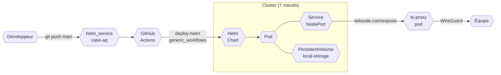

import Tabs from '@theme/Tabs';
import TabItem from '@theme/TabItem';

<ProjectMeta
  start="2024"
  role="Ingénieur DevOps, conception et exploitation"
  domain="Infrastructure interne, Kubernetes bare-metal, observabilité"
  stack={["Kubernetes", "kubeadm", "Calico", "Tailscale", "Helm", "GitHub Actions", "Prometheus", "Grafana"]}
/>

## Contexte

Le CATIE disposait de serveurs tour inutilisés. Plutôt que de les virtualiser au cas par cas ou de louer du cloud, j'ai monté à partir de ces machines un cluster Kubernetes pour l'équipe. C'était mon premier cluster, et je l'ai volontairement construit avec kubeadm plutôt qu'avec une distribution simplifiée comme k3s ou un service managé comme EKS : comprendre le plan de contrôle, installer le CNI Calico, gérer les certificats et le stockage sans provisionneur automatique. Un cluster managé masque ces problèmes ; l'objectif était précisément de les rencontrer.

:::info Double objectif
Le cluster héberge des services dont le CATIE a besoin au quotidien. Il sert aussi de terrain d'expérimentation : une pratique y est validée avant d'être recommandée sur un projet client.
:::

## Topologie physique

Le cluster compte sept nœuds avec une convention de nommage inspirée des composants électroniques : `discodiode` est le control-plane, les workers s'appellent `elegantencoder`, `incredibleinductor`, `athleticantenna`, `roaringresistor`, `trustytransistor`, `burningbattery`. Le cluster n'a pas eu cette forme dès le départ : les trois nœuds fondateurs tournent sous Ubuntu 22.04, et quatre workers ont été ajoutés progressivement sous Ubuntu 24.04 au fil de l'augmentation des besoins en capacité.

Cette croissance organique est visible dans l'état du cluster : les anciens nœuds portent une version de Kubernetes légèrement différente des nouveaux, résultat de mises à jour partielles jamais entièrement terminées. Le cluster fonctionne avec cet écart, mais c'est une dette technique documentée, en attente d'une fenêtre de maintenance.

## Réseau : Tailscale par service

L'exposition des services sur un cluster bare-metal sans IP publique pose une question concrète : comment rendre un service accessible à l'équipe sans ouvrir de ports sur le pare-feu ? La réponse retenue est Tailscale, mais pas comme un VPN global devant le cluster. L'opérateur Kubernetes de Tailscale crée, pour chaque Service annoté, un pod proxy dédié dans le namespace `tailscale`, qui porte sa propre identité sur le réseau Tailscale. Grafana, n8n, Thingsboard, Portainer et les autres services sont ainsi accessibles indépendamment, sans ingress controller ni ouverture de port.

Exposer un nouveau service se résume à ajouter une annotation dans son `values.yaml`. En contrepartie, le namespace `tailscale` contient autant de pods proxy que de services exposés : le modèle croît en nombre de processus plutôt qu'en complexité de configuration.

## GitOps : un dépôt par service

Chaque service déployé sur le cluster a son propre dépôt Helm dans l'organisation `catie-aq`. La structure est systématique : un chart Helm, un `values.yaml` qui centralise la configuration, des PersistentVolumes déclarés explicitement, et un workflow GitHub Actions qui appelle le workflow réutilisable `deploy-helm` de [`generic_workflows`](cicd.md). Pousser sur `main` déclenche le déploiement ; le kubeconfig est injecté via un secret GitHub.

Conséquence directe : la configuration du cluster est lisible depuis GitHub. Pour savoir ce qui tourne et comment, il suffit de lire les dépôts, sans configuration appliquée à la main puis oubliée.

```mermaid
flowchart LR
    dev{{Développeur}} -->|git push main| repo{{helm_service\ncatie-aq}}
    repo --> gha{{GitHub\nActions}}
    gha -->|deploy-helm\ngeneric_workflows| chart{{Helm\nChart}}

    subgraph cluster["Cluster (7 nœuds)"]
        chart --> pod{{Pod}}
        pod --- svc{{Service\nNodePort}}
        pod --- pv{{PersistentVolume\nlocal-storage}}
    end

    svc -->|tailscale.com/expose| proxy{{ts-proxy\npod}}
    proxy -->|WireGuard| team{{Équipe}}
```

## Services hébergés

Au-delà de la chaîne d'observabilité, le cluster héberge les outils du quotidien de l'équipe et plusieurs projets.

<Tabs>
  <TabItem value="observabilite" label="Observabilité">

La chaîne d'observabilité couvre trois couches. **Prometheus** collecte les métriques des workloads, des composants Kubernetes et des nœuds, via un node exporter déployé sur chacun. **Grafana** visualise ces données ; son volume persistant est configuré en `Retain` pour que les dashboards survivent aux redéploiements. **Smokeping** mesure la latence réseau vers des cibles externes et internes : c'est ce qui permet de distinguer une panne applicative d'une dégradation réseau en amont.

**Loki** centralise les logs de l'ensemble du cluster. Promtail tourne comme DaemonSet sur chaque nœud et pousse les logs vers Loki. Avoir les logs applicatifs et système au même endroit que les métriques permet de corréler un pic Prometheus avec les lignes de logs correspondantes sans changer d'outil. **Uptime Kuma** complète le tableau en donnant une vue binaire de la disponibilité de chaque service.

  </TabItem>
  <TabItem value="services" label="Services internes">

Le cluster héberge une palette de services qui reflète les outils du quotidien de l'équipe. **Dashy** centralise tous les accès. **Portainer** offre une vue visuelle des workloads, utile pour les collègues qui n'ont pas `kubectl` en réflexe. **n8n** sert de colle entre des systèmes qui n'ont pas d'intégration native (notifications, synchronisations, déclencheurs).

Plusieurs [outils internes](outils-internes.md) automatisent des tâches répétitives : un bot surveille les mouvements de stock Dolibarr et envoie des alertes, un autre traite les demandes de téléchargement du site 6TRON, un troisième suit les contributions GitHub. Ces petits services tournent depuis des centaines de jours sans intervention. **MARP** permet de générer des présentations depuis des fichiers Markdown en CI/CD. **jira-dashboard** expose des métriques Jira à l'équipe.

  </TabItem>
  <TabItem value="iot" label="IoT & projets">

**Thingsboard** tourne avec PostgreSQL sur des volumes persistants : c'est la plateforme de collecte et de visualisation de données capteurs. **IoT Gateway** gère la connectivité avec des équipements industriels via Modbus ; ce chart a été principalement développé par un collègue, avec ma contribution sur l'intégration infrastructure.

Le cluster sert également de terrain de déploiement pour de nouveaux projets avant qu'ils ne trouvent leur hébergement définitif. Des namespaces dédiés apparaissent et disparaissent au rythme des prototypes en cours.

  </TabItem>
</Tabs>

## Incident : expiration des certificats

Les certificats clients et serveurs générés par kubeadm ont une durée de validité d'un an. `kubeadm upgrade` les renouvelle au passage, mais le plan de contrôle n'ayant pas été mis à jour dans l'année, ils ont expiré : `kubectl` a cessé de répondre, les nouveaux pods n'étaient plus planifiés, et les messages `x509: certificate has expired` sont apparus dans les logs. Sur un cluster managé, ce renouvellement est à la charge du fournisseur.

La procédure de renouvellement est `kubeadm certs renew all` sur le nœud de plan de contrôle, suivie de la mise à jour du kubeconfig administrateur, puis du redémarrage des composants du plan de contrôle. Ceux-ci sont des pods statiques : un simple redémarrage du kubelet ne suffit pas, il faut déplacer temporairement leurs manifestes hors de `/etc/kubernetes/manifests` pour forcer leur recréation. Les workers n'ont rien à renouveler, le kubelet assurant lui-même la rotation de son certificat client. Le problème est banal en théorie, mais déstabilisant la première fois : le cluster est muet et les outils de diagnostic habituels ne répondent plus. J'ai documenté la procédure dans un [article de blog](/blog/2025/06/06/06-orchestration/renouveler-certificats).

L'incident a aussi mis en évidence une dépendance : les [runners GitHub ARC](github-arc-kubeadm.md) tournent sur ce même cluster, donc son indisponibilité arrête les pipelines CI/CD de toute l'organisation. Il n'existe pas de plan de bascule ; c'est une limite assumée pour une infrastructure interne sans engagement de niveau de service.

## Limites connues

**Le stockage est manuel et fragile.** Il n'y a pas de storage provisioner dynamique. Chaque PersistentVolume est créé à la main, lié à un nœud spécifique, avec un chemin local explicite. Un volume inutilisé peut rester bloqué en état `Terminating` pendant des centaines de jours si ses finalizers ne sont pas retirés à la main. C'est un état actuel du cluster, pas une hypothèse.

**Un composant est en CrashLoopBackOff.** Au moment de la rédaction, le pod Tailscale associé au controller ingress-nginx redémarre en boucle depuis plusieurs semaines, sans bloquer le reste : les services ont leurs propres proxys Tailscale et restent accessibles. Ce dysfonctionnement est toléré faute de temps ; il ne bloque rien de critique, mais il pollue les logs et génère du bruit dans la supervision.

**Les mises à jour Kubernetes sont incomplètes.** Les anciens nœuds et les nouveaux ne sont pas sur la même version mineure. Mettre à jour un cluster kubeadm en production nécessite, nœud par nœud, de drainer le nœud, de mettre à jour kubeadm, puis kubelet et kubectl. La procédure est documentée, mais n'a pas encore été menée jusqu'au bout.

**La surveillance des certificats n'est pas automatisée.** Une alerte Prometheus sur les dates d'expiration, routée par [Alertmanager](/blog/2026/09/20/07-monitoring/prometheus-alertmanager), aurait permis d'anticiper l'incident ; elle n'est pas encore en place.

## Liens

Les dépôts Helm des services sont privés à l'organisation `catie-aq`. Pages liées :

- [Workflows GitHub Actions mutualisés](cicd.md)
- [GitHub ARC sur ce cluster](github-arc-kubeadm.md)
