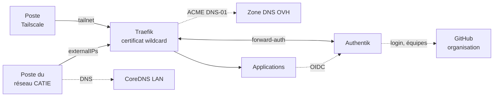
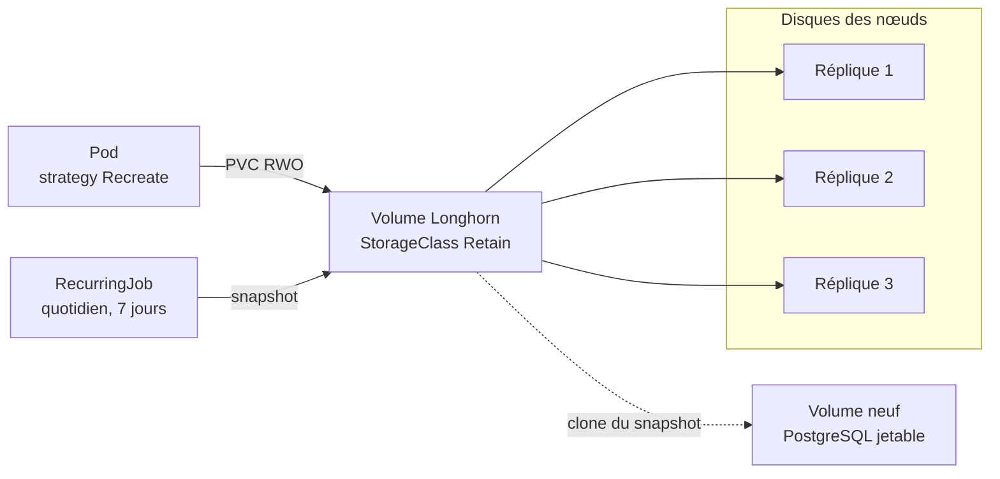
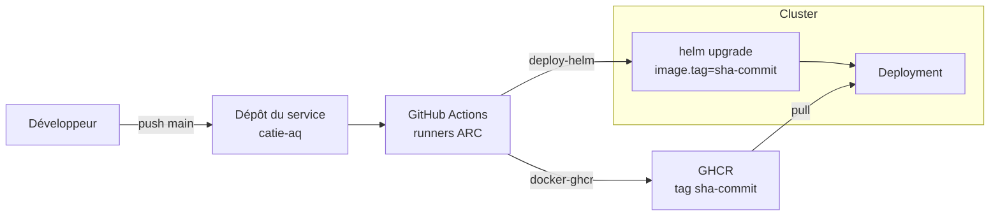

import Tabs from '@theme/Tabs';
import TabItem from '@theme/TabItem';

<ProjectMeta
  start="2024"
  role="Ingénieur DevOps, conception et exploitation"
  domain="Infrastructure interne, Kubernetes bare-metal, observabilité"
  stack={["Kubernetes", "kubeadm", "Calico", "Tailscale", "Traefik", "Authentik", "Longhorn", "Helm", "GitHub Actions", "Prometheus", "Grafana"]}
/>

## Contexte

Le CATIE disposait de serveurs tour inutilisés. Plutôt que de les virtualiser au cas par cas ou de louer du cloud, j'ai monté à partir de ces machines un cluster Kubernetes pour l'équipe. C'était mon premier cluster, et je l'ai volontairement construit avec kubeadm plutôt qu'avec une distribution simplifiée comme k3s ou un service managé comme EKS : comprendre le plan de contrôle, installer le CNI Calico, gérer les certificats et le stockage sans provisionneur automatique. Un cluster managé masque ces problèmes ; l'objectif était précisément de les rencontrer.

:::info Double objectif
Le cluster héberge des services dont le CATIE a besoin au quotidien. Il sert aussi de terrain d'expérimentation : une pratique y est validée avant d'être recommandée sur un projet client.
:::

## Topologie physique

Le cluster compte sept nœuds, un control-plane et six workers, nommés selon une convention adjectif + composant électronique. Le cluster n'a pas eu cette forme dès le départ : les trois nœuds fondateurs tournent sous Ubuntu 22.04, et quatre workers ont été ajoutés progressivement sous Ubuntu 24.04 au fil de l'augmentation des besoins en capacité.

Cette croissance organique est visible dans l'état du cluster : les nœuds ne sont pas tous au même niveau de version, résultat de mises à jour partielles jamais entièrement terminées. C'est une dette technique documentée, dont la résorption est planifiée.

## Réseau : une entrée unique sur Tailscale

L'exposition des services sur un cluster bare-metal sans IP publique pose une question concrète : comment rendre un service accessible à l'équipe sans ouvrir de ports sur le pare-feu ? La réponse retenue est Tailscale, avec l'opérateur Kubernetes de Tailscale. La première version créait, pour chaque Service annoté, un pod proxy dédié dans le namespace `tailscale`, avec sa propre identité sur le réseau Tailscale. Exposer un service se résumait à une annotation, mais le namespace `tailscale` comptait autant de proxys que de services, chacun avec son adresse et sans authentification commune.

En septembre 2026, j'ai remplacé ce modèle par une entrée unique : **Traefik** est le seul service exposé sur le tailnet, et route chaque sous-domaine vers son application. Les annotations par service ont été retirées de tous les charts. Ce point d'entrée commun a rendu possibles trois choses que le modèle par service ne permettait pas :

- un **certificat wildcard** Let's Encrypt obtenu par challenge ACME DNS-01 chez OVH, avec une clé d'API limitée à la seule zone DNS concernée : les services sont servis en HTTPS valide alors qu'aucun n'est joignable depuis Internet, ce qu'un challenge HTTP-01 n'aurait pas permis ;
- une **authentification unique** posée devant toutes les applications (section suivante) ;
- un **accès LAN optionnel** depuis le réseau du CATIE sans client Tailscale : Traefik écoute aussi sur les adresses de quelques nœuds (`externalIPs`), et un CoreDNS dédié, en deux répliques réparties avec un PodDisruptionBudget, résout les sous-domaines du cluster vers ces adresses. Avec Tailscale, rien ne change : le DNS public pointe vers l'adresse tailnet.

```mermaid
flowchart LR
    tail["Poste<br/>Tailscale"] -->|tailnet| traefik
    lan["Poste du<br/>réseau CATIE"] -.->|DNS| coredns["CoreDNS LAN"]
    lan -->|externalIPs| traefik["Traefik<br/>certificat wildcard"]
    traefik -.->|ACME DNS-01| ovh["Zone DNS OVH"]
    traefik <-->|forward-auth| authentik["Authentik"]
    traefik --> apps["Applications"]
    apps -.->|OIDC| authentik
    authentik -.->|login, équipes| github["GitHub<br/>organisation"]
```

Le certificat est stocké sur un volume persistant à accès unique : Traefik ne tourne qu'en une réplique, et chaque déploiement le coupe quelques secondes, le temps que l'ancien pod libère le volume. C'est un compromis assumé pour un usage interne.

## Authentification unique : Authentik

Avant ce chantier, chaque application gérait ses comptes, ou n'en avait pas. J'ai déployé **Authentik** comme fournisseur d'identité du cluster, avec deux modes de raccordement selon l'application :

- **forward-auth** pour les applications sans authentification propre (Dashy, Prometheus, Smokeping, Gatus, l'interface Longhorn, les outils internes) : un middleware Traefik interroge l'outpost Authentik avant de laisser passer la requête ;
- **OIDC natif** pour celles qui ont leurs propres comptes et rôles (Grafana, Portainer, Dolibarr, l'interface Garage), pour garder leur gestion des droits plutôt que de la court-circuiter.

La connexion passe par GitHub : à chaque login, l'appartenance aux équipes de l'organisation est relue et convertie en groupes Authentik (équipe SONU, reste de l'organisation, administrateurs de l'infrastructure). Retirer quelqu'un d'une équipe GitHub lui retire donc ses droits au login suivant, sans intervention dans Authentik. Grafana dérive aussi ses rôles de ces groupes.

Toute la configuration d'Authentik (fournisseurs, applications, droits par groupe) est déclarée dans le `values.yaml` et appliquée par des blueprints : protéger une nouvelle application revient à ajouter une entrée dans une liste. Deux pièges rencontrés en route : Traefik refuse par défaut les références de middleware entre namespaces, ce qui impose de dupliquer le middleware dans le namespace de l'application ; et la route vers l'outpost d'authentification ne doit pas recevoir de petite priorité explicite. Traefik calcule la priorité par défaut sur la longueur de la règle : la route de l'outpost, plus longue, passe naturellement avant celle de l'application, alors qu'une priorité explicite de 15, comme dans l'exemple de la documentation d'Authentik, la fait passer après et provoque une boucle de redirection.

## Stockage : de local-storage à Longhorn

Jusqu'en septembre 2026, chaque PersistentVolume était créé à la main, lié à un nœud et à un chemin local : perdre un nœud, c'était perdre ses données, et le pod ne pouvait être replanifié ailleurs. J'ai déployé **Longhorn**, qui fournit un stockage bloc répliqué en trois exemplaires sur les disques des nœuds du cluster, puis migré un à un les services avec état : Traefik (certificats), Authentik, ThingsBoard, Smokeping, Portainer, le cache de CI, Gatus, Grafana, Prometheus, Alertmanager, Dolibarr, le site de l'équipe et les bots internes. La StorageClass est en `Retain`, pour qu'une désinstallation de chart ne supprime jamais un volume.

La migration a fait apparaître une contrainte : un volume Longhorn en accès unique (`ReadWriteOnce`) ne s'attache qu'à un nœud à la fois. Avec la stratégie de déploiement par défaut, le nouveau pod démarre avant l'arrêt de l'ancien et reste bloqué en `Multi-Attach`. Les Deployments concernés sont passés en `strategy: Recreate`.

```mermaid
flowchart LR
    pod["Pod<br/>strategy Recreate"] -->|PVC RWO| vol["Volume Longhorn<br/>StorageClass Retain"]
    job["RecurringJob<br/>quotidien, 7 jours"] -->|snapshot| vol
    subgraph disques["Disques des nœuds"]
        r1["Réplique 1"]
        r2["Réplique 2"]
        r3["Réplique 3"]
    end
    vol --> r1
    vol --> r2
    vol --> r3
    vol -.->|clone du snapshot| test["Volume neuf<br/>PostgreSQL jetable"]
```

Les bases critiques (PostgreSQL d'Authentik, dont la perte coupe l'accès à toutes les applications, et Dolibarr) sont snapshotées chaque jour par des `RecurringJob` Longhorn, avec sept jours de rétention. Une sauvegarde non restaurée n'est qu'une hypothèse : j'ai testé la restauration du snapshot PostgreSQL d'Authentik en clonant le snapshot dans un volume neuf, lu par un pod PostgreSQL jetable, sans toucher à la production, et documenté la procédure.

Pour les besoins de stockage objet, j'ai ajouté **Garage**, un stockage S3 auto-hébergé, avec son interface web derrière Authentik. Les objets sont sur un volume Longhorn à un seul réplica, local au nœud, et Garage ne les duplique pas ; il prend seulement un instantané de ses métadonnées toutes les six heures. Ce stockage est donc réservé à des données reproductibles ou sauvegardées ailleurs.

## GitOps : un dépôt par service

Presque chaque service déployé sur le cluster a son propre dépôt Helm dans l'organisation `catie-aq`. La structure est systématique : un chart Helm, un `values.yaml` qui centralise la configuration, et un workflow GitHub Actions qui appelle le workflow réutilisable `deploy-helm` de [`generic_workflows`](cicd.md). Pousser sur `main` déclenche le déploiement, avec des identifiants de déploiement fournis par la CI.

Conséquence directe : la configuration du cluster est lisible depuis GitHub. Pour savoir ce qui tourne et comment, il suffit de lire les dépôts. Les rares exceptions (quelques composants installés à la main et les secrets d'amorçage) sont recensées dans la documentation d'exploitation.

En septembre et début octobre 2026, j'ai mené une campagne de mise à niveau de l'ensemble des charts :

- **Déploiement par tag immuable.** Les outils internes étaient déployés sur le tag `main`, avec une annotation aléatoire et `--recreate-pods` pour forcer le redémarrage. Chaque déploiement redémarrait donc les pods, même sans changement, et rien n'indiquait quel build tournait. La quasi-totalité est désormais déployée par le tag `sha-<commit>` publié par la CI : le pod ne redémarre que si l'image change, et la version en production se lit dans le manifeste. Les changements de configuration déclenchent le redémarrage par une somme de contrôle de la ConfigMap.
- **Hardening.** `securityContext` (escalade de privilèges interdite, capabilities retirées, système de fichiers racine en lecture seule quand l'image le permet), sondes de vivacité et de disponibilité, `resources` déclarées, tags d'image figés plutôt que `latest`.
- **Secrets au runtime.** Les secrets applicatifs passent des secrets GitHub à un Secret Kubernetes chargé en variables d'environnement par le pod, au lieu d'être cuits dans l'image ou passés en variables de build.
- **Déploiements sérialisés.** Un groupe `concurrency` par dépôt empêche deux déploiements simultanés de se marcher dessus.

```mermaid
flowchart LR
    dev["Développeur"] -->|push main| repo["Dépôt du service<br/>catie-aq"]
    repo --> gha["GitHub Actions<br/>runners ARC"]
    gha -->|docker-ghcr| ghcr["GHCR<br/>tag sha-commit"]
    gha -->|deploy-helm| helm["helm upgrade<br/>image.tag=sha-commit"]
    subgraph cluster["Cluster"]
        helm --> deploy["Deployment"]
    end
    ghcr -->|pull| deploy
```

## Services hébergés

Au-delà de la chaîne d'observabilité, le cluster héberge les outils du quotidien de l'équipe et plusieurs projets.

<Tabs>
  <TabItem value="observabilite" label="Observabilité">

La chaîne d'observabilité couvre trois couches. **Prometheus** collecte les métriques des workloads, des composants Kubernetes et des nœuds, via un node exporter déployé sur chacun. **Grafana** visualise ces données ; son volume persistant est configuré en `Retain` pour que les dashboards survivent aux redéploiements. **Smokeping** mesure la latence réseau vers des cibles externes et internes : c'est ce qui permet de distinguer une panne applicative d'une dégradation réseau en amont.

**Loki** centralise les logs de l'ensemble du cluster. Promtail tourne comme DaemonSet sur chaque nœud et pousse les logs vers Loki. Avoir les logs applicatifs et système au même endroit que les métriques permet de corréler un pic Prometheus avec les lignes de logs correspondantes sans changer d'outil. **Gatus** complète le tableau en donnant une vue binaire de la disponibilité de chaque service. Il a remplacé Uptime Kuma en septembre 2026 : ses sondes sont déclarées dans le `values.yaml` de son chart, donc versionnées et relues comme le reste de la configuration, au lieu d'être saisies dans une interface et stockées dans une base, et il expose ses résultats en métriques Prometheus.

  </TabItem>
  <TabItem value="services" label="Services internes">

Le cluster héberge une palette de services qui reflète les outils du quotidien de l'équipe. **Dashy** centralise tous les accès. **Portainer** offre une vue visuelle des workloads, utile pour les collègues qui n'ont pas `kubectl` en réflexe. **Dolibarr**, l'ERP de l'équipe, a été rapatrié d'un serveur Apache isolé vers le cluster : j'ai écrit son chart (Dolibarr, MariaDB, sauvegardes quotidiennes par dump transactionnel et archive des documents, vérifiées avant publication, en plus des snapshots Longhorn), migré la base et raccordé la connexion à Authentik en OIDC.

Plusieurs [outils internes](outils-internes.md) automatisent des tâches répétitives : un bot surveille les mouvements de stock Dolibarr et envoie des alertes, un autre traite les demandes de téléchargement du site 6TRON, un troisième recherche des composants chez les distributeurs, et une application suit l'activité GitHub de l'équipe. Ces petits services ont longtemps tourné sans intervention, avant d'être migrés sur Longhorn et durcis en septembre 2026. **TS341** sert les supports d'un cours d'imagerie, rédigés en Markdown et rendus en diaporamas Marp. Le **plan de charge** de l'équipe, qui a remplacé l'ancien tableau de bord Jira, est alimenté directement par les fichiers de suivi de l'équipe.

  </TabItem>
  <TabItem value="iot" label="IoT & projets">

**ThingsBoard** tourne avec PostgreSQL sur des volumes persistants : c'est la plateforme de collecte et de visualisation de données capteurs. **IoT Gateway** gère la connectivité avec des équipements industriels via Modbus ; ce chart a été principalement développé par un collègue, avec ma contribution sur l'intégration infrastructure.

Le cluster sert également de terrain de déploiement pour de nouveaux projets avant qu'ils ne trouvent leur hébergement définitif. Des namespaces dédiés apparaissent et disparaissent au rythme des prototypes en cours.

  </TabItem>
</Tabs>

## Documentation d'exploitation

Un cluster que seul son auteur sait exploiter est un point de défaillance unique. J'ai donc rédigé sa documentation dans un dépôt dédié, structuré par type de document avec un code et un numéro de révision : des **références** (cartographie de l'infrastructure, inventaire des dépôts, parc de machines, charte graphique des applications), des **guides** (déployer une application, accéder aux services) et une dizaine de **modes opératoires** pour les situations d'exploitation : redémarrage après coupure électrique, ajout ou retrait d'un nœud, restauration Longhorn, renouvellement des certificats kubeadm, montée de version de Kubernetes, diagnostic d'une application indisponible, accès d'urgence en cas de panne d'Authentik, gestion des accès, panne de la CI de déploiement. Chaque point non vérifié sur le cluster est signalé comme tel dans le texte, puis levé par un relevé.

Cette documentation est publiée sur le site interne de l'équipe, que j'ai refondu sur Docusaurus. Le site agrège aussi la documentation stockée dans le Dropbox de l'équipe : un bot suit les changements du dossier partagé, convertit les documents (Word, Paper, Markdown) en pages et publie chaque modification en une à deux minutes, avec l'historique des versions de chaque page, une page de fraîcheur par section et une carte des liens entre pages. Les dépôts GitHub suivis, dont celui du cluster, sont relus périodiquement.

## Incident : expiration des certificats

Les certificats clients et serveurs générés par kubeadm ont une durée de validité d'un an. `kubeadm upgrade` les renouvelle au passage, mais le plan de contrôle n'ayant pas été mis à jour dans l'année, ils ont expiré : `kubectl` a cessé de répondre, les nouveaux pods n'étaient plus planifiés, et les messages `x509: certificate has expired` sont apparus dans les logs. Sur un cluster managé, ce renouvellement est à la charge du fournisseur.

La procédure de renouvellement est `kubeadm certs renew all` sur le nœud de plan de contrôle, suivie de la mise à jour du kubeconfig administrateur, puis du redémarrage des composants du plan de contrôle. Ceux-ci sont des pods statiques : un simple redémarrage du kubelet ne suffit pas, il faut déplacer temporairement leurs manifestes hors de `/etc/kubernetes/manifests` pour forcer leur recréation. Les workers n'ont rien à renouveler, le kubelet assurant lui-même la rotation de son certificat client. Le problème est banal en théorie, mais déstabilisant la première fois : le cluster est muet et les outils de diagnostic habituels ne répondent plus. J'ai documenté la procédure dans un [article de blog](/blog/2025/06/06/06-orchestration/renouveler-certificats).

L'incident a aussi mis en évidence une dépendance : les [runners GitHub ARC](github-arc-kubeadm.md) tournent sur ce même cluster, donc son indisponibilité affecte aussi la CI. Il n'existe pas de bascule automatique des runners, mais un déploiement manuel de secours est documenté ; c'est une limite assumée pour une infrastructure interne sans engagement de niveau de service.

## Résultats

Le cluster fait tourner sur sept nœuds les services du quotidien de l'équipe, les outils internes et les [runners CI](github-arc-kubeadm.md) de l'organisation, sans ressource cloud louée. Sa configuration est lisible dans les dépôts Helm et se déploie par la CI, sans accès SSH. Depuis le chantier de septembre 2026, toutes les applications web passent par une entrée unique en HTTPS valide, derrière une authentification commune dont les droits suivent les équipes GitHub ; les services avec état sont sur un stockage répliqué en trois exemplaires, hors stockage objet, et la restauration de la base la plus critique a été testée. Une dizaine de modes opératoires permettent à un autre membre de l'équipe d'intervenir sur les situations d'exploitation courantes.

## Limites connues

**Les sauvegardes restent sur le cluster.** Les snapshots Longhorn et les sauvegardes de Dolibarr sont stockés sur les disques du cluster lui-même : ils protègent d'une erreur de manipulation ou de la perte d'un disque, pas de la perte du cluster. La sauvegarde hors cluster est le prochain chantier.

**Les mises à jour Kubernetes sont incomplètes.** La branche Kubernetes installée n'est plus maintenue, et les nœuds ne sont pas tous au même niveau de correctif. Mettre à jour un cluster kubeadm en production nécessite, nœud par nœud, de drainer le nœud, de mettre à jour kubeadm, puis kubelet et kubectl. La procédure est rédigée en mode opératoire et la montée de version est planifiée.

**La surveillance des certificats n'est pas automatisée.** Une alerte Prometheus sur les dates d'expiration, routée par [Alertmanager](/blog/2026/09/20/07-monitoring/prometheus-alertmanager), aurait permis d'anticiper l'incident ; elle n'est pas encore en place. La prochaine échéance est relevée dans le mode opératoire de renouvellement, avec une date d'intervention préventive.

**Promtail est en fin de vie.** Grafana a déprécié Promtail au profit de Grafana Alloy, et ne le maintient plus depuis mars 2026 : l'agent de collecte des logs ne reçoit plus de correctifs. La migration vers Alloy, qui fournit une commande de conversion des configurations Promtail, reste à faire.

## Liens

Les dépôts Helm des services sont privés à l'organisation `catie-aq`. Pages liées :

- [Workflows GitHub Actions mutualisés](cicd.md)
- [GitHub ARC sur ce cluster](github-arc-kubeadm.md)
