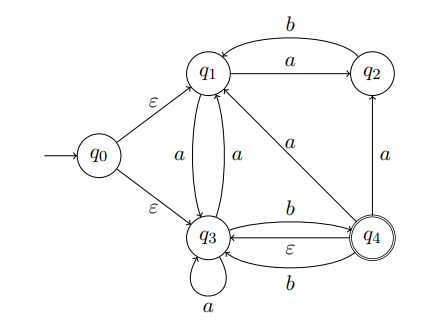
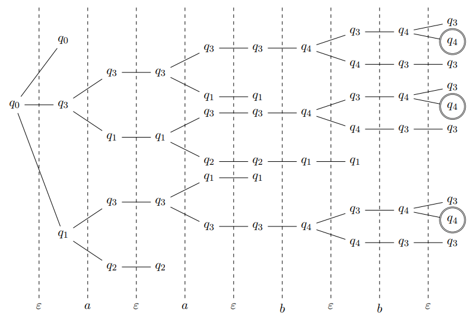

Nous avons introduit au [chapitre 1](cours1.md) une distinction entre automates finis
déterministes et automates finis non déterministes. La notion de non-déterminisme
provient de l'impossibilité de déterminer l'état courant de
l'automate à partir de son état initial et des symboles lus.

Nous avons vu au [chapitre 2](cours2.md) l'intérêt des transitions instantanées (étiquetées
$\varepsilon$) pour la construction de Kleene qui construit, pour toute
expression régulière, un automate fini non déterministe qui accepte le même
langage. Se pose alors la question de l'expressivité du non-déterminisme :
existe-t-il des langages réguliers qui sont acceptés par des AFN, mais par aucun
AFD ? Nous avons en effet montré que tout problème de décision décrit par un
langage régulier est décidé par un automate fini non déterministe. Existe-t-il
donc des problèmes de décision "réguliers" qui ne peuvent pas être décidés par
un automate fini déterministe ?

## Élimination du non-déterminisme

Considérons l'automate fini non déterministe $A_N$ suivant.

$A_N$ accepte en particulier le mot $aabb$, notamment sur l'exécution
suivante :

$$
q_0 \stackrel{\epsilon}{\rightarrow} q_3 \stackrel{a}{\rightarrow} q_3
\stackrel{a}{\rightarrow} q_3 \stackrel{b}{\rightarrow} q_4
\stackrel{\epsilon}{\rightarrow} q_3 \stackrel{b}{\rightarrow} q_4
$$

Nous remarquons que cette exécution contient deux transitions instantanées qui
sont toutes les deux indispensables à $A_N$ pour accepter $aabb$ (sur cette
exécution) puisque, d'une part, depuis $q_0$ il n'y a aucune transition
d'étiquette $a$ et, d'autre part, sans la transition $q_4
\stackrel{\epsilon}{\rightarrow} q_3$, l'exécution se terminerait en $q_3$
qui n'est pas accepteur. En toute généralité, il peut être nécessaire qu'un
automate fini non déterministe franchisse une ou plusieurs transitions
instantanées avant et après avoir lu chaque symbole du mot d'entrée afin de
l'accepter. La figure suivante présente l'arbre des exécutions de $A_N$ sur le
mot $aabb$, où nous avons donné l'occasion à $A_N$ de franchir autant de
transitions instantanées que possible (les symboles de $aabb$ sont séparés par
des $\epsilon$). Nous voyons en particulier que, pour toutes les exécutions
acceptantes de $A_N$ sur $aabb$, il est nécessaire de commencer par une
transition instantanée : soit $q_0 \stackrel{\epsilon}{\rightarrow} q_1$, soit
$q_0 \stackrel{\epsilon}{\rightarrow} q_3$. Rappelons également que
$\epsilon$ permet de boucler sur tout état (une séquence vide de transitions instantanées laisse l'automate dans son état). Nous construisons la séquence de
transitions d'ensemble d'états en ensemble d'états de $A_N$ en regroupant les
états suivant leur distance à la racine $q_0$ dans l'arbre :

$$
\{ q_0\} \stackrel{\epsilon}{\rightarrow} \{q_0, q_1, q_3\}
\stackrel{a}{\rightarrow} \{q_1,q_2,q_3\} \stackrel{\epsilon}{\rightarrow} \{
q_1, q_2, q_3\} \stackrel{a}{\rightarrow} \{q_1,q_2,q_3\}
\stackrel{\epsilon}{\rightarrow} \{q_1,q_2,q_3\}
\stackrel{b}{\rightarrow} \{q_1,q_4\} \stackrel{\epsilon}{\rightarrow}
\{q_1,q_3,q_4\} \stackrel{b}{\rightarrow} \{q_3,q_4\}
\stackrel{\epsilon}{\rightarrow} \{q_3,q_4\}
$$

Dans cette séquence, la transition $\{q_0\} \stackrel{\epsilon}{\rightarrow}
\{q_0,q_1,q_3\}$ signifie que, sans avoir lu aucune lettre du mot $aabb$,
$A_N$ peut se déplacer de l'état $q_0$ à l'un des états $q_0$, $q_1$ ou
$q_3$. Puis les deux transitions $\{q_0,q_1,q_3\} \stackrel{a}{\rightarrow}
\{q_1,q_2,q_3\} \stackrel{\epsilon}{\rightarrow} \{q_1,q_2,q_3\}$ indiquent que,
depuis un état parmi $\{q_0,q_1,q_3\}$, en lisant le symbole $a$, $A_N$
atteint un état parmi $\{q_1,q_2,q_3\}$, puis $A_N$ peut se déplacer suivant
des transitions instantanées (si possible) pour se trouver dans un état parmi
$\{q_1,q_2,q_3\}$. Les transitions de la séquence peuvent donc être regroupées
de la façon suivante :

$$
\{q_0\} \stackrel{\epsilon}{\rightarrow} \{q_0,q_1,q_3\} \stackrel{a,
\epsilon}{\rightarrow} \{q_1,q_2,q_3\} \stackrel{a,\epsilon}{\rightarrow}
\{q_1,q_2,q_3\} \stackrel{b, \epsilon}{\rightarrow}\{q_1,q_3,q_4\} \stackrel{b,
\epsilon}{\rightarrow} \{q_3,q_4\}
$$

L'ensemble des exécutions d'un automate fini non déterministe $A$ sur un mot
$\omega=\omega_1 \ldots \omega_n$ peut donc être vu comme suit.

1. $A$ débute dans l'ensemble $X_0 = \{q \in Q \mid \exists q_0 \in I, q_0
   \stackrel{\epsilon}{\rightarrow} q\}$ des états $q$ pour lesquels il existe
   une séquence (éventuellement vide) de transitions $\epsilon$ d'un état
   initial à $q$.
2. Puis $A$ lit le premier symbole $\omega_1$ et atteint l'ensemble $X_1 =
   \{q' \in Q \mid \exists q \in X_0 , q \stackrel{\omega_1, \epsilon}{\rightarrow}
   q'\}$ des états $q'$ pour lesquels il existe une séquence de transitions issue d'un état $q \in X_0$, débutant par $\omega_1$ et suivie d'une séquence (éventuellement vide) de transitions $\epsilon$.
3. Puis $A$ lit le second symbole $\omega_2$ et atteint l'ensemble d'états $X_2 = \{ q' \in Q \mid \exists q \in X_1, q \stackrel{\omega_2, \epsilon}{\rightarrow} q'\}$.
4. Et ainsi de suite : $\omega$ est accepté si et seulement si $X_n$ contient un état accepteur.

Nous pouvons in fine éliminer les $\epsilon$ pour obtenir la séquence de transitions qui suit :

$$
\{q_0,q_1,q_3\} \stackrel{a}{\rightarrow} \{q_1,q_2,q_3\} \stackrel{a}{\rightarrow}\{q_1,q_2,q_3\} \stackrel{b}{\rightarrow}\{q_1,q_3,q_4\} \stackrel{b}{\rightarrow} \{q_3,q_4\}
$$

Nous présentons maintenant une construction de déterminisation des automates finis non déterministes qui généralise le principe exposé ci-dessus. Celle-ci requiert deux phases :

1. l'élimination des transitions instantanées ;
2. l'élimination des choix non déterministes.

### Clôture instantanée

Reprenons la séquence de transitions précédente. La première transition $\{q_0\} \stackrel{\epsilon}{\rightarrow} \{q_0,q_1,q_3\}$ définit l'ensemble des états accessibles depuis $q_0$ par des transitions instantanées.

Soient un automate fini $A=(Q,\Sigma,\delta,I,F)$ et $q$ un état de $A$. La `clôture instantanée` de $q$, notée $cl_{\epsilon}(q)$, est l'ensemble des états de $A$ accessibles depuis $q$ par une séquence (éventuellement vide) de transitions instantanées :

$$
cl_\epsilon(q)=\{q' \in Q \mid q \stackrel{\epsilon}{\rightarrow} q'\}
$$

La clôture instantanée se généralise à un ensemble d'états $X \subseteq Q$ :

$$
cl_\epsilon(X)= \bigcup \limits_{q \in X} cl_\epsilon(q)
$$

### Construction par sous-ensembles

La seconde phase regroupe dans un même état de l'automate déterministe tous les états que l'AFN peut atteindre après la lecture d'un même préfixe, comme dans la séquence ci-dessus. À partir de $A=(Q,\Sigma,\delta,I,F)$, on construit l'automate déterministe $A_D=(Q_D,\Sigma,\delta_D,X_0,F_D)$ :

* l'état initial est $X_0 = cl_\epsilon(I)$ ;
* pour tout ensemble $X \in Q_D$ et tout $s \in \Sigma$, $\delta_D(X,s) = cl_\epsilon(\{q' \in Q \mid \exists q \in X, (q,s,q') \in \delta\})$ ;
* $Q_D \subseteq 2^Q$ est l'ensemble des parties atteintes depuis $X_0$ par $\delta_D$ ;
* $F_D = \{X \in Q_D \mid X \cap F \neq \emptyset\}$.

Par construction, $\mathcal{L}(A_D) = \mathcal{L}(A)$ : le non-déterminisme n'augmente donc pas l'expressivité des automates finis. En revanche, l'automate déterministe obtenu peut compter jusqu'à $2^{card(Q)}$ états, et cette borne est atteinte pour certains langages.
