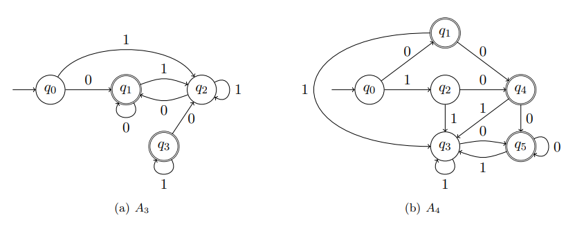
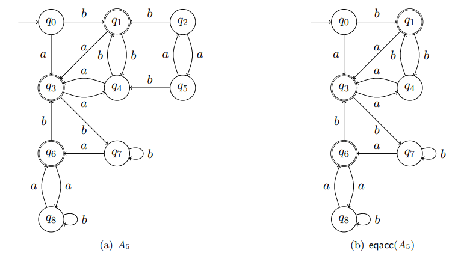

Nous avons vu au chapitre précédent que tout langage régulier est accepté par un automate fini déterministe. Cependant, il n'y a pas un unique automate fini (déterministe) qui accepte un langage régulier donné.

Comment comparer deux automates finis ? Par exemple, comment décider que les deux AFD de la figure suivante acceptent le même langage ? Nous avons vu au [chapitre 2](cours2.md) comment calculer une expression régulière pour le langage accepté par un automate fini. Mais il n'y a pas de représentation canonique d'un langage régulier par une expression régulière, et la comparaison d'expressions régulières est au moins aussi difficile que la comparaison d'automates finis.



*Deux AFD acceptant les encodages binaires des entiers naturels pairs.*

Nous avons également vu aux chapitres [1](cours1.md) et [2](cours2.md) qu'un automate fini est un algorithme pour résoudre les problèmes de décision représentés par des langages réguliers. Pour un problème de décision régulier donné, il existe une infinité d'automates finis qui l'acceptent. D'un point de vue pratique, il est pourtant important de choisir un petit automate, c'est-à-dire un algorithme avec aussi peu d'instructions que possible.

Tout d'abord, nous montrons qu'il existe un automate minimal unique (à renommage des états près) pour chaque langage régulier. Ceci va nous permettre de parler de représentation canonique des langages réguliers, ou encore d'algorithmes minimaux pour les problèmes de décision réguliers. Puis nous présentons un algorithme qui calcule, à partir d'un automate fini déterministe $A$ donné, l'automate minimal qui accepte $\mathcal{L}(A)$.

## Représentation canonique des langages réguliers

### Congruence associée à un langage

Nous montrons maintenant que l'existence d'une représentation canonique pour les langages réguliers est une propriété intrinsèque à ces langages.

Soit $L$ un langage sur $\Sigma$. Deux mots $w$ et $w'$ sont **congrus
(à droite) modulo $L$**, noté $w \sim_L w'$, si pour tout mot $x \in
\Sigma^\ast$, $w.x \in L$ si et seulement si $w'.x \in L$. $w$ et $w'$ sont
dits **indistinguables** pour $L$. La relation $\sim_L$ est une relation
d'équivalence, compatible avec la concaténation à droite ($w \sim_L w'$ implique $w.s \sim_L w'.s$). Nous notons $[w]_{\sim_L} = \{w' \mid w \sim_L w'\}$ la classe
d'équivalence de $w$ pour $\sim_L$.

Intuitivement, si deux mots $u$ et $v$ ne sont pas congrus modulo $L$,
alors il existe un mot $x$ tel que $u.x \in L$ et $v.x \notin L$ (ou
inversement). Ainsi, un automate fini qui accepte $L$ doit, lorsqu'il lit
$u.x$, mémoriser une information suffisante pour ne pas confondre $u$ et
$v$, et *in fine* accepter $u.x$. *A contrario*, si $u$ et $v$ sont
congrus modulo $L$, un automate fini qui accepte $L$ n'est plus obligé de
distinguer $u$ et $v$ puisque $u.x$ et $v.x$ conduisent au même verdict.
Un automate fini mémorise l'information au moyen de ses états. Ainsi, dans le
cas où $u$ et $v$ ne sont pas congrus modulo $L$, afin de distinguer $u$
et $v$, la lecture de ces mots doit conduire l'automate dans deux états
distincts. Et inversement, lorsque $u$ et $v$ sont congrus modulo $L$,
leur lecture peut conduire dans le même état puisqu'il n'est pas nécessaire de
les distinguer. Sachant qu'un automate fini possède un nombre fini d'états, et
que tout langage régulier est accepté par un automate fini, nous pouvons en
déduire une nouvelle caractérisation des langages réguliers.

Soit $A=(Q,\Sigma,\delta,I,F)$ un automate fini. Le **langage de l'état** $q
\in Q$ est défini par :

$$
\mathcal{L}(A,q)=\{w \in \Sigma^\ast \mid q \stackrel{w}{\rightarrow} q' \;
\text{avec} \; q' \in F\}
$$

Le **co-langage de l'état** $q \in Q$ est défini par :

$$
co\mathcal{L}(A,q)=\{w \in \Sigma^\ast \mid \exists q_0 \in I, q_0
\stackrel{w}{\rightarrow} q\}
$$

#### Théorème (congruence à droite et régularité, Myhill-Nerode)

Un langage $L$ est régulier si et seulement si la congruence $\sim_L$ est
d'index fini (elle possède un nombre fini de classes d'équivalence).

### Automate minimal

Nous nous intéressons maintenant à une notion d'automate minimal reconnaissant
un langage régulier donné. Nous montrons que chaque état de cet automate
correspond à une des classes d'équivalence de $\sim_L$. Ses transitions
correspondent au passage d'une classe à l'autre : depuis la classe d'équivalence
de $w$, la lecture d'un symbole $s$ conduit à la classe d'équivalence de
$w.s$.

Soit $L$ un langage régulier sur un alphabet $\Sigma$. L'**automate fini
minimal** $afmin(L)=(Q,\Sigma,\delta,q_0,F)$ qui accepte $L$ est défini par :

* $Q=\{[w]_{\sim_L} \mid w \in \Sigma^\ast\}$
* $\delta=\{([w]_{\sim_L},s,[w.s]_{\sim_L}) \mid w \in \Sigma^\ast, s \in \Sigma\}$
* $q_0=[\epsilon]_{\sim_L}$
* $F=\{[w]_{\sim_L} \mid w \in \Sigma^\ast \; \text{et} \; [w]_{\sim_L}\subseteq
  L\}$

Notons que $afmin(L)$ est un automate déterministe et complet.

#### Théorème

Pour tout langage régulier $L$, $afmin(L)$ est le plus petit automate fini
déterministe et complet tel que $\mathcal{L}(afmin(L))=L$. Il est unique à renommage des états près.

## Minimisation des automates finis

La définition d'un automate minimal nous permet de prouver l'existence et
l'unicité de l'automate minimal qui accepte un langage $L$ donné. Cependant,
elle ne permet pas de construire $afmin(L)$ : il faudrait énumérer tous les
mots de $\Sigma^\ast$ pour connaître l'ensemble de ses états. Nous présentons
maintenant un algorithme qui permet de calculer $afmin(L)$ à partir d'un
automate $A$ connu qui accepte $L$.

Soit $A=(Q,\Sigma,\delta,q_0,F)$ un AFD supposé non minimal. Nous pouvons
maintenant caractériser la non-minimalité en considérant les langages acceptés
depuis chacun des états de $A$. Deux états $q,q' \in Q$ sont dits
**équivalents** si $\mathcal{L}(A,q)=\mathcal{L}(A,q')$. On note $\equiv_Q$
la relation d'équivalence ainsi définie.

L'équivalence entre états doit être rapprochée de la congruence de
$\mathcal{L}(A)$. En effet, supposons que $q_0 \stackrel{w}{\rightarrow} q$
et $q_0 \stackrel{w'}{\rightarrow} q'$ pour deux mots $w,w' \in
\Sigma^\ast$ et que $q \equiv_Q q'$. Alors, puisque $\mathcal{L}(A,q) = \mathcal{L}(A,q')$, pour
tout mot $x \in \Sigma^\ast$, $w.x$ est accepté par $A$ si et seulement si
$w'.x$ est accepté par $A$. Il vient alors $w \sim_{\mathcal{L}(A)}w'$.
L'équivalence entre $\equiv_Q$ et $\sim_{\mathcal{L}(A)}$ est prouvée plus loin. Un
automate fini déterministe et complet $A$ n'est donc pas minimal si et seulement si :

* il possède (au moins) un état inaccessible : il existe $q\in Q$ tel que pour
  tout $w \in \Sigma^\ast$, $q_0 \stackrel{w}{\nrightarrow} q$ ;
* ou il possède deux états distincts $q,q' \in Q$ qui sont équivalents :
  $\mathcal{L}(A,q)=\mathcal{L}(A,q')$.

L'algorithme de minimisation d'un automate $A$ procède donc en deux étapes :
tout d'abord la suppression des états inaccessibles de $A$, puis la fusion de
ses états équivalents.



*Automate fini déterministe et sa partie accessible.*

### Élimination des états inaccessibles

L'ensemble des **états accessibles** d'un automate fini
$A=(Q,\Sigma,\delta,I,F)$ est défini par :

$$
access(A)=\{q \in Q \mid \exists q_0 \in I, \exists w \in \Sigma^\ast, q_0
\stackrel{w}{\rightarrow} q\}
$$

Intuitivement, les états accessibles d'un automate fini
$A=(Q,\Sigma,\delta,I,F)$ sont les états $q$ pour lesquels il existe une
séquence de transitions partant d'un état initial et menant jusqu'à $q$.

La restriction d'un automate fini $A=(Q,\Sigma,\delta,I,F)$ à sa **partie
accessible** est l'automate fini $eqacc(A)=(Q',\Sigma,\delta',I,F')$ défini
par :

* premièrement $Q'=access(A)$ ;
* de plus $\delta'=\delta \cap (Q' \times \Sigma \times Q')$ ;
* et $F'=F \cap Q'$.

Remarquons que si $A$ est déterministe (resp. complet), alors $eqacc(A)$ est
déterministe (resp. complet).

La suppression des états inaccessibles d'un automate fini ne modifie pas le
langage accepté par celui-ci. Cela vient du fait que, par définition, aucun état
inaccessible ne peut être rencontré sur une exécution (acceptante) de
l'automate.

#### Théorème

Pour tout automate fini $A$, $\mathcal{L}(eqacc(A))=\mathcal{L}(A)$.

Le calcul de $access(A)$ correspond au plus petit point fixe contenant les états initiaux $I$ de la fonction
$Acc : X \mapsto X \cup \{q' \in Q \mid \exists q \in X, \exists s \in
\Sigma, (q,s,q') \in \delta \}$. On peut le
calculer par itérations successives :

$$
\begin{aligned} Acc(0) &= I \\ Acc(n+1) &= Acc(n) \cup \{q' \in Q \mid \exists q
\in Acc(n), \exists s \in \Sigma, (q,s,q') \in \delta\} \end{aligned}
$$

Intuitivement, $Acc(n)$ est l'ensemble des états pour lesquels il existe une
séquence d'au plus $n$ transitions menant d'un état initial jusqu'à eux. Nous
calculons donc successivement $Acc(0)$, puis $Acc(1)$ en utilisant
$Acc(0)$, puis $Acc(2)$ à partir de $Acc(1)$, et ainsi de suite jusqu'au
point fixe obtenu lorsque $Acc(n)=Acc(n-1)$ pour une valeur donnée de $n$.
L'algorithme `EtatsAccessibles` calcule le plus petit point fixe de $Acc$.

```text
Entrée : Un automate fini A=(Q,Σ,δ,I,F)
Sortie : access(A) l'ensemble des états accessibles de A

EtatsAccessibles(A):
debut
    Acc  <- I
    Acc' <- ∅
    tant que (Acc != Acc') faire
        Acc' <- Acc
        Acc  <- Acc' ∪ {q' ∈ Q | ∃ q ∈ Acc', ∃ s ∈ Σ, (q,s,q') ∈ δ}
    fin tant que

    retourner Acc
fin
```

#### Théorème

Pour tout automate $A=(Q,\Sigma,\delta,I,F)$, l'algorithme `EtatsAccessibles`
calcule $access(A)$ en au plus $Card(Q)$ itérations de la boucle (chaque itération qui ne termine pas ajoute au moins un état), soit un temps $\mathcal{O}(Card(Q) \times Card(\delta))$ pour cette version naïve. Un parcours en largeur depuis $I$ ramène ce coût à $\mathcal{O}(Card(Q) + Card(\delta))$.

### Fusion des états équivalents

Nous considérons maintenant des automates finis déterministes et complets, sans
états inaccessibles. Nous avons vu au [chapitre 5](cours5.md) comment
déterminiser tout AFN. Tout automate peut être rendu complet par la procédure de
complétion vue au chapitre 1. Enfin, la section précédente décrit comment
calculer l'ensemble des états accessibles d'un automate fini, puis comment le
restreindre à sa partie accessible.

Il nous reste maintenant à fusionner les états équivalents de l'automate $A$,
c'est-à-dire les états $q$ et $q'$ tels que
$\mathcal{L}(A,q)=\mathcal{L}(A,q')$. Pour cela, il faut donc calculer quels
états de $A$ acceptent le même langage, c'est-à-dire la relation $\equiv_Q$.

Une fois connue la relation $\equiv_Q$, nous pouvons définir l'automate fini
minimal qui accepte le même langage que l'automate $A$ donné.

Soit $A=(Q,\Sigma,\delta,q_0,F)$ un automate fini déterministe, complet et
sans états inaccessibles. L'**automate minimal équivalent** à $A$ est
$eqmin(A)=(Q',\Sigma,\delta',q'_0,F')$ défini par :

* $Q'=\{[q]_{\equiv_Q} \mid q \in Q\}$
* $\delta'=\{([q]_{\equiv_Q},s,[q']_{\equiv_Q}) \mid (q,s,q') \in \delta\}$
* $q'_0=[q_0]_{\equiv_Q}$
* $F'=\{[q]_{\equiv_Q} \mid q \in F\}$

Nous montrons maintenant que l'automate minimal équivalent à $A$ correspond à
$afmin(\mathcal{L}(A))$, l'automate minimal qui accepte le langage accepté par
$A$.

#### Théorème

Pour tout automate fini $A=(Q,\Sigma,\delta,q_0,F)$ déterministe, complet et
sans états inaccessibles, $eqmin(A)=afmin(\mathcal{L}(A))$ (à renommage des états près).

Les relations $\sim_L$ et $\equiv_Q$ sont équivalentes pour
$A=(Q,\Sigma,\delta,q_0,F)$ tel que $\mathcal{L}(A)=L$. Mais en pratique,
pour calculer $\sim_L$ ou $\equiv_Q$, il est nécessaire de travailler sur
une structure finie. $L$ est en général infini, mais nous pouvons travailler
soit sur une expression régulière du langage $L$, soit sur un automate fini
qui accepte $L$. Nous présentons donc l'algorithme `Partition` de calcul de
$\equiv_Q$ pour un automate fini déterministe complet et sans états
inaccessibles $A=(Q,\Sigma,\delta,q_0,F)$. L'algorithme `Partition` maintient
un ensemble $P$ de couples d'états $(q,q')$ tels que :

* si $(q,q') \notin P$, alors $q \not\equiv_Q q'$ ;
* et si $(q,q') \in P$, on fait l'hypothèse que $q \equiv_Q q'$.

```text
Entrée : A=(Q,Σ,δ,q_0,F) AFD complet sans états inaccessibles
Sortie : P tel que (q,q') ∈ P si et seulement si q ≡ q'

Partition(A)
debut
    P' <- Q × Q
    P  <- Q × Q
    pour tout q dans F et q' pas dans F faire
        retirer (q,q') et (q',q) de P
    tant que (P différent de P') faire
        P' <- P
        pour tout (q,q') dans P faire
            pour tout s dans Σ faire
                si (succ(q,s),succ(q',s)) pas dans P' alors
                    retirer (q,q') et (q',q) de P
                fin si
            fin pour
        fin pour
    fin tant que
    retourner P
fin
```

Le principe de l'algorithme est de faire tendre la relation $P$ vers
$\equiv_Q$ par raffinements successifs, en retirant les couples $(q,q')$ de
$P$ dès que l'hypothèse $q \equiv_Q q'$ est invalidée.

1. `Partition` fait l'hypothèse initiale que tous les états sont équivalents
   pour $\equiv_Q$.
2. Nous savons que pour tous états $q,q' \in Q$ tels que $q \in F$ et $q'
   \notin F$, $q \not\equiv_Q q'$ puisque $\epsilon \in \mathcal{L}(A,q)$ alors
   que $\epsilon \notin \mathcal{L}(A,q')$. La première boucle retire donc de
   $P$ toutes les paires d'états distinguables selon ce critère.
3. Enfin, supposons que $(q,q') \in P$ et qu'il existe un symbole $s \in
   \Sigma$ et deux états $p,p' \in Q$ tels que $q \stackrel{s}{\rightarrow}
   p$ et $q' \stackrel{s}{\rightarrow} p'$ avec $(p,p') \notin P$. Alors
   nous avons la certitude que $q \not\equiv_Q q'$ puisque $\mathcal{L}(A,p)
   \neq \mathcal{L}(A,p')$ implique que $s . \mathcal{L}(A,p) \neq s
   . \mathcal{L}(A,p')$ et que $A$ est déterministe. De tels couples $(q,q')$
   sont détectés et éliminés de $P$ dans la boucle `tant que`.

Le point fixe est atteint lorsque $P=P'$, $P'$ conservant la valeur de $P$
au raffinement précédent, donc lorsque $P$ ne contient plus que des couples
$(q,q')$ tels que $q \equiv_Q q'$.

#### Théorème

Pour tout AFD complet sans états inaccessibles $A=(Q,\Sigma,\delta,q_0,F)$,
l'algorithme précédent calcule $\equiv_Q$ en temps $\mathcal{O}(Card(\Sigma)
\times Card(Q)^4)$ : au plus $Card(Q)^2$ itérations de la boucle `tant que`, chacune examinant $Card(Q)^2$ couples pour $Card(\Sigma)$ symboles. L'algorithme de Hopcroft réalise la même minimisation en $\mathcal{O}(Card(\Sigma) \times Card(Q) \log Card(Q))$.
