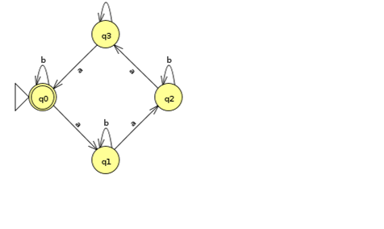
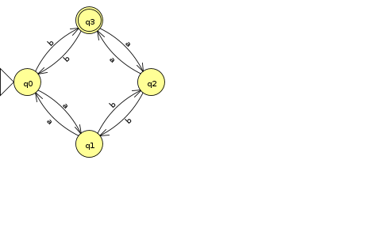
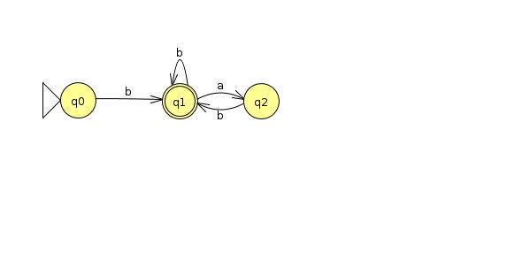
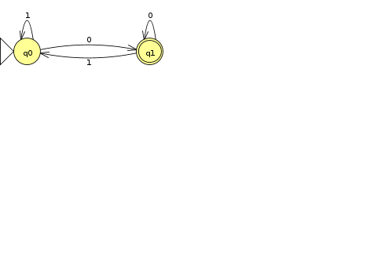
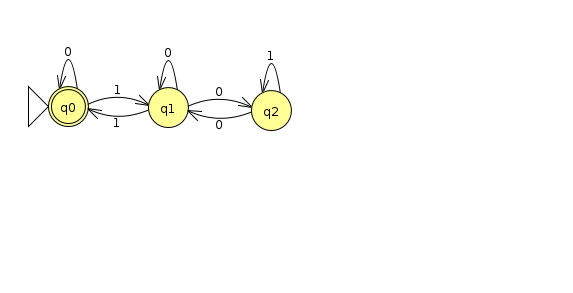
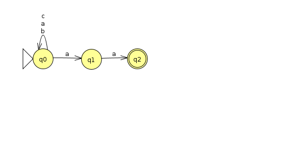
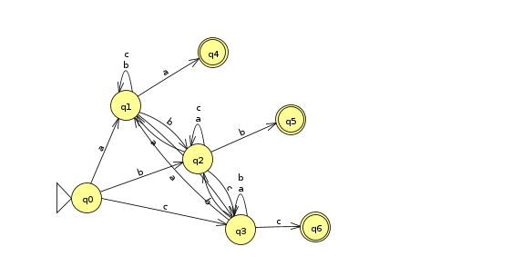
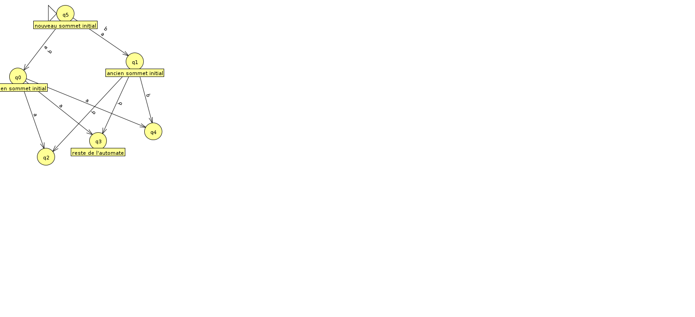
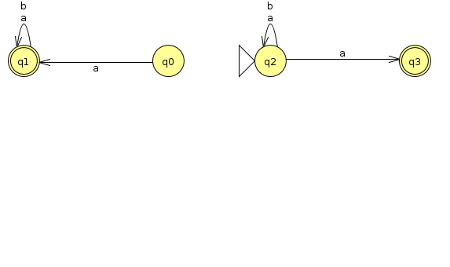
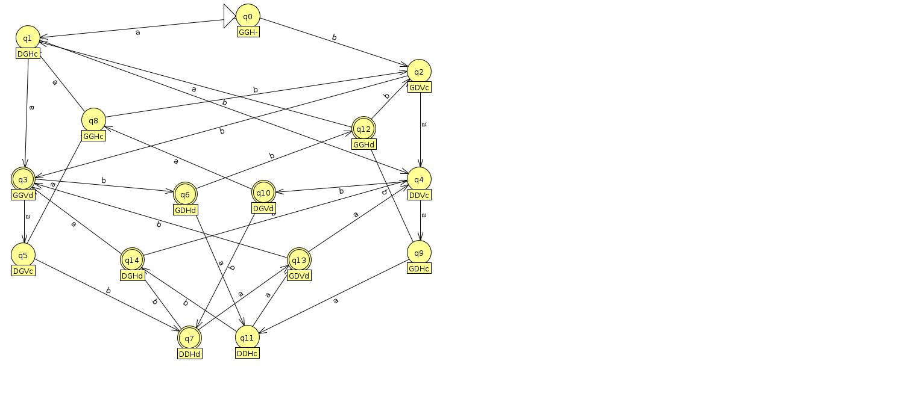

## Langages et automates finis

### Exercice 1

> Pour chaque langage ci-dessous sur l'alphabet $\{a,b\}$, donnez un automate
> fini déterministe qui l'accepte.

Le nombre de $a$ est un multiple de 4.



Un nombre pair de $a$ et impair de $b$.



Tout symbole $a$ est précédé et suivi d'au moins un symbole $b$.



Remarque : dans cet automate, $q_0$ n'est pas accepteur ; si l'on considère que le mot vide appartient au langage (il ne contient aucun $a$), il faut aussi rendre $q_0$ accepteur.

### Exercice 2

> Pour chaque langage ci-dessous sur l'alphabet binaire $\{0,1\}$, donnez un
> automate fini déterministe qui l'accepte.

Les entiers pairs.



Les entiers multiples de 3 (l'état $q_r$ mémorise le reste $r$ de la division par 3 du préfixe lu ; lire le bit $b$ fait passer de $r$ à $(2r+b) \bmod 3$).



### Exercice 3

> Pour chaque langage ci-dessous sur l'alphabet $\{a,b,c\}$, donnez un automate
> fini non déterministe qui l'accepte.

Les mots qui se terminent par $aa$.



Les mots dont la dernière lettre apparaît précédemment dans le mot.



Les mots dont la dernière lettre n'apparaît pas précédemment dans le mot (pas de schéma dans ces notes).

### Exercice 4

> Écrire un algorithme qui indique si un automate fini déterministe et complet
> $A=(Q,\Sigma,\delta,q_0,F)$ accepte un mot $\omega \in \Sigma^\ast$.

Formellement, soit $\omega = \omega_1 \ldots \omega_k$ un mot ($\omega_i$
est la $i$-ème lettre du mot) et $A=(Q,\Sigma,\delta,q_0,F)$ un automate : on veut
décider si $\omega$ est accepté par $A$. Soit $X_i$ l'ensemble des états
que l'on peut atteindre en ayant lu $\omega_1,\omega_2,\ldots,\omega_i$. L'algorithme suivant fonctionne aussi pour un automate non déterministe sans transition $\epsilon$ ; pour un automate déterministe et complet, chaque $X_i$ contient exactement un état.

```text
X_0 = {q_0}
pour i de 1 à k
    X_i = ∅
    pour tout p dans X_{i-1}
        pour tout q tel que (p, ω_i, q) est dans δ
            X_i = X_i ∪ {q}
pour tout p dans X_k
    si p est dans F
        retourner Vrai
retourner Faux
```

### Exercice 5

L'idée est de retirer le statut initial des deux états initiaux et de créer un nouvel état initial qui
mène aux deux anciens.

Remarque : si l'objectif est de conserver le langage accepté, les transitions issues du nouvel état doivent être des transitions $\epsilon$ (ou bien le nouvel état doit reprendre les transitions sortantes des anciens états initiaux). Avec des transitions étiquetées $a$ et $b$ comme sur le schéma, chaque mot accepté est précédé d'une lettre supplémentaire.



### Exercice 6

Démonstration par l'exemple :



## Jeu des portes bascules

Les parties gagnantes avec trois billes sont AAB, ABB, BAB et BBB.

Table de transition de l'automate :

|      |  A   |  B   |
|:----:|:----:|:----:|
| 000a | 100r | 011r |
| 000a | 100r | 011r |
| 001a | 101r | 011r |
| 010r | 110r | 000a |
| 010a | 110r | 001a |
| 100r | 010r | 111r |
| 100a | 010r | 111r |
| 101r | 011r | 100a |
| 101a | 011r | 100a |
| 110r | 000a | 101a |
| 110a | 000a | 101a |
| 111r | 001a | 110a |


