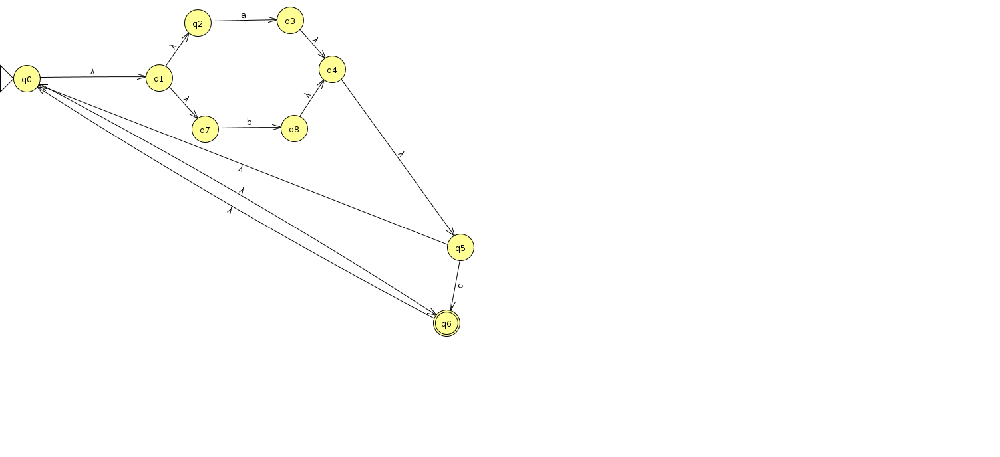

## Expressions régulières

### Exercice 1 (Syntaxe des expressions régulières)

`Définition :` L'ensemble des expressions régulières sur un alphabet $\Sigma$
est défini par :

1. $\varnothing, \epsilon, s$ quel que soit $s \in \Sigma$ sont des
   expressions régulières ;
2. si $\alpha$ et $\beta$ sont deux expressions régulières, alors
   $(\alpha+\beta)$, $\alpha\beta$ et $(\alpha)^\ast$ sont des expressions
   régulières.

Identification des expressions régulières :

1. $a$ est une expression régulière car membre de l'alphabet
2. $c$ n'est pas une expression régulière car non membre de l'alphabet
3. $a$ est une expression régulière et $b$ aussi donc $(a+b)$ est une
   expression régulière et aussi $(b)^\ast$ donc $(a+b^\ast)$ est une
   expression régulière
4. (non traité)
5. $a^\ast b$ est une expression régulière puisque $(a)^\ast$ et $b$ le
   sont
6. $(abba+baba)^\ast$ est une expression régulière (étoile d'une somme de concaténations de lettres)

### Exercice 2 (Langage défini par une expression régulière)

1. Le seul mot du langage est $a$.
2. Les mots formés d'un $a$ suivi d'un nombre quelconque de $b$, exemple
   $abbbb$.
3. Les mots commençant par un $a$ suivi de $a$ ou de $b$ en nombre quelconque,
   exemple $aababa$.
4. Les concaténations quelconques de $abba$ et de $baba$, exemple $abbababa$.

### Exercice 3 (Construction de Kleene)

Tentative :

### Exercice 4 (Simplifier la concaténation)

Non traité dans ces notes.

### Exercice 5 (Utilisation de grep)

1. `grep -e PATH .bash_export`
2. `last | grep -e sedelpeuch`
3. `grep -e .c` (attention : `.` désigne n'importe quel caractère ; pour rechercher les noms se terminant par `.c`, utiliser `grep -e '\.c$'`)
