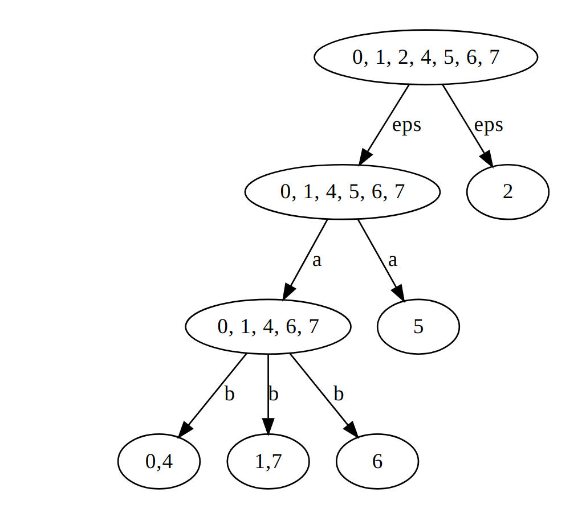

Merci à Aurélien et Fabien pour la prise de notes durant les séances de questions-réponses (initialement publiée sur l'instance de démonstration CodiMD, aujourd'hui supprimée).

Pour transformer un automate fini déterministe et complet en automate minimal équivalent :

1. éliminer les états inaccessibles ;
2. fusionner les états qui acceptent le même langage.

On obtient finalement le plus petit automate déterministe et complet qui accepte le même langage que l'automate de départ.

## Exercice 1 : Calcul d'automate minimal

*(Schéma non disponible : l'image était hébergée sur l'instance de démonstration CodiMD, qui n'existe plus.)*

### Calcul de la partie accessible

| Itération |                   Acc                   |
|:---------:|:---------------------------------------:|
|     0     |                $\{q_0\}$                |
|     1     |           $\{q_0, q_1, q_5\}$           |
|     2     |      $\{q_0, q_1, q_5, q_2, q_6\}$      |
|     3     |   $\{q_0, q_1, q_5, q_2, q_6, q_4\}$    |
|     4     | $\{q_0, q_1, q_5, q_2, q_6, q_4, q_7\}$ |

$q_3$ est un état inaccessible.

### Calcul des classes d'équivalence $\equiv_Q$

On considère au départ que tous les états sont équivalents, puis on enlève ceux qui ne le sont pas. On commence par retirer les couples contenant un état final et un état non final.

|       |       |       |       |       |       |       |       |
|:-----:|:-----:|:-----:|:-----:|:-----:|:-----:|:-----:|:-----:|
| $q_0$ |       |       |       |       |       |       |       |
| $q_1$ |   x   |       |       |       |       |       |       |
| $q_2$ |       |       |       |       |       |       |       |
| $q_4$ |       |   x   |       |       |       |       |       |
| $q_5$ |   x   |   x   |       |   x   |       |       |       |
| $q_6$ |   x   |   x   |       |   x   |   x   |       |       |
| $q_7$ |   x   |   x   |       |   x   |   x   |   x   |       |
|       | $q_0$ | $q_1$ | $q_2$ | $q_4$ | $q_5$ | $q_6$ | $q_7$ |

On fait ensuite la deuxième étape (pour chaque couple, s'il existe une lettre qui le mène vers un couple non équivalent, ce couple est lui aussi non équivalent).

|       |       |       |       |       |       |       |       |
|:-----:|:-----:|:-----:|:-----:|:-----:|:-----:|:-----:|:-----:|
| $q_0$ |       |       |       |       |       |       |       |
| $q_1$ |       |       |       |       |       |       |       |
| $q_2$ |       |       |       |       |       |       |       |
| $q_4$ |   x   |       |       |       |       |       |       |
| $q_5$ |       |       |       |       |       |       |       |
| $q_6$ |       |       |       |       |       |       |       |
| $q_7$ |       |   x   |       |       |       |       |       |
|       | $q_0$ | $q_1$ | $q_2$ | $q_4$ | $q_5$ | $q_6$ | $q_7$ |

Autre présentation/méthode pour trouver les états équivalents :

### Dessin de l'automate minimal

*(Schéma non disponible : l'image était hébergée sur l'instance de démonstration CodiMD, qui n'existe plus.)*

## Exercice 2 : Calcul de l'automate minimal

*(Schéma non disponible : l'image était hébergée sur l'instance de démonstration CodiMD, qui n'existe plus.)*

### Calcul de la partie accessible

| Itération |                     Acc                      |
|:---------:|:--------------------------------------------:|
|     0     |                  $\{q_0\}$                   |
|     1     |             $\{q_0, q_1, q_4\}$              |
|     2     |        $\{q_0, q_1, q_4, q_5, q_2\}$         |
|     3     |   $\{q_0, q_1, q_4, q_5, q_2, q_3, q_6\}$    |
|     4     | $\{q_0, q_1, q_4, q_5, q_2, q_3, q_6, q_7\}$ |

### Calcul des classes d'équivalence $\equiv_Q$

On commence par retirer les couples contenant un état final et un état non final.

|       |       |       |       |       |       |       |       |       |
|:-----:|:-----:|:-----:|:-----:|:-----:|:-----:|:-----:|:-----:|:-----:|
| $q_0$ |       |       |       |       |       |       |       |       |
| $q_1$ |   x   |       |       |       |       |       |       |       |
| $q_2$ |       |       |       |       |       |       |       |       |
| $q_3$ |   x   |   x   |       |       |       |       |       |       |
| $q_4$ |   x   |   x   |       |   x   |       |       |       |       |
| $q_5$ |   x   |   x   |       |   x   |   x   |       |       |       |
| $q_6$ |   x   |   x   |       |   x   |   x   |   x   |       |       |
| $q_7$ |       |       |   x   |       |       |       |       |       |
|       | $q_0$ | $q_1$ | $q_2$ | $q_3$ | $q_4$ | $q_5$ | $q_6$ | $q_7$ |

On fait ensuite la deuxième étape (pour chaque couple, s'il existe une lettre qui le mène vers un couple non équivalent, ce couple est lui aussi non équivalent).

|       |       |       |       |       |       |       |       |       |
|:-----:|:-----:|:-----:|:-----:|:-----:|:-----:|:-----:|:-----:|:-----:|
| $q_0$ |       |       |       |       |       |       |       |       |
| $q_1$ |       |       |       |       |       |       |       |       |
| $q_2$ |       |       |       |       |       |       |       |       |
| $q_3$ |   x   |       |       |       |       |       |       |       |
| $q_4$ |   x   |       |       |   x   |       |       |       |       |
| $q_5$ |   x   |       |       |   x   |   x   |       |       |       |
| $q_6$ |       |   x   |       |       |       |       |       |       |
| $q_7$ |       |       |   x   |       |       |       |       |       |
|       | $q_0$ | $q_1$ | $q_2$ | $q_3$ | $q_4$ | $q_5$ | $q_6$ | $q_7$ |
