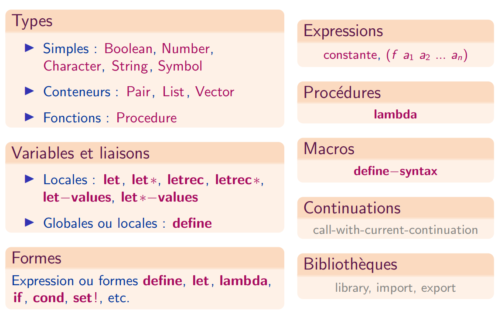
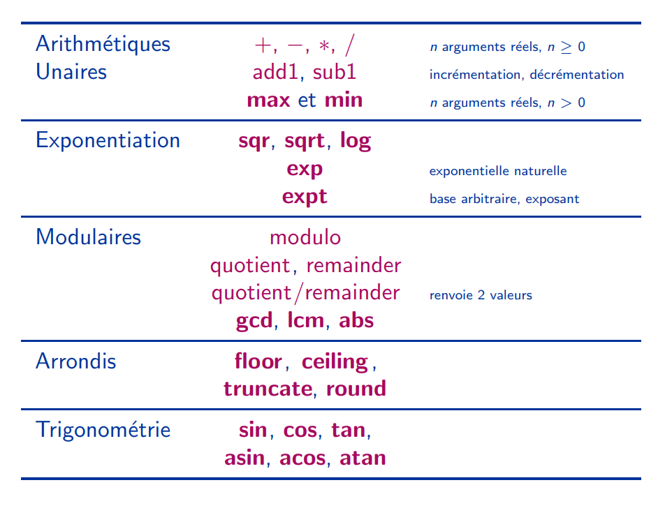

Résumé des constructions syntaxiques du langage :

Résumé des opérations numériques :

## Les caractères et les chaînes de caractères

* Caractère : `#\a`
* Chaîne : `"de caractères"`
* Prédicats de type : `char?`, `string?`
* Comparaisons : `char=?`, `char<?`, `char>?`, `string=?`, `string<?`, `string>?`
* Constructeurs : `make-string`, `string`
* Accesseur : `string-ref`
* Longueur : `string-length`
* Conversion : `number->string`, `string->number`

## Les expressions conditionnelles

`(if <condition> <alors> <sinon>)`

`(when <condition> <e1> ... <en>)`

Cette forme évalue les expressions `<ei>` et renvoie le résultat de la dernière quand l'expression `<condition>` est vraie.

`(cond [<condition> <e1> ... <en>] ... [<condition> <e1> ... <en>])`

Les crochets délimitant les clauses peuvent être remplacés par des parenthèses : la norme R6RS du langage Scheme les rend interchangeables.
