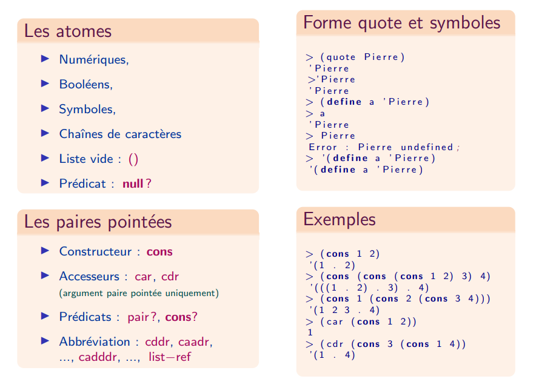

Résumé des différents objets en Scheme :

## Les listes

### Définition récursive des listes

* Liste vide : `'()` ou `null`
* Liste non vide : une paire pointée dont le `car` est un élément de la liste et le `cdr` est une liste
* **Liste impropre** : une chaîne de paires pointées qui ne se termine pas par la liste vide
* **Liste circulaire** : une chaîne de `cons` sans fin

### Fonctions de base sur les listes

* **Prédicats** : `list?`, `empty?`, `null?`
* **Prédicats d'égalité** : `eq?`, `equal?`
* **Fonctions de construction** : `list`, `list*`, `make-list`
* **Fonctions prédéfinies** : `length`, `append`, `reverse`, `member`, `remove`, `first` ... `tenth`, `list-ref`, `rest`, `last`
* **Fonctions d'a-listes** : `assq`, `assoc`

## Fonction `append` : concaténation de listes

* Fonction n-aire
* Les arguments sont des listes, sauf le dernier qui est un objet quelconque
* Le `cdr` de la dernière paire pointée de l'argument $n$ (la liste vide) est remplacé par l'argument $n+1$
* Sans effet de bord : recopie des paires pointées de toutes les listes en argument, sauf le dernier argument qui est partagé

## Fonction `remove` : filtrage de listes

La fonction `remove` prend en arguments un élément et une liste, et elle renvoie la liste privée de la première occurrence de l'élément. Elle admet un troisième argument optionnel, qui est le prédicat de test de l'égalité. Par défaut, c'est `equal?` qui est utilisé.

## Fonction `member` : appartenance à une liste

La fonction `member` prend en arguments un élément `e` et une liste `l`, et elle renvoie `#f` si `e` n'appartient pas à `l`, ou la sous-liste de `l` qui commence à la première occurrence de `e` si celui-ci apparaît dans la liste. Le prédicat d'égalité utilisé est `equal?`.

## Les listes d'association : a-listes

C'est une liste de paires pointées. Le `car` de chaque paire est une clé : ces listes servent à représenter des tables (indexées), des dictionnaires, des environnements.

La fonction `assoc` admet deux paramètres : une clé et une a-liste. Elle parcourt la liste et renvoie la première paire pointée dont le `car` est égal, au sens de `equal?`, à la clé, et `#f` sinon.

La fonction `assq` réalise le même travail avec `eq?` (`assv` avec `eqv?`).
