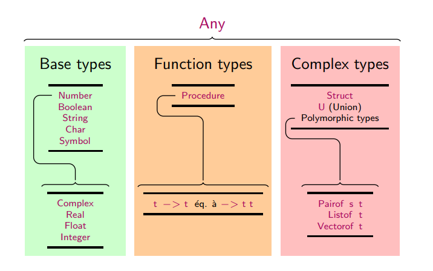

Un système de type classe les valeurs en ensembles appelés **types**, de manière à garantir la correction de certains programmes.



## Styles de typage

* Le typage **dynamique** : déterminé pendant l'exécution par l'environnement d'exécution, il ne nécessite aucune intervention du programmeur
* Le typage **statique** : fixé avant l'exécution par le compilateur, il est soit inféré automatiquement, soit indiqué par des annotations dans le code

En Typed Racket, afin d'annoter une valeur `<val>` par un type `<typ>`, il suffit d'écrire avant la définition de `<val>` :

```scheme
(: <val> <typ>)
```

Les types primitifs contiennent en particulier : `Number`, `Integer`, `Float`, `Char`, `String`.

Le typage possède plusieurs intérêts :

* détection d'erreurs de type : passer une valeur de type `String` à une fonction `Integer -> Integer` est incohérent ;
* compatibilité de types : passer une valeur de type `Integer` à une fonction `Number -> Number` est cohérent, car un `Integer` est aussi un `Number` ;
* optimisations : le compilateur peut générer du code dédié à des types particuliers.

## Définir ses propres types

Le code suivant définit une structure représentant des points du plan :

```scheme
(struct point ([x : Real] [y : Real]))

(: distance (point point -> Real))
(define (distance p1 p2)
  (sqrt (+ (sqr (- (point-x p2) (point-x p1)))
           (sqr (- (point-y p2) (point-y p1))))))
```

Cette construction définit en même temps les fonctions suivantes :

* un constructeur `point` permettant de construire des instances, par exemple `(point 3 4)` ;
* deux accesseurs `point-x` et `point-y` permettant d'accéder aux champs de la structure.

## Reconnaissance de motifs

La reconnaissance de motifs (*pattern matching*) s'effectue avec la forme `match` :

```scheme
(match t
  [<pat1> res1]
  [<pat2> res2]
  ...
  [<patn> resn]
  [_ default])
```

* `match` compare l'expression `t` à chacun des motifs `<patk>`, dans l'ordre ;
* elle renvoie le résultat associé au premier motif auquel `t` correspond ; le motif `_` correspond à toute valeur.

Les motifs peuvent introduire des liaisons utilisées dans le résultat.
