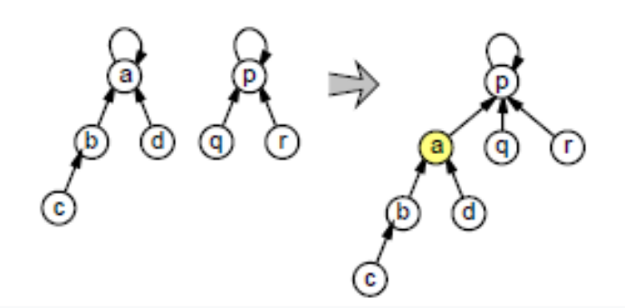

## Union-Find

[Énoncé de l'exercice (PDF)](./img/UnionFindenoncés.pdf)

On dispose d'ensembles disjoints sur $n$ éléments, on veut :

+ tester si 2 éléments $x,y$ appartiennent au même ensemble : `Find(x)=Find(y)` ?
+ fusionner les 2 ensembles disjoints contenant $x$ et $y$ : `Union(x,y)`.

### Une première structure naïve

#### Question 1

Test si $x$ et $y$ appartiennent au même ensemble en temps $O(1)$ (comparaison des indices d'ensemble).

#### Question 2

UNION : tous les éléments $z$ de l'ensemble de $x$ doivent mettre à jour leur indice `z.indice = y.indice`, en temps linéaire en fonction de $n$.

#### Question 3

Complexité totale $O(k^2)$.

### Vers une version efficace

#### Question 4

#### Question 5

La complexité de la séquence `Union(1,2)...Union(1,n)` est $\Theta (n^2)$.

#### Question 6

On a $rang(p)>rang(q)$.

#### Question 7

Soit $P(r)$ la proposition : « Tout ensemble dont la racine est de rang $r$ possède au moins $2^r$ éléments ». On montre que cette propriété est un invariant de la structure, par récurrence sur le nombre d'opérations.

+ Initialement (`MakeSet`), chaque ensemble est un singleton de rang $0$ et possède $1 = 2^0$ élément.
+ Considérons une opération `Union` entre deux ensembles $S_1$ et $S_2$ de rangs $r_1 \leq r_2$ vérifiant l'invariant.
  + Si $r_1 < r_2$, la racine de $S_2$ devient la racine de l'union et son rang reste $r_2$ ; l'union possède au moins $2^{r_1}+2^{r_2} \geq 2^{r_2}$ éléments.
  + Si $r_1 = r_2 = r$, le rang de la nouvelle racine devient $r+1$ ; l'union possède au moins $2^r+2^r = 2^{r+1}$ éléments. C'est l'unique cas où un rang augmente.

Dans tous les cas, l'invariant est préservé (les opérations `Find` ne modifient ni les rangs ni les ensembles).

#### Question 8

D'après la question 7, si une racine est de rang $r$, alors son ensemble possède au moins $2^r$ éléments. Or $2^r \leq n$, donc $r \leq \log_2(n)$. Comme le rang croît strictement le long d'un chemin qui va vers la racine, la hauteur maximale d'un arbre est $\lfloor \log_2(n) \rfloor$. Toute opération FIND et UNION prend donc un temps $O(\log n)$, et chaque opération MakeSet un temps $O(1)$. Ainsi, une séquence de $m$ opérations sur $n$ éléments a une complexité $O(n + m \log n)$.

Notons qu'on peut encore améliorer la structure avec la compression de chemins, qui diminue la profondeur des arbres : combinée à l'union par rang, elle donne une complexité quasi linéaire $O(m \, \alpha(n))$, où $\alpha$ est l'inverse de la fonction d'Ackermann.
