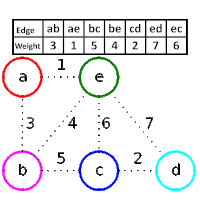
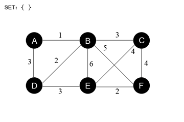

Un **arbre couvrant** d'un graphe $G:=(V,E)$ est un ensemble d'arêtes $D
\subseteq E$ pour lequel $(V,D)$ est un arbre. Si l'on suppose que le graphe
est **pondéré**, c'est-à-dire muni d'une fonction $p$ qui associe à toute
arête un réel appelé son **poids**, un arbre couvrant $D$ est dit
**minimal** si son **poids**, $p(D)=\sum \limits_{d \in D} p(d)$, est au plus
égal au poids de tout arbre couvrant. Le problème de l'arbre couvrant minimal
(ACM) est alors :

```text
ACM
ENTRÉE : un graphe G non orienté, connexe et pondéré
SORTIE : un arbre couvrant minimal de G
```

La résolution de ce problème repose sur la définition suivante.

`Définition :` Une **coupure** d'un graphe $G$ est un couple partitionnant
l'ensemble des sommets, c'est-à-dire un couple de la forme $(P,V_G-P)$ avec
$P \subseteq V_G$. Une arête $e \in E_G$ **traverse** la coupure
$(P,V_G-P)$ si l'une de ses extrémités est dans $P$ et l'autre non. Une coupure
**respecte** un ensemble d'arêtes $D \subseteq E_G$ si aucune arête $e \in
D$ ne traverse la coupure.

L'algorithme générique repose sur la propriété suivante : si $D$ est inclus dans un arbre couvrant minimal et si $e$ est une arête de poids minimal traversant une coupure qui respecte $D$, alors $D \cup \{e\}$ est encore inclus dans un arbre couvrant minimal.

```text
fonction Acm(G:graphe):ensemble d'arêtes
    retourner AcmRecursif(G, ∅)

fonction AcmRecursif(G:graphe, D:ensemble d'arêtes): ensemble d'arêtes
    si D est un arbre couvrant de G
        retourner D
    sinon
        choisir une coupure (P,V_G-P) respectant D et une arête e de poids minimal traversant (P,V_G-P)
        retourner AcmRecursif(G, D ∪ {e})
```

## Algorithme de Kruskal



L'implémentation de l'ACM itératif par Kruskal consiste à choisir une arête de
poids minimal parmi toutes celles qui traversent une coupe respectant les arêtes
déjà choisies, c'est-à-dire choisir une arête qui ne crée pas de cycle dans la
solution courante. Avec une structure Union-Find pour tester l'acyclicité, la complexité est en $O(m \log m)$, dominée par le tri.

```text
fonction Acm-Kruskal(G:graphe):ensemble d'arêtes
    trier l'ensemble des arêtes E_G par poids croissant
    D = ∅

    pour chaque arête e prise par poids croissant
        si D ∪ {e} est acyclique alors
            D = D ∪ {e}
    retourner D
```

## Algorithme de Prim



L'algorithme de **Prim** construit une coupure $(V-P,P)$ et un ensemble $D$ de
telle sorte qu'à chaque instant l'ensemble acyclique $D$ connecte les sommets
de $V-P$ en un arbre et laisse chacun des sommets de $P$ isolé. L'arbre
couvrant minimal de $G$ sera représenté à l'aide d'une fonction père qui
associe à tout sommet, sauf un (la racine), un sommet. Pour choisir rapidement
une arête traversant $(V-P,P)$ de poids minimal, on fait en sorte qu'à chaque
instant, pour tout sommet $x \in P$ :

+ l'arête $\{pere(x),x\}$ soit une arête de poids minimal parmi celles qui relient $x$ à $V-P$ ;
+ on connaisse le poids de cette arête : c'est l'objet de la fonction `clé(x)`.

```text
fonction Acm-Prim(G:graphe pondéré): fonction V_G -> V_G
    clé = tableau indicé par V_G initialisé à l'infini
    père = tableau indicé par V_G initialisé à NULL
    P = V_G
    choisir un sommet r dans V_G
    clé[r] = 0

    tant que non(estVide(P)) faire
        extraire de P un élément x de clé minimale
        pour chaque voisin y de x faire
            si y dans P et poids(x,y) < clé[y] alors
                clé[y] = poids(x,y)
                père[y] = x
    retourner père
```
