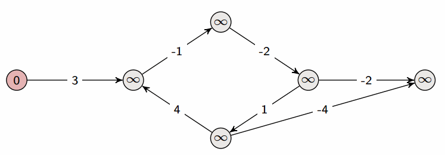

Le problème du plus court chemin considéré ici porte sur des graphes orientés à
arcs pondérés. Un plus court chemin d'un sommet $s$ à un sommet $t$ est
alors un chemin de $s$ à $t$ dont la somme des poids des arcs est
minimale.

## Bellman-Ford

Le premier algorithme étudié est un algorithme qui garantit que, pour tout
chemin $(s_1,\ldots,s_l)$ avec $l \leq n$, les arcs
$(s_1,s_2),\ldots,(s_{l-1},s_l)$ seront relâchés dans cet ordre. L'intérêt de cet
algorithme est triple :

+ sa définition est très simple ;
+ il retourne un résultat correct pour des graphes possédant des arcs de poids
  négatifs ;
+ il détecte un cycle de poids négatif accessible depuis $s$, s'il en existe un.

Sa complexité est en $O(n \times m)$.



```text
fonction Bellman-Ford(G : graphe à arcs pondérés, s : sommet de G) : (booléen, tableau V_G -> R, tableau V_G -> V_G)
    (d,pere) = relacherInit(G,s)

    faire |V_G| - 1 fois
        pour chaque arc (u,v) de G
            relacher(u,v,G,d,pere)

    // détection d'un cycle de poids négatif
    pour chaque arc (u,v) de G
        si d(v) > d(u) + poids(u,v)
            retourner (Faux, d, pere)
    retourner (Vrai, d, pere)

procédure relacher(u:sommet, v:sommet, G:graphe à arcs pondérés, d: tableau V_G -> R, père : tableau V_G -> V_G)
    si d(v) > d(u) + poids(u,v)
        d[v] = d(u) + poids(u,v)
        père[v] = u
```

## Dijkstra


Le second algorithme étudié a pour principales propriétés :

+ sa correction n'est établie que pour des graphes sans arc de poids négatif ;
+ la simplicité de sa définition ;
+ une faible complexité en temps : $O((n + m) \log n)$ avec un tas binaire.

```text
fonction Dijkstra(G: graphe à arcs pondérés, s: sommet):(fonction V_G -> R, fonction V_G -> V_G)
    (d,père) = relacherInit(G,s)
    Y = V_G

    tant que Y n'est pas l'ensemble vide faire
        extraire un élément u de Y de valeur d minimale
        pour chaque successeur v de u faire
            si v appartient à Y alors
                relacher(u,v,G,d,père)
    retourner(d,père)

procédure relacherInit(G: graphe à arcs pondérés, s: sommet):(tableau V_G -> R, tableau V_G -> V_G)
    d = tableau indicé par V_G initialisé à l'infini
    père = tableau indicé par V_G initialisé à NULL
    d[s] = 0
    retourner (d,père)
```
