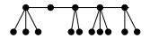
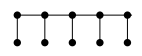
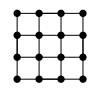

## <i class="fas fa-project-diagram"></i> Chemins

Une **chemin** dans un graphe $(V,E)$ est une séquence $w$ de la forme
$(s_1,e_1,...,e_l,s_{l+1})$ où pour pour tout $i \in [1,l]$, $e_i$ est un
arc allant du sommet $s_i$ au sommet $s_i+1$. L'entier $l$ éventuellement
nul est noté $|w|$ et est appelé la **longueur** de $w$.

Un chemin est **simple** si il ne passe pas deux fois par le même arc. Il est
**élémentaire** si il passe deux fois par le même sommet.

### Concaténation

Une opération naturelle sur les chemins est la concaténation : la concaténation
de deux chemins $u$ et $v$ allant respectivement d'un sommet $x$ à un
sommet $y$ et d'un somme $y$ à un sommet $z$ est le chemin noté $u \cdot
v$ obtenu en concaténant à la séquence $u$ la séquence $v$ débarassée de
son premier élément $y$. Clairement, le chemin $u \cdot v$ va de $x$ à
$z$ et à pour longueur $|u \cdot v| = |u| + |v|$

### Distance dans un graphe

La **distance** dans un graphe $G$ est notée $d_G(s,t)$ et est la longueur
du plus court chemin allant de $s$ à $t$ si il existe $+\infty$ sinon.

## <i class="fas fa-project-diagram"></i> Cycle

Un **cycle** dans un graphe est un chemin dont les deux extrémités sont égales.
Les adjectifs **élémentaires** et **simples** sont étendus aux cycle. Si un
graphe contient un cycle, il contient un cycle élémentaire.

`Fait 2 :` Si un graphe orienté possède un cycle, il possède un cycle simple et élémentaire

Dans le cas non orienté, tout graphe possédant au moins une arête, possède un
cycle : l'arête $e$ d'extrémités $s$ et $t$ permet de construire le cycle
$(s,e,t,e,s)$. Ainsi la notion intéressante n'est pas "cycle" mais "cycle
simple".

Définition 4 : Un graphe est acyclique si il ne possède aucun cycle simple de
longueur non nulle.

## <i class="fas fa-project-diagram"></i> Arborescence et arbre

Une **arboresence** est un graphe orienté admettant un sommet, appelé
**racine**, tel que pour tout sommet il existe un unique chemin de la racine
vers ce sommet.

Un **arbre** est un graphe non orienté connexe et acyclique.

## <i class="fas fa-project-diagram"></i> Lexique sur les graphes

|  Nom du graphe   |        Représentation         |
|:----------------:|:-----------------------------:|
| Graphes discrets |  |
|     Etoiles      |  |
|     Peignes      |  |
|    Chenilles     |  |
|      Grille      |  |
|    Hypercube     |  |
