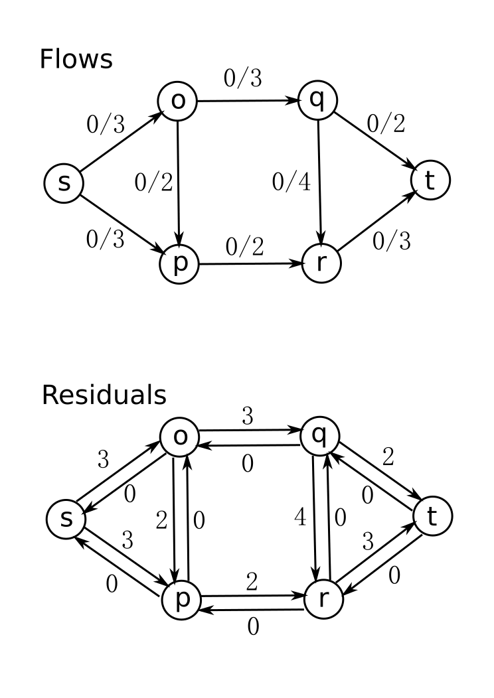
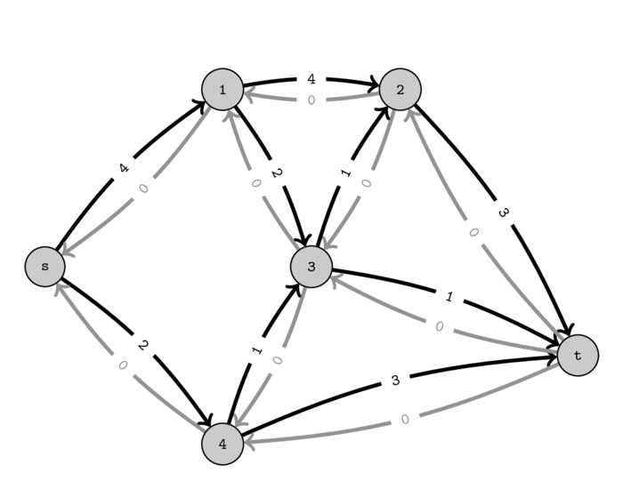

Un système dans lequel un matériau s'écoule, tel l'eau ou l'électricité, peut
être modélisé à l'aide d'un graphe. Une question naturelle se pose : quelle est
la capacité maximale de ce système ? Ce problème est connu sous le nom de flot
maximal et admet plusieurs solutions algorithmiques efficaces. Nous en
présenterons ici quelques-unes.

## Définitions

Un `réseau` est un 5-uplet $G=(V,E,c,s,t)$ noté $(V_G,E_G,c_G,s_G,t_G)$ où

* $(V,E)$ est un graphe simple orienté où $E$ est supposé être $E=V \times
  V$
* $c$ associe à chaque arc $e$ sa capacité, c'est-à-dire un réel positif ou
  nul noté $c(e)$
* $s$ est un sommet appelé la source
* $t$ est un sommet distinct de $s$ appelé le puits

Un flot de $G$ est une fonction qui associe à chaque arc $(u,v) \in E$ un
réel $f(u,v)$ appelé le flot net de $u$ à $v$, et tel que :

1. contrainte de capacité : pour tout arc $(u,v) \in E$, on a $f(u,v)\leq
   c(u,v)$
2. symétrie : pour tout arc $(u,v) \in E$, on a : $f(u,v)=-f(v,u)$
3. conservation du flot : tout sommet $u \in V - \{s,t\}$ vérifie : $\sum
   \limits_{v \in V} f(u,v)=0$

La valeur du flot $f$, notée $|f|$, est la quantité $\sum \limits_{v \in V}
f(s,v)$.

Le problème du flot maximal consiste à calculer, pour tout réseau, un flot de
valeur maximale. Dans la suite de ce chapitre, nous noterons *flot net positif*
d'un sommet $u$ la somme des flots nets positifs sortant de $u$, c'est-à-dire
plus formellement $\sum \limits_{v \in V, f(u,v)>0} f(u,v)$. Afin d'établir la
correction des algorithmes résolvant le problème du flot maximal, nous
établissons ci-dessous un lemme portant sur le flot entre deux ensembles de
sommets $X$ et $Y$. Cette quantité définie pour tout couple d'ensembles de
sommets $X$ et $Y$ est notée $f(X,Y)$ et est égale à :

$$
f(X,Y)=\sum \limits_{x \in X}\sum \limits_{y \in Y}f(x,y)
$$

## Propriétés

### Réseau résiduel

La propriété qui suit implique que tout flot de valeur non nulle est, s'il n'est pas maximal, un début de réponse. En effet, nous pouvons définir à partir de ce flot $f$ défini sur un réseau $G$ un nouveau réseau $G'$ "plus simple" pour lequel tout flot maximal $f'$ permettra de définir le flot maximal $f'+f$ sur $G$.

#### Définition

La capacité résiduelle d'un réseau $(V,E,c,s,t)$ induit par un flot $f$ est la fonction notée $c_f$ qui associe à tout arc $(u,v) \in E$ le réel positif ou nul $c(u,v)-f(u,v)$. Le réseau résiduel d'un réseau $(V,E,c,s,t)$ induit par un flot $f$ est le réseau $(V,E,c_f,s,t)$.

### Chemin améliorant

Définir un flot peut se réaliser simplement en choisissant dans le réseau un chemin de $s$ à $t$ et en prenant pour valeur la capacité minimale des arcs de ce chemin.

#### Définition

Soit $G=(V,E,c,s,t)$ un réseau et $p$ un chemin élémentaire dans $G$ de $s$ à $t$. La capacité de $p$ est le minimum des capacités des arcs que possède $p$ et est notée $c(p)$. Le flot induit par $p$ est la fonction notée $f_p$ qui associe à tout arc $(u,v) \in V^2$ la quantité définie par :

* $c(p)$ si $(u,v)$ appartient à $p$ ;
* $-c(p)$ si $(v,u)$ appartient à $p$ ;
* $0$ sinon.

Un chemin $p$ allant de $s$ à $t$ améliore un flot $f$ de $G$ si la capacité de $p$ dans le réseau résiduel de $G$ induit par $f$ est strictement positive.

#### Lemme

La fonction $f_p$ induite par un chemin élémentaire $p$ de la source au puits dans un réseau est un flot de valeur $c(p)$.

## Flot maximal et coupe minimale

Nous allons établir le théorème `minimax` qui caractérise un entier maximal à vérifier une certaine propriété comme étant minimal à en vérifier une seconde. Ce genre de résultat est à remarquer car il augure souvent favorablement la possibilité de calculer efficacement un tel entier.

### Définition

Une `coupe` dans un réseau $G=(V,E,c,s,t)$ est un couple d'ensembles de sommets de la forme $(X,Y)$ avec $X\subseteq V$, $Y = V-X$, $s \in X$ et $t \in Y$. Sa `capacité`, notée $c(X,Y)$, est la somme $\sum \limits_{x \in X, y \in Y} c(x,y)$. Une coupe est minimale si sa capacité est au plus égale à la capacité de toute coupe de ce réseau. Le flot d'une coupe $(X,Y)$ relativement à un flot $f$ est la quantité $f(X,Y)$.

### Lemme

Tout flot $f$ et toute coupe $(X,Y)$ d'un même réseau de capacité $c$ vérifient :

$$
|f|=f(X,Y) \leq c(X,Y)
$$

### Théorème

Soit $f$ un flot dans un réseau $G$. Les quatre assertions suivantes sont équivalentes :

1. $f$ est un flot maximal
2. $f$ n'admet aucun chemin améliorant
3. il existe une coupe dans le réseau résiduel induit par $f$ de capacité nulle
4. il existe une coupe $(X,Y)$ de capacité $c_G(X,Y)$ égale au flot $f(X,Y)$

### Corollaire (flot maximal / coupe minimale)

Pour tout réseau, la valeur maximale des flots est égale à la capacité minimale des coupes.

## Deux solutions au problème du flot maximal

### Ford-Fulkerson



L'algorithme de Ford-Fulkerson est un algorithme pour le problème du flot maximal. Il s'agit d'un algorithme itératif. À chaque itération, la solution courante est un flot qui satisfait les contraintes de capacité (c'est donc un flot réalisable) et l'algorithme essaie d'augmenter la valeur de ce flot. À chaque itération de la boucle, deux sous-procédures interviennent :

* le marquage, qui consiste à tester si une amélioration du flot est possible (recherche d'un chemin améliorant) ;
* le changement de flot, qui augmente le flot le long du chemin trouvé.

```text
fonction FordFulkerson(G=(V,E,c,s,t):réseau):flot
    fmax = 0
    tant qu'il existe un chemin de s à t de capacité positive faire
        calculer un chemin p élémentaire de s à t de capacité positive
        f = flotInduit(G,p)
        G = réseauRésiduel(G,f)
        fmax = fmax + f
    retourner fmax
```

Pour garantir une complexité polynomiale, le marquage doit être fait dans le même ordre que la découverte des sommets (parcours en largeur). La complexité de l'algorithme est alors en $O(n m^2)$ pour un graphe avec $n$ sommets et $m$ arcs (algorithme d'Edmonds-Karp, ci-dessous).

### Une amélioration de Ford-Fulkerson qui termine

Dans la définition de `FordFulkerson`, aucune précision n'a été indiquée sur la façon de calculer un chemin de $s$ à $t$ de capacité non nulle. Cette question est pourtant cruciale : sur des réseaux à capacités réelles (irrationnelles), l'algorithme peut ne pas terminer, et avec des capacités entières son nombre d'itérations peut être proportionnel à la valeur du flot maximal.

Cette grande faiblesse de `FordFulkerson` peut être facilement corrigée : en effet, si l'on utilise un simple parcours en largeur à partir de $s$ pour calculer un plus court chemin de $s$ à $t$, on obtient un algorithme qui termine toujours, avec une bien meilleure complexité en temps dans le pire des cas : l'algorithme d'Edmonds-Karp.



```text
fonction EdmondsKarpRec(G=(V,E,c,s,t):réseau):flot
    si il n'existe aucun chemin de s à t de capacité positive alors
        retourner 0
    sinon
        calculer un plus court chemin p de s à t de capacité positive
        f = flotInduit(G,p)
        H = réseauRésiduel(G,f)
        retourner f + EdmondsKarpRec(H)
```

Le temps d'exécution en $O(n m^2)$ s'obtient en constatant que chaque chemin augmentant peut être trouvé en temps $O(m)$, qu'à chaque fois au moins un arc de $E$ est saturé, que la distance de la source à un arc saturé par le chemin augmentant croît à chaque fois que l'arc est saturé, et que cette distance est au plus $|V|$. Une autre propriété de cet algorithme est que la longueur du plus court chemin augmentant ne décroît jamais.

## Théorèmes de Menger

Nous conclurons ce chapitre en présentant les Théorèmes de Menger. Chacun de ces théorèmes établit, pour tous sommets $s \neq t$, l'égalité de deux entiers :

* le plus petit nombre d'objets qu'il faut retirer pour déconnecter $s$ de $t$ ;
* le plus grand nombre de chemins deux à deux disjoints (vis-à-vis de ces objets) connectant $s$ à $t$.

Fait remarquable, cette propriété concerne des graphes orientés ou non et des
  "séparateurs" formés de sommets, d'arcs ou d'arêtes.

Un ensemble $S$ d'arcs (resp. d'arêtes, de sommets) d'un graphe $G$ sépare un
sommet $s$ d'un sommet $t$ s'il ne contient ni $s$ ni $t$ et si tout
chemin de $G$ allant de $s$ à $t$ contient un élément de $S$. Un tel
ensemble est dit séparateur.

Cette définition en appelle d'autres, qui permettent de quantifier le nombre de
sommets, d'arcs ou d'arêtes nécessaires à déconnecter le graphe, c'est-à-dire à
séparer deux sommets.

Soit $k$ un entier. Un graphe $G$ est :

* $k$-arc-connexe si tout ensemble d'arcs séparateur est de cardinalité
  au moins $k$ ;
* $k$-arête-connexe si tout ensemble d'arêtes séparateur est de cardinalité
  au moins $k$ ;
* $k$-connexe si tout ensemble de sommets séparateur est de cardinalité
  au moins $k$.
