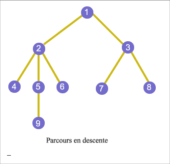

Pour la plupart des problèmes sur des graphes, toute solution algorithmique doit
visiter chacun des sommets et/ou chacun des arcs du graphe considéré, c'est-à-dire
prendre en compte ses propriétés locales : quels sont ses sommets adjacents,
quels sont ses arêtes ou arcs incidents, quels sont les étiquettes ou éventuels
poids, etc.

Pour définir algorithmiquement un parcours, on utilise, comme pour les arbres,
un ensemble de sommets en attente (noté ici GRIS). À tout instant de l'algorithme, l'ensemble des
sommets est partitionné en trois ensembles disjoints BLANC, GRIS, NOIR, dont
l'union forme l'ensemble des sommets de G et dont la sémantique est la suivante :

+ BLANC est l'ensemble des sommets non visités ;
+ NOIR est l'ensemble des sommets visités dont on sait que tous les arcs
  sortants ont été visités, ainsi que leurs sommets extrémités ;
+ GRIS contient les autres sommets (visités, mais pas encore entièrement traités).

## Parcours en largeur


Le premier choix pour implémenter l'ensemble GRIS est d'utiliser une file.
L'algorithme qui en découle est appelé un parcours en largeur. La raison de ce
nom est liée à l'ordre dans lequel les sommets sont visités à partir du premier
sommet $s$ : les premiers sommets visités sont les sommets à distance 1 du
sommet $s$, puis ceux à distance 2 et ainsi de suite. En conséquence,
l'arborescence de liaison retournée (tableau `pere`) fournit un ensemble de plus courts chemins (en nombre d'arcs) du
sommet $s$ aux sommets accessibles à partir de $s$. Voici l'algorithme de
parcours vu dans le chapitre précédent, modifié uniquement par le traitement de
l'ensemble GRIS comme une file.

```text
procédure parcoursLargeur(G: graphe, s: sommet)
    n = nbrSommets(G)
    couleur = constructTableau(n,'blanc')
    pere = constructTableau(n,0)
    GRIS = fileVide()
    couleur[s] = 'gris'
    enfiler(s,GRIS)

    tant que non(estVide(GRIS)) faire
        u = défiler(GRIS)
        pour tout arc e sortant de u faire
            v = 2ndeExtrémité(e)
            si couleur[v]='blanc' alors
                couleur[v] = 'gris'
                enfiler(v,GRIS)
                pere[v]=u
        couleur[u] = 'noir'
```

## Parcours en profondeur



À la différence du parcours en largeur, où l'on découvre tous les successeurs
blancs du sommet colorié le plus anciennement en gris, lors du parcours en
profondeur le sommet gris dont on découvre les successeurs blancs est le sommet
le plus récemment colorié en gris : en d'autres termes, on implémente l'ensemble
GRIS à l'aide d'une pile. À l'image du parcours en profondeur dans les arbres
binaires, la définition la plus simple d'un parcours en profondeur est
assurément récursive. La pile GRIS mentionnée est alors cachée par la pile
d'appel utilisée lors de ces appels récursifs.

```text
procédure parcoursProfondeur(G:graphe)
    temps = 0
    n =  nbrSommets(G)
    couleur = constructTableau(n,'blanc')
    pere = constructTableau(n,0)
    d = constructTableau(n,0)
    f = constructTableau(n,0)

    pour chaque sommet u faire
        si couleur[u] = 'blanc' alors
            explorer(G,u)

procédure explorer(G: graphe,u: sommet)
    couleur[u] = 'gris'
    d[u] = ++temps

    pour chaque arc e sortant de u faire
        v = 2ndeExtrémité(e)
        si couleur[v]='blanc' alors
            pere[v] = u
            explorer(G,v)
    couleur[u] = 'noir'
    f[u] = ++temps
```

### Première application : reconnaissance de graphes acycliques

On s'intéresse ici à déceler, dans un graphe orienté, la présence de cycles, c'est-à-dire plus précisément
de cycles simples ayant au moins un arc. L'algorithme décidant si un graphe est
sans cycle est une variante immédiate du parcours en profondeur. Sa correction
est basée sur l'équivalence des deux assertions suivantes :

+ $G$ contient un cycle simple ;
+ tout parcours en profondeur de $G$ rencontre un arc de retour (arc vers un sommet encore gris).

### Deuxième application : tri topologique

Comment numéroter les sommets de façon à ce que, pour tout arc $(s,t)$, $s$ ait un
plus petit numéro que $t$ ?

`Définition :` Un **tri topologique** d'un graphe orienté $G$ est une
numérotation $\phi$ des sommets de $G$ telle que pour tous sommets $s$ et
$t$ on ait : $(s,t) \in E_G \Rightarrow \phi(s) < \phi(t)$

Clairement, tout graphe n'admet pas un tri topologique. Propriété remarquable : un graphe orienté admet un tri topologique si et seulement s'il est acyclique. Un tel tri s'obtient en classant les sommets par dates de fin `f[u]` décroissantes à l'issue d'un parcours en profondeur.
