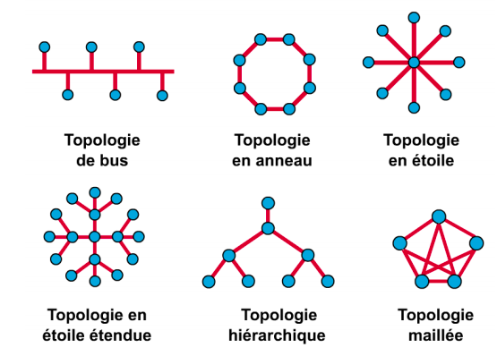

## Qu'est-ce qu'un réseau de communication ?

+ Un réseau de communication peut être défini comme l'ensemble des ressources
  matérielles et logicielles liées à la transmission et l'échange d'informations
  entre différentes entités. Suivant leur organisation, ou architecture, les
  distances, les vitesses de transmission et la nature des informations
  transmises, les réseaux font l'objet d'un certain nombre de spécifications et
  normes.
+ Les réseaux de communications peuvent être classés en fonction :
  + du type d'informations transportées
  + de la nature des entités impliquées
+ On distingue trois principales catégories de réseaux :
  + Les réseaux de télécommunications
  + Les réseaux téléinformatiques
  + Les réseaux de télédiffusion

## Les réseaux de télécommunications

Ce sont les réseaux de communication les plus anciens ; ils ont pour objectif
l'acheminement de communications vocales entre individus. La parole pouvant être
envoyée brute sous la forme d'ondes électromagnétiques, on parle alors de
communication vocale analogique, ou sous la forme d'une suite d'informations
binaires (0 ou 1) après avoir subi un traitement appelé numérisation.

### Historique des télécommunications

Les télécommunications recouvrent toutes les techniques de transfert de
l'information quelle qu'en soit la nature. Le terme "télécommunication" a été
introduit en 1904 par Édouard Estaunié (1862-1942), ingénieur général des télégraphes.
En 1932 (conférence de Madrid), l'Union télégraphique internationale
est renommée Union internationale des télécommunications.

### Mise en relation des correspondants dans les réseaux de télécommunications

La mise en relation, c'est la commutation : la commutation de circuits
(commutation spatiale) consiste à juxtaposer de bout en bout les voies
physiques de communication ; la liaison est maintenue durant tout l'échange. Elle a d'abord été
réalisée manuellement par des opératrices, puis automatisée : le réseau téléphonique
français est entièrement automatisé fin 1979.

## Les réseaux téléinformatiques

Ils sont destinés à relier des équipements informatiques (serveurs, ordinateurs,
imprimantes, etc.). Ils permettent l'échange de données binaires issues d'applications ou de
processus informatiques tels que les traitements de texte, les bases de
données ou les navigateurs Internet, ainsi que le partage de ressources informatiques.

### Historique de l'Internet

Le 7 février 1958, création de l'ARPA (agence pour les projets de
recherche avancée) ; en 1969, développement du premier réseau à commutation de
paquets, ARPANET ; au milieu des années 1970, début des travaux de l'ARPA sur
l'interconnexion de réseaux (TCP/IP).

### Classification des réseaux téléinformatiques

| Type de réseau               | Exemples de technologies |
|:-----------------------------|:-------------------------|
| Bus des ordinateurs          | ISA, MCA, PCI |
| Réseaux personnels (PAN)     | Bluetooth, Infrarouge, ZigBee |
| Réseaux locaux (LAN)         | Ethernet, Token Ring, ATM |
| Réseaux départementaux (DAN) | Fast Ethernet, Fast Token Ring, ATM |
| Réseaux métropolitains (MAN) | Metro Ethernet |
| Réseaux étendus (WAN)        | RTCP, RNIS, Internet, Frame Relay, ATM, Metro Ethernet |

+ Topologie du réseau : un réseau de communication est composé de terminaux, de
  nœuds et de liens
+ Topologie physique : décrit comment les différents nœuds sont reliés entre
  eux
+ Topologie logique : décrit comment l'information est transmise d'un nœud à
  l'autre
+ On distingue 2 classes de réseaux :
  + Utilisant le mode de diffusion
  + Utilisant des liaisons point à point

### Mode de connexion : connecté

Identique au principe de fonctionnement du téléphone : toute communication entre
2 entités du réseau (A et B par exemple) suit le processus suivant en 3 phases :

1. Établissement de la connexion
    + A demande une connexion avec B par l'envoi d'un message spécial
      (paquet d'appel)
    + Le paquet d'appel trace un chemin entre A et B dans le réseau
    + B confirme ou non la connexion avec un autre message spécial (paquet
      d'acquittement)
2. Transfert des données
    + Tous les paquets du message sont envoyés à B en suivant le même chemin
      dans le réseau
    + Les paquets du message contiennent le numéro du circuit et non plus
      l'adresse de B
3. Libération de la connexion
    + un paquet de libération du circuit est envoyé à l'initiative de A ou
      B

### Mode de connexion : non connecté

Identique au principe de fonctionnement du courrier postal

+ A envoie vers B les différents messages (ou paquets de son message)
  avec l'adresse de destination B sans demande préalable de connexion (pas
  de circuit virtuel entre A et B)
+ C'est aux équipements de réseau d'acheminer ces paquets individuellement par
  des chemins pouvant être différents, et en les temporisant si nécessaire

| Connecté                                                 | Non connecté                            |
|:---------------------------------------------------------|:----------------------------------------|
| Négociation à l'avance des paramètres de communication   | Simplicité                              |
|                                                          | Efficacité                              |
|                                                          | Robustesse aux pannes du réseau         |
|                                                          |                                         |
| Temps de connexion long                                  | Déséquencement des paquets à l'arrivée  |
| Multipoint peu aisé à mettre en place                    | Mémoire tampon des équipements réseaux  |
|                                                          | Pas de qualité négociée                 |

### Techniques de commutation

On s'intéresse au mode de fonctionnement des nœuds et du réseau : la commutation
est la technique utilisée par les noeuds dans le réseau pour acheminer
(aiguiller) les messages de l'émetteur vers le récepteur. Il existe plusieurs
variantes :

+ Commutation de circuits
+ Commutation de messages
+ Commutation de paquets

## Les réseaux de télédiffusion

Plus récents, ils servent à la diffusion de chaînes de télévision entre les
studios TV et les particuliers. On y trouve les réseaux de distribution
terrestre, les réseaux des câblo-opérateurs et les réseaux satellites.
