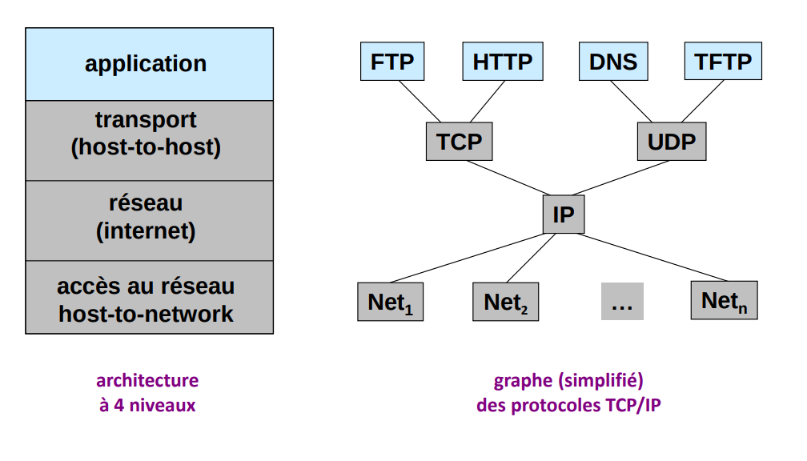
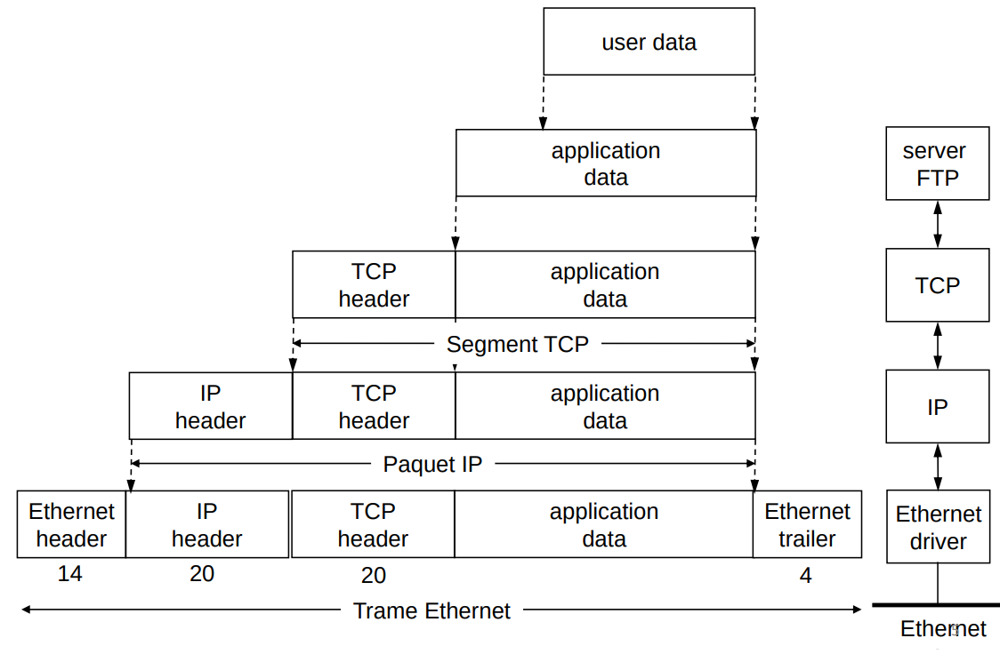
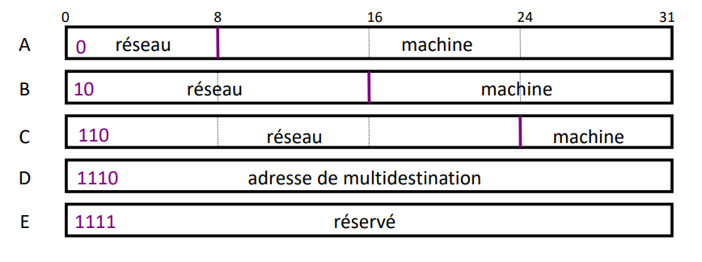
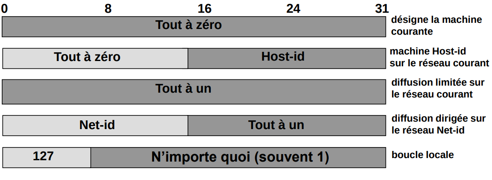

TCP/IP est souvent considéré comme une simplification d'OSI. Il y a deux visions différentes :

- Le modèle OSI plus générique, des spécifications globales et des fonctionnalités définies au niveau de chaque couche
- TCP/IP utilise des protocoles bien définis, avec un modèle simplifié

## L'architecture TCP/IP

### Encapsulation TCP/IP : exemple

### Les rôles des 4 couches

- Couche accès au réseau (MAC)
  - Délimitation des trames
  - Accès au canal
- Couche réseau
  - Adressage
  - Routage
  - Fragmentation et réassemblage
- Couche transport
  - Multiplexage et démultiplexage
  - Transfert de bout en bout
- Couche application
  - Interface avec l'utilisateur
  - Applications

## Adressage TCP/IP

Permet d'identifier chaque machine du réseau de façon unique. C'est le point de départ de toute communication sur Internet. Dans le réseau Internet, chaque interface réseau d'une machine est identifiée par une adresse IP. Une machine possède aussi d'autres adresses (adresse MAC notamment).

### Le modèle IP

Le protocole IP est la glue qui lie Internet : plusieurs protocoles d'accès existent, mais un seul protocole de couche réseau. On parle d'adressage physique et logique.

### Adressages physique et logique

L'adresse de la couche accès est une adresse physique : elle est fixée par le constructeur (même si elle peut souvent être modifiée par logiciel). Elle n'est utilisée que sur le réseau physique local (Ethernet) ; c'est une adresse plate (non hiérarchique) qui identifie physiquement un équipement.

L'adresse IP est l'adresse logique choisie par l'administrateur du réseau.

### Adressage IPv4

- Adressage : pour l'identification d'un équipement réseau, pour le routage
- Plan d'adressage homogène : 4 octets, soit $2^{32} \approx 4{,}3$ milliards d'adresses, en notation décimale pointée
- Adresse globalement unique et hiérarchique
- Format : `<réseau><machine>`

### Classes d'adresses

- Classe A = 0.0.0.0 à 127.255.255.255 (masque par défaut /8)
- Classe B = 128.0.0.0 à 191.255.255.255 (/16)
- Classe C = 192.0.0.0 à 223.255.255.255 (/24)
- Classe D = 224.0.0.0 à 239.255.255.255 (multicast)
- Classe E = 240.0.0.0 à 255.255.255.255 (réservée)

Ce découpage en classes est historique : depuis 1993, l'adressage sans classe (CIDR) permet des préfixes de longueur quelconque (notation `a.b.c.d/n`).

### Adresses publiques et privées

- Parmi les adresses IP disponibles, certaines ne peuvent être utilisées que
  pour un usage local (RFC 1918) : 10.0.0.0/8, 172.16.0.0/12 et 192.168.0.0/16
- Ces adresses ne sont pas routées sur Internet : l'accès à Internet passe par une traduction d'adresses (NAT)
- Elles sont utiles pour mettre en place les réseaux locaux
