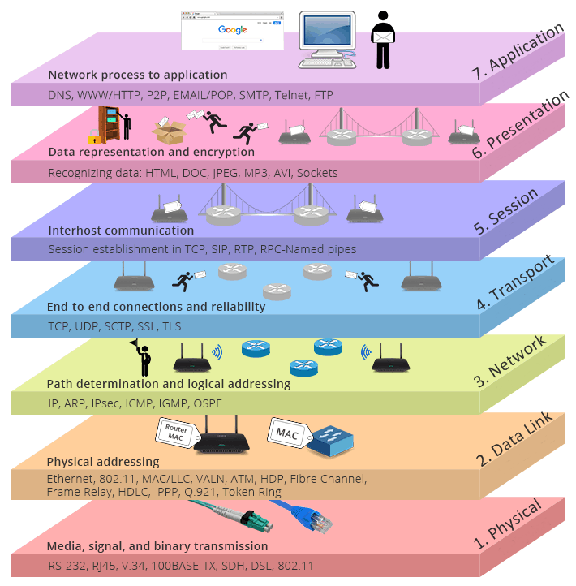
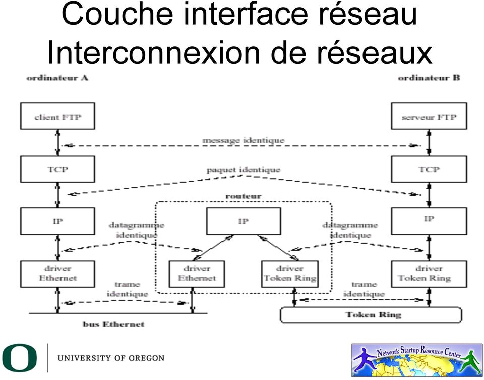
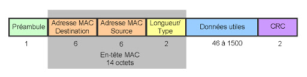

## Historique et définition de l'Internet

### 3 définitions pour Internet

1. Une famille de protocoles de communication, appelée :
    + TCP/IP : Transmission Control Protocol / Internet Protocol
    + ou Internet Protocol Suite
2. Un réseau mondial constitué de milliers de réseaux hétérogènes
   interconnectés au moyen des protocoles TCP/IP :
    + réseaux locaux d'agences gouvernementales, d'institutions d'éducation,
      d'hôpitaux, d'entreprises...
    + réseaux fédérateurs de campus
    + réseaux régionaux, nationaux, intercontinentaux
3. Une communauté de personnes utilisant différents services :
    + courrier électronique, Web, transfert de fichiers FTP...

### Gouvernance d'Internet

La gouvernance d'Internet se base sur trois axes : la gestion des adresses IP
(l'IANA attribue des blocs d'adresses aux registres régionaux, les RIR, qui les
distribuent aux fournisseurs d'accès), la gestion des noms de domaine (ICANN)
et la spécification de nouveaux standards (IETF pour les protocoles de
l'Internet, IEEE pour les couches liaison comme Ethernet ou Wi-Fi).

## Rappel : principe de fonctionnement

## Interconnexion de niveau réseau

Plusieurs questions sont alors soulevées par l'interconnexion des réseaux :

1. Comment traiter la diversité des supports de communication (couches 1 et
   2), due :
    + aux évolutions technologiques ;
    + à des besoins différents en débit, distance, fiabilité... ;
    + à des coûts différents ?
2. Comment gérer les communications entre entités raccordées à des supports
   différents, et assurer l'interopérabilité des applications fonctionnant dans
   ce contexte ?

Certains moyens d'interconnexion sont alors mis en place :

+ l'interconnexion permet de fédérer plusieurs réseaux présentant des
  différences physiques ou protocolaires, afin de permettre la communication
  entre leurs entités ;
+ diviser pour régner : segmenter un réseau en plusieurs parties à des fins de
  performances, d'administration ou de sécurité.

Le rôle de l'interconnexion de niveau 3 (couche réseau du modèle OSI) est
triple :

+ masquer l'hétérogénéité des supports en les fédérant ;
+ fournir un service de communication unifié ;
+ disposer d'un protocole de couche réseau adapté à de nombreux supports.

IP (Internet Protocol) fonctionne sur des supports variés (filaires et sans
fil) et offre des services à la couche 4 (UDP, TCP, etc.).

### Commutation de paquets vs commutation de circuits

#### Commutation de paquets

Un message à transmettre est découpé en paquets comportant, outre la portion du
message, des informations d'adresses (source et destination) et d'autres
informations de contrôle. Chaque paquet est ensuite envoyé vers sa destination
en utilisant une route d'acheminement.

#### Commutation de circuits

La commutation de circuits est fondée sur la négociation et la construction
d'un chemin unique et exclusif d'une machine A à une machine B, lors de
l'établissement du dialogue entre ces deux machines. Le chemin ainsi créé
perdure jusqu'à la clôture du dialogue.

### Mode connecté vs non connecté

La transmission de messages entre deux éléments d'un réseau peut se faire
selon deux modes :

+ mode connecté ;
+ mode non connecté.

En commutation de paquets, on retrouve ces deux modes :

+ en mode connecté (circuit virtuel), tous les paquets du message suivent le
  même chemin ;
+ en mode non connecté, aussi appelé mode datagramme, les paquets peuvent
  emprunter des chemins différents, et la station réceptrice doit remettre les
  paquets dans le bon ordre pour reconstituer le message.

### Rappel : structure d'une trame Ethernet 802.3

### Adressage IP

+ Identification d'une entité sur un réseau TCP/IP (unique sur le réseau
  considéré, indépendante des couches inférieures, une adresse par point
  d'accès au réseau)
+ 32 bits (IPv4)
+ Une adresse se décompose en deux champs : numéro de réseau (bits de poids
  fort) et numéro d'entité sur ce réseau ; un numéro d'entité dont tous les
  bits valent 0 (adresse du réseau) ou 1 (adresse de diffusion) est réservé

### Cinq classes d'adresses

1. Classe A de 0.x.x.x à 127.x.x.x (0 et 127 réservés, 127 étant la boucle
   locale)
2. Classe B de 128.0.x.x à 191.255.x.x
3. Classe C de 192.0.0.x à 223.255.255.x
4. Classe D de 224.0.0.0 à 239.255.255.255 (multicast)
5. Classe E de 240.0.0.0 à 255.255.255.255 (expérimentale)

Ce découpage en classes est historique : depuis 1993, l'adressage sans classe
(CIDR, notation `a.b.c.d/n`) permet des préfixes réseau de longueur
quelconque.

## Résolution d'adresses

Les entités réseau sont désignées par leur adresse de niveau 3 (IP), mais
l'acheminement d'un datagramme utilise un réseau physique, sur lequel les
entités sont identifiées par leur adresse de niveau 2.

Le but est donc de trouver une manière d'obtenir l'adresse de niveau 2
(physique) d'une entité à partir de son adresse de niveau 3.

### Méthodes de résolution

1. fonction de traduction simple, sur un réseau physique donné (quelquefois
   possible) ;
2. table de traduction statique ;
3. mécanisme de découverte à l'aide d'un protocole réseau ;
4. solutions hybrides : le protocole ARP.

### Protocole ARP

ARP (Address Resolution Protocol) a été initialement prévu pour le support
Ethernet ; les mécanismes sont similaires pour d'autres supports.

La problématique est la suivante : nous avons des adresses Internet (32 bits,
affectées à l'époque par l'InterNIC, aujourd'hui par l'IANA et les RIR) et une
adresse Ethernet (48 bits, affectée par le constructeur dans un bloc attribué
par l'IEEE, et associée à la carte d'interface).

+ pas de fonction de résolution simple ;
+ table de résolution statique extrêmement contraignante ;
+ utilisation d'un mécanisme de découverte, ARP, associé à une table dynamique.

Principe de la résolution d'adresses par ARP :

1. vérification de l'existence de la correspondance entre adresse IP et adresse
   Ethernet dans la table dynamique ;
2. en cas d'absence dans la table dynamique :
    + envoi d'une requête ARP (who-has) en diffusion générale sur le réseau
      Ethernet : **ARP Request** ;
    + réception et traitement de la requête par toutes les entités du réseau ;
    + en fonctionnement normal, seule l'entité cible répond à la requête, en
      unicast : **ARP Reply**.

Gestion de la table dynamique de résolution :

+ collecter des informations sur le réseau pour éviter les requêtes inutiles ;
+ conserver les correspondances acquises suffisamment longtemps pour éviter de
  surcharger le réseau ;
+ ne pas conserver les correspondances acquises trop longtemps, pour limiter la
  taille de la table et éviter les entrées obsolètes.
