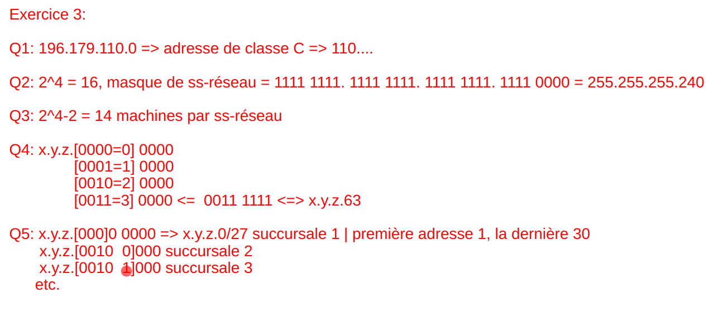
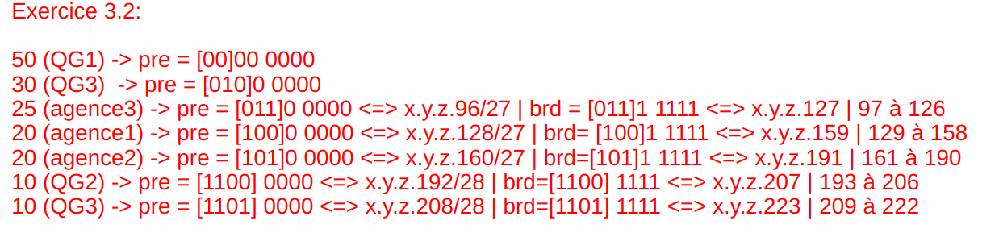

## Exercices en vrac

### Exercice p40

*Pas de correction rédigée.*

### Exercice p51

+ *En utilisant les formats de trame donnés, décoder les trames MAC Ethernet
  suivantes (ces trames sont données sans l'en-tête)*
+ *Pour chaque trame, déterminer les valeurs de tous les champs présents et ce
  qu'ils signifient*

Première trame (requête ARP) :

| Champ                                  | Valeur                 | Signification                                      |
|:---------------------------------------|:-----------------------|:---------------------------------------------------|
| Destination                            | `FF FF FF FF FF FF`    | diffusion générale                                 |
| Source                                 | `08 00 20 02 45 9E`    | émetteur (129.104.254.6)                           |
| Longueur / Type                        | `08 06`                | valeur > 1500, donc un type : ARP                  |
| Hardware Type                          | `00 01`                | Ethernet                                           |
| Protocol Type                          | `08 00`                | IPv4                                               |
| Hardware / Protocol Address Length     | `06 04`                | adresses de 6 et 4 octets                          |
| Operation Code                         | `00 01`                | requête (who-has)                                  |
| Sender Hardware Address (6 octets)     | `08 00 20 02 45 9E`    | adresse MAC de l'émetteur                          |
| Sender Protocol Address (4 octets)     | `81 68 FE 06`          | 129.104.254.6                                      |
| Target Hardware Address (6 octets)     |                        | inconnue, non significative dans une requête       |
| Target Protocol Address (4 octets)     |                        | adresse IP recherchée (129.104.254.5 d'après la réponse) |

Seconde trame (réponse ARP) :

| Champ                                  | Valeur                 | Signification                                      |
|:---------------------------------------|:-----------------------|:---------------------------------------------------|
| Destination                            | `08 00 20 02 45 9E`    | émetteur de la requête (unicast)                   |
| Source                                 | `08 00 20 07 0B 94`    | machine 129.104.254.5                              |
| Longueur / Type                        | `08 06`                | ARP                                                |
| Hardware Type                          | `00 01`                | Ethernet                                           |
| Protocol Type                          | `08 00`                | IPv4                                               |
| Hardware / Protocol Address Length     | `06 04`                | adresses de 6 et 4 octets                          |
| Operation Code                         | `00 02`                | réponse (is-at)                                    |
| Sender Hardware Address (6 octets)     | `08 00 20 07 0B 94`    | adresse MAC recherchée                             |
| Sender Protocol Address (4 octets)     | `81 68 FE 05`          | 129.104.254.5                                      |
| Target Hardware Address (6 octets)     |                        | MAC du demandeur                                   |
| Target Protocol Address (4 octets)     |                        | IP du demandeur (129.104.254.6)                    |

### Exercice p52

#### Réseau 1

`192.168.1.1` effectue un who-has en cherchant `192.168.1.2`, qui répond
is-at.

#### Réseau 2

`192.168.1.1` diffuse un who-has pour `192.168.1.254` (sa passerelle). Le
routeur répond is-at puis, pour relayer le datagramme, effectue un who-has pour
`192.168.2.1` sur le second réseau. Finalement, `192.168.2.1` répond is-at.

### Exercice p14

#### Énoncé

+ Soit un datagramme IP :
  + Data = 4000 octets
  + Options copiées = 9 octets
  + Options non copiées = 26 octets
  + MTU = 512 octets

+ Étudier la fragmentation du datagramme IP
+ Écrire un algorithme (pseudo-code) permettant de fragmenter un datagramme IP
+ Étudier le réassemblage des fragments
+ Pourquoi la fragmentation est-elle considérée comme un mécanisme inefficace
  dans IP ?
+ Trouver une solution permettant d'éviter la fragmentation

L'en-tête IP a une longueur multiple de 4 octets (champ IHL exprimé en mots de
32 bits) : les options sont complétées par du bourrage. Seules les options
copiées sont répétées dans les fragments suivant le premier. Le décalage
(offset) est exprimé en unités de 8 octets.

```text
MTU    <- 512
data   <- 4000
offset <- 0

// Premier fragment : en-tête complet
header_size  <- 20 + arrondi_sup_4("nb d'options copiées" + "nb d'options non copiées")
ip_data_size <- partie_entiere((MTU - header_size) / 8) * 8

data_rest <- data - ip_data_size
offset    <- ip_data_size / 8

// Fragments suivants : seules les options copiées sont répétées
header_size <- 20 + arrondi_sup_4("nb d'options copiées")
frag_size   <- partie_entiere((MTU - header_size) / 8) * 8
nb_trames   <- partie_entiere_sup(data_rest / frag_size)
```

Application numérique : le premier en-tête fait $20 + 36 = 56$ octets, donc le
premier fragment transporte $\lfloor 456 / 8 \rfloor \times 8 = 456$ octets ;
les suivants ont un en-tête de $20 + 12 = 32$ octets et transportent 480
octets. Il reste $4000 - 456 = 3544$ octets, soit 8 fragments supplémentaires
(7 de 480 octets et un dernier de 184 octets), 9 fragments au total.

## TD 1 - Adressage et subdivision de réseau

*La subdivision de réseau est un procédé qui permet de découper logiquement des
réseaux de grande taille en sous-réseaux de plus petites tailles. Pour ce faire,
on applique, grâce à une formule mathématique, à partir d'une adresse de base,
un masque de sous-réseau. Le résultat est une plage d'adresses de machines
continue mais de taille réduite par rapport à la plage d'adresses initiale.*

### Exercice 1

*L'adresse de la machine A est 193.55.28.152. De quelle classe est cette
adresse ? Quel est le masque du réseau ? Définir l'adresse de diffusion
restreinte sur tout le sous-réseau.*

Adresse de classe C, masque : `255.255.255.0`, diffusion : `193.55.28.255`.

### Exercice 2

*Une entreprise a obtenu l'adresse réseau suivante auprès de l'AFNIC :
194.57.242.0*

Adresse de classe C.

1 bit pour le sous-réseau :

- `0000 0000` : `194.57.242.0/25`, hôtes `.1` à `.126`, diffusion `194.57.242.127`
- `1000 0000` : `194.57.242.128/25`, hôtes `.129` à `.254`, diffusion `194.57.242.255`

### Exercice 3

On a un réseau de classe B : `129.178.0.0`.

On peut faire ce que l'on veut sur les deux derniers octets, soit 16 bits.

`**** **-- . ---- ----` : les bits `*` sont réservés aux sous-réseaux ($2^6=64$
sous-réseaux possibles).

Il reste $16-6 = 10$ bits pour les hôtes, soit $2^{10} = 1024$ possibilités.

Sauf que dans ces 1024 adresses, deux sont réservées : l'adresse du réseau et
l'adresse de diffusion. Au final, il y a 1022 hôtes possibles par sous-réseau.

### Exercice 4

On connaît le masque de sous-réseau : `255.255.248.0`. Si on écrit le masque en
binaire : `(1111 1111)(1111 1111)(1111 1000)(0000 0000)`

```text
129.148.208.x => 129.148.(1101 0000)2.x => réseau A
129.148.216.y => 129.148.(1101 1000)2.y => réseau B
129.148.210.z => 129.148.(1101 0010)2.z => réseau A
```

L'adresse du réseau $A$ est donc `129.148.(1101 0000)2.0 => 129.148.208.0`.

Calcul de la plage d'adresses : `{129.148.1101 0}[000.0000 0001 - 111.1111 1110]`,
soit de `129.148.208.1` à `129.148.215.254`.

Adresse de diffusion : `129.148.215.255`.

### Exercice 5

Une entrée dans la table de routage est de la forme :

| Réseau destinataire | Passerelle (IP d'un routeur) |
|:--------------------|:-----------------------------|
| 10.0.0.0            | 20.0.0.10 (B)                |
| 20.0.0.0            | `*` (C)                      |
| 30.0.0.0            | `*` (C)                      |
| 40.0.0.0            | 30.0.0.10 (D)                |

`*` : remise directe (réseau directement connecté).

### Exercice 6

+ Combien de données IP au total ?

$data_{ip} = 1500 - 26 - 20 = 1454$ ; or ce n'est pas un multiple de 8 : c'est
donc 1448, le multiple de 8 inférieur le plus proche de 1454, qui est retenu.

+ Combien de données IP au total peuvent être transmises dans une trame
  Ethernet sur le réseau 20 ?

$MTU_{IP} = 492$ ; les données IP valent $492 - 20 = 472$ octets (multiple de 8).

+ Combien y aura-t-il de fragments ?

$1448 / 472 \approx 3{,}07$ : il y aura 4 fragments.

+ Combien de données IP par fragment ?

Les 3 premiers transporteront 472 octets et le dernier
$1448 - 3 \times 472 = 32$ octets.

### Exercice 7

1. Nous avons 8 bits pour notre découpage et 5 établissements (3 bits
   nécessaires) ; il reste donc 5 bits pour les hôtes, c'est-à-dire 30 hôtes
   ($2^5 - 2$). Le découpage est donc réalisable.

2. Plan d'adressage :

| Réseau  | Adresse réseau | Masque          | Adresse de diffusion | Adresses des machines |
|:--------|:---------------|:----------------|:---------------------|:----------------------|
| Centro  | 220.156.10.0   | 255.255.255.0   | 220.156.10.255       | `*`                   |
| A1      | 220.156.10.32  | 255.255.255.224 | 220.156.10.63        | 33 à 62               |
| B1      | 220.156.10.64  | 255.255.255.224 | 220.156.10.95        | 65 à 94               |
| C1      | 220.156.10.96  | 255.255.255.224 | 220.156.10.127       | 97 à 126              |
| D1      | 220.156.10.128 | 255.255.255.224 | 220.156.10.159       | 129 à 158             |
| E1      | 220.156.10.160 | 255.255.255.224 | 220.156.10.191       | 161 à 190             |

## TD 3 - Sous-adressage VLSM

### Exercice 1




