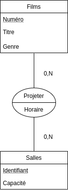
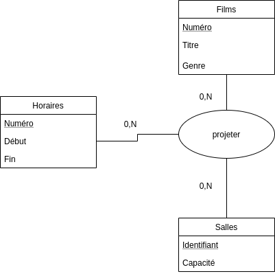

## Le cinéma du troisième art

*Un cinéma comporte plusieurs salles définies par un identifiant et une
capacité; où différents films, définis par le titre et le genre, sont projetés.*

1. *On suppose que les horaires ne sont pas fixes, proposez un schéma
   conceptuel*
   

2. *Il y a t'il des modifications à apporter au schéma précédent si l'on suppose
   maintenant que les films sont projetés à des horaires précises ? Par exemple,
   tous les films sont projetés, soit entre 16h et 18h, soit entre 20h et 22h,
   etc. Si oui, adapter le schéma conceptuel ...*
   

3. *Comment modifier le schéma conceptuel pour indiquer qu'à une horaire donné,
   il n'y a qu'un seul film ?*
   

## Bibliothèque d'emprunts

*On considère une base de données pour gérer une bibliothèque d'emprunts.
L'interview des bibliothécaire permet de déterminer les faits suivants :*

- *un livre est caractérisé par un numéro, un éditeur et un autre*
- *un adhérent qui s'inscrit ) la bibliothèque vers une caution*
- *les emprunts durent au maximum 8 jours*
- *on veut pouvoir obtenir, pour chaque adhérent les emprunts qu'il a effectué
  (nombre, numéro et titre du livre, date de l'emprunt) au cours des trois
  derniers mois*
- *toutes les semaines, on édite la liste des emprunteurs en retard : nom et
  adresse de l'adhérent, date de l'emprunt, numéro et titre du livre concerné*
- *on veut enfin pouvoir connaître pour chaque livre la date d'achat et son état*

1. *Élaborer un diagramme entité-association pour cette base*
   
   

2. *Donner un schéma relationnel de cette base*

Livres(*Numéro Livre*, Titre, Date d'achat, État, #id_personne)

Personnes(*Numéro personne*, Nom, prénom)

Emprunter(#num_livre, #num_personne, #id_emprunt)

Emprunts(*id_emprunt*,date)

EtreAuteur(#num_livre,#num_personne)

3. *Peut-on utiliser une seule relation contenant tous les attributs ? Pourquoi ?*

## Passage au relationnel (synthèse) - Le cinéma du premier art

Donner un schéma relationnel correspondant au schéma conceptuel suivant

