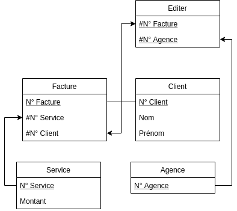
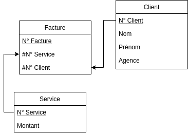

## Entraînement sur les DF

Soit les attributs suivants : n° client, nom client, adresse client, n° article,
nom article, prix, n° commande, date commande, quantité commandée.

Légende : `o` = oui, `x` = non.

|                                               | DF | Élémentaire | Directe |
|:----------------------------------------------|:--:|:-----------:|:-------:|
| nom client -> adresse client                  | x  |             |         |
| n° client -> adresse client                   | o  |      o      |    o    |
| n° commande, n° client -> quantité commandée  | x  |             |         |
| n° commande, n° article -> prix article       | o  |      x      |    o    |
| n° commande, n° article -> quantité commandée | o  |      o      |    o    |
| n° commande -> date commande                  | o  |      o      |    o    |
| n° commande -> nom client                     | o  |      o      |    x    |
| n° commande -> nom article                    | x  |             |         |

## Fermeture transitive

*On considère la relation $R$ construite sur les attributs suivants :
(propriétaire, occupant, adresse, num appartement, nbr pièces, nbr personnes),
ainsi que le $n$-uplet $(p,o,a,n,nb1,nb2)$ ayant la signification suivante : la
personne $o$ habite avec $nb2$ personnes dans l'appartement de numéro $n$
ayant $nb1$ pièces dont le propriétaire est $p$. Une analyse de cette
relation fournit un ensemble initial $E$ de dépendances fonctionnelles :*

```text
occupant -> adresse
occupant -> num_appartement
occupant -> nbr_personnes
[adresse, num_appartement] -> propriétaire
[adresse, num_appartement] -> occupant
[adresse, num_appartement] -> nbr_pièces
```

+ *Donner l'ensemble des dépendances fonctionnelles engendrées par $E$ (par
  transitivité)*

```text
occupant -> propriétaire
occupant -> nbr_pièces
[adresse, num_appartement] -> nbr_personnes
```

+ *Quelles sont les clés potentielles de $R$ ?*

Les clés potentielles sont `(adresse, num_appartement)` et `occupant`.

## Factures

*Soit une société de publicité dont les clients règlent des factures pour des
services rendus. La société a plusieurs agences. Le schéma de la base est réduit
à une seule relation de schéma : `Factures (Numéro_Client, Nom, Prénom, Numéro_facture, Service, Montant,
Agence)` où `Numéro_Client, Numéro_Facture, Nom, Prénom, Montant`, désignent
respectivement les numéros de client et de facture, les noms et prénoms des clients
et le coût de chaque service. L'ensemble de dépendances fonctionnelles est le
suivant :*

```text
Numéro_Client -> Nom
Numéro_Client -> Prénom
Numéro_Facture -> Service
Numéro_Facture -> Numéro_Client
Service -> Montant
```

+ *Donner la clé*

`(Numéro_Facture, Agence)` : `Numéro_Facture` détermine tous les attributs sauf
`Agence`, qui n'apparaît dans aucune partie droite de DF.

+ *Donner une décomposition de Factures sans perte d'information et qui préserve
  les dépendances, le résultat étant un ensemble de relations en 3e forme
  normale.*



+ *Donner une nouvelle décomposition dans le cas où on rajoute la dépendance
  suivante `Numéro_Client -> Agence`*



## Système de gestion de fichiers

*On considère un système d'exploitation dans lequel chaque fichier a un index
(inode) I, une taille T, un type Ty, un propriétaire P et un répertoire D dans
lequel on peut le trouver. On considère une relation R dont les attributs sont
I, T, Ty, P et D.*

+ *Cette relation est-elle en troisième forme normale ? Quelle est sa (ou ses)
  clé(s) ?*

  `R(I,T,Ty,P,D)`, la relation est en 3FN et sa clé est `I`

+ *On suppose maintenant que le système d'exploitation autorise au même fichier
  à figurer dans plusieurs répertoires et à avoir plusieurs propriétaires. La
  relation R est-elle alors en troisième forme normale ? Sinon, proposer une
  décomposition minimale en relations en troisième forme normale.*

  La clé devient `(I, P, D)` et `I -> T, Ty` est une dépendance partielle : R
  n'est même pas en 2FN. Décomposition minimale en 3FN :

  ```text
  F(I, T, Ty)
  FPD(#I, P, D)
  ```

  Si les propriétaires et les répertoires d'un fichier sont indépendants
  (dépendances multivaluées `I ->> P` et `I ->> D`), `FPD` contient encore de la
  redondance ; la décomposition en 4FN la remplace par :

  ```text
  FP(#I, P)
  FD(#I, D)
  ```
