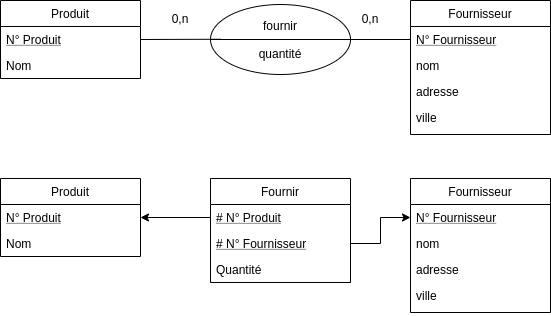

## Produit fournisseur

*On considère la base de données suivante :*

```text
Produit : numprod, nomprod, quantité
Fournisseur : numfour, nomfour, adresse, ville
```

1. *Donner un schéma conceptuel et un schéma relationnel*
2. *Donner une expression algébrique et un arbre algébrique pour chacune des
   requêtes suivantes :*
    + *Les produits disponibles sur Bordeaux*
    + *Les fournisseurs qui vendent tous les produits (cf. division)*



Schéma relationnel retenu : Produit(**numprod**, nomprod),
Fournisseur(**numfour**, nomfour, adresse, ville),
Fournir(**#numprod, #numfour**, quantité). Le symbole $\bowtie$ désigne la
jointure naturelle.

Nous cherchons les produits disponibles sur Bordeaux :

$$
\pi_{\text{nomprod}}\big(\sigma_{\text{ville} = \text{'Bordeaux'}}(\text{Produit} \bowtie \text{Fournir} \bowtie \text{Fournisseur})\big)
$$

Nous cherchons les fournisseurs qui vendent tous les produits. Le dividende et
le diviseur sont projetés pour que le schéma du diviseur soit strictement inclus
dans celui du dividende :

$$
\pi_{\text{nomfour}}\Big(\big(\pi_{\text{numfour}, \text{numprod}}(\text{Fournir}) \div \pi_{\text{numprod}}(\text{Produit})\big) \bowtie \text{Fournisseur}\Big)
$$

## Élèves-matières

*Soit le schéma relationnel suivant (les clés primaires sont en gras, les clés
étrangères sont précédées du symbole #) qui représente des élèves, des matières
et le fait que des élèves suivent des matières.*

+ Élève(**Numéro Élève**, Nom élève, Prénom élève)
+ Matière(**Numéro Matière**, Nom Matière)
+ Suivre(**#Numéro Élève, #Numéro Matière**)

*Écrire en algèbre relationnelle les requêtes suivantes :*

+ *Donner la liste des matières suivies par un étudiant qui s'appelle Jean
  Dupont*

$$
\pi_{\text{Nom Matière}}\big(\sigma_{\text{Nom élève} = \text{'Dupont'} \,\wedge\, \text{Prénom élève} = \text{'Jean'}}(\text{Élève} \bowtie \text{Suivre} \bowtie \text{Matière})\big)
$$

+ *Donner le nom et prénom des élèves qui suivent le cours de Base de Données*

$$
\pi_{\text{Nom élève}, \text{Prénom élève}}\big(\sigma_{\text{Nom Matière} = \text{'Base de Données'}}(\text{Élève} \bowtie \text{Suivre} \bowtie \text{Matière})\big)
$$

+ *Donner la liste des élèves qui ont le même nom, mais pas le même prénom*

On utilise deux copies renommées $E_1 = \rho_{E_1}(\text{Élève})$ et
$E_2 = \rho_{E_2}(\text{Élève})$ :

$$
\pi_{E_1.\text{Nom}, E_1.\text{Prénom}}\big(E_1 \bowtie_{E_1.\text{Nom} = E_2.\text{Nom} \,\wedge\, E_1.\text{Prénom} \neq E_2.\text{Prénom}} E_2\big)
$$

+ *Donner la liste des élèves qui suivent tous les cours*

$$
\pi_{\text{Nom élève}, \text{Prénom élève}}\Big(\big(\text{Suivre} \div \pi_{\text{Numéro Matière}}(\text{Matière})\big) \bowtie \text{Élève}\Big)
$$
