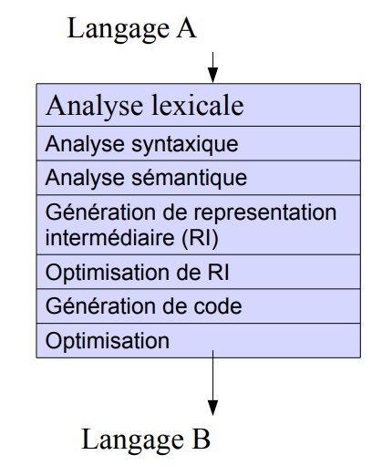

Notes inspirées du cours de David Janin.

## Introduction

### Intérêt de la compilation

+ Outil incontournable, quel que soit le langage informatique
+ Une meilleure connaissance des compilateurs permet une meilleure programmation
+ Techniques de compilation réutilisables dans de nombreux contextes (notamment
  l'analyse de code)
+ Définition : *un compilateur est un programme qui prend en entrée un programme
  et le transforme en un autre programme. Un interpréteur est un programme qui
  prend en entrée un programme et l'exécute.*

### Objectifs possibles du compilateur

+ Préserver la sémantique (obligatoire)
+ Compiler le plus rapidement possible (temps de compilation court)
+ Trouver les erreurs lexicales, syntaxiques et sémantiques (prouver que le code
  généré est correct, que le code d'entrée respecte une spécification) ; la
  détection exhaustive des erreurs sémantiques est indécidable en général
+ Générer un code s'exécutant le plus rapidement possible, consommant le moins
  d'énergie possible, le plus petit possible

Obtenir le code le plus performant ou le binaire le plus petit est difficile.

+ Évolution constante de la complexité des compilateurs
+ En général, le code compilé est meilleur que le code écrit à la main (en
  assembleur)
+ Possibilité de guider le compilateur avec des options / paramètres / pragmas

## Structure du compilateur

### Décomposition en couches

1. Analyse lexicale : lit le programme et reconnaît chaque mot (lexème)
2. Analyse syntaxique : vérifie la grammaire
3. Analyse sémantique : vérifie le sens du programme (exemple : types)
4. Représentation intermédiaire (RI) : une interface séparant le front-end, le
   middle-end et le back-end du compilateur
