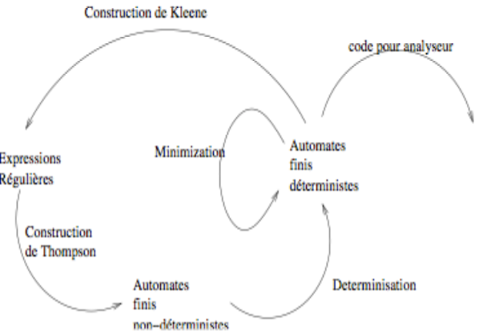
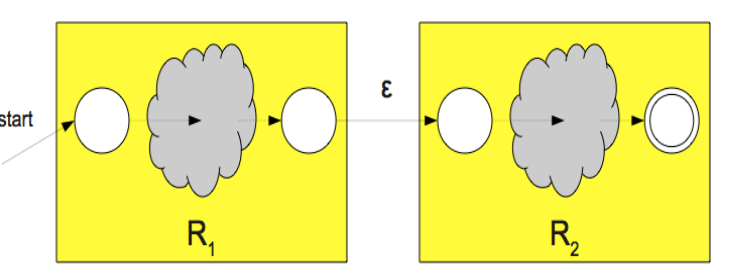
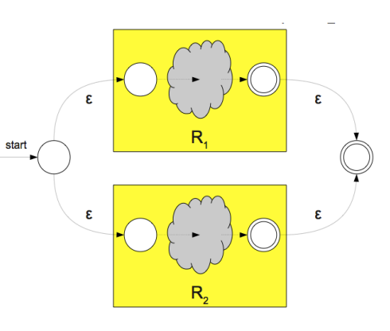
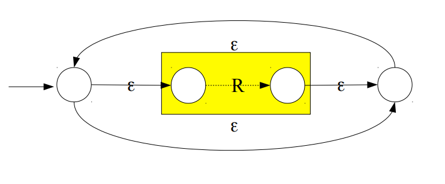

Notes inspirées du cours de David Janin.

L'objectif de l'analyse lexicale est de lire le programme d'entrée et de
reconnaître des lexèmes (tokens). Ce sont les éléments constitutifs du langage :
mots-clés, noms de variables, symboles de ponctuation...

## Langages réguliers

L'analyse lexicale repose sur le cadre théorique des langages réguliers. Pour
rappel, on manipule :

- un alphabet : ensemble fini de symboles (lettres) ;
- des mots : suites finies de lettres, munies de l'opération de concaténation ;
- des langages : ensembles de mots ;
- des expressions régulières, qui décrivent les langages réguliers, formées avec
  les opérateurs $\ast$, $\vert$, la concaténation et $\varepsilon$.

Les langages réguliers sont exactement les langages reconnus par les automates
finis (théorème de Kleene). Les automates déterministes et non déterministes
reconnaissent la même classe de langages, mais présentent des différences
(taille, coût de la reconnaissance) importantes durant ce cours.

## Rappel : construction de Thompson

### R1.R2

### R1 | R2

### R*

## Algorithme de déterminisation

- On part d'un automate $(N,\Sigma,\Delta,n_0,N_F)$
- On construit un automate $(Q,\Sigma,\delta,q_0,Q_F)$
- Les états du nouvel automate sont des ensembles d'états de l'ancien
- Algorithme par calcul de point fixe
- Complexité exponentielle au pire

## Algorithme de minimisation

- On part d'une partition des états (finaux / non finaux)
- On raffine la partition en séparant les états qui n'ont pas le même
  comportement
- Algorithme par calcul de point fixe

## Génération de lexèmes

L'objectif de l'analyseur lexical est de reconnaître tous les lexèmes du
langage. Chaque lexème reconnu est transmis sous la forme d'un couple : un type
(utilisé par l'analyse syntaxique) et une valeur (utilisée par l'analyse
sémantique). À chaque reconnaissance de lexème, l'analyseur lexical transmet ce
couple à l'analyseur syntaxique et sémantique.

Il y a cependant certaines difficultés : lorsqu'un lexème est préfixe d'autres
lexèmes, on prend le plus long. De plus, lorsqu'il y a une ambiguïté entre
lexèmes, on procède par résolution contextuelle (ou par préférence donnée à un
type de lexème, par exemple les mots-clés avant les identificateurs).
