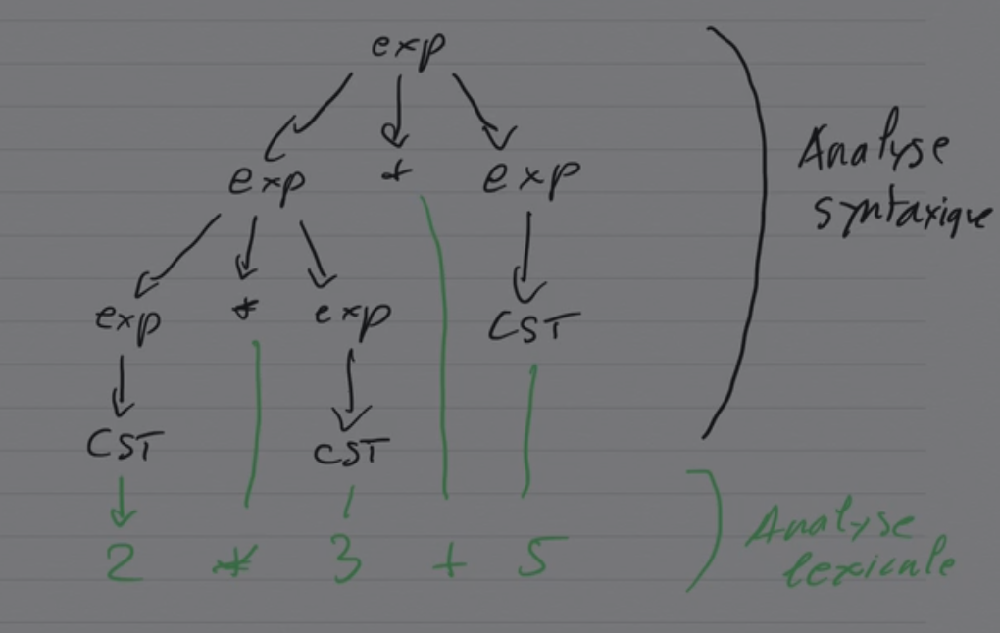
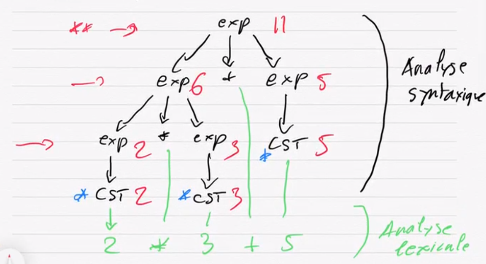
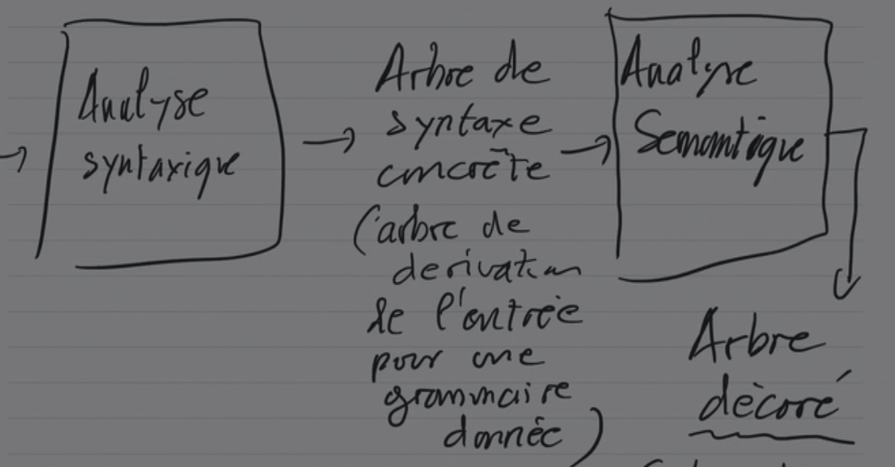

Notes inspirées du cours de David Janin.

Question du jour : que faire avec les arbres de dérivation ?

## Évaluation sur un arbre de dérivation

Sur un exemple, les expressions arithmétiques :



Comment évaluer cette expression ? Il suffit d'effectuer une évaluation des
feuilles vers la racine :



Les valeurs sont obtenues par application d'une règle de calcul : la valeur
d'un nœud interne dépend des valeurs (tout ou partie) portées par ses enfants.

## Attributs

Les règles de calcul à utiliser ne dépendent que des règles de grammaire
utilisées. Les calculs sont **locaux** et uniformément définis par la règle
appliquée.

Plus généralement, ces valeurs associées aux nœuds des arbres de dérivation
sont appelées attributs. Dans l'exemple, on parle d'attributs synthétisés,
puisque pour chaque règle de la forme $X \rightarrow x_1 x_2 \dots x_n$, la
valeur d'attribut de $X$ dépend des valeurs d'attributs de $x_1,\dots,x_n$.

Dans le cas général (théorie des grammaires attribuées), les dépendances entre
attributs peuvent être plus complexes : elles génèrent des équations
qui peuvent être difficiles à résoudre.

Exemple utile : dans une règle $X \rightarrow x_1 x_2 \dots x_n$, on peut
souhaiter que l'attribut de $x_{i+1}$ dépende aussi de l'attribut de $x_i$ (on
parle alors d'attribut hérité). Nous verrons comment faire cela avec des
attributs synthétisés (calculs des feuilles vers la racine) et des effets de
bord.

**Attention :** dans tous les cas, la règle de calcul à appliquer ne dépend que
de la règle de grammaire à laquelle elle est associée.

*Remarque :* dans l'exemple, les attributs prennent la « valeur entière » de
leur nœud. Un attribut pourra aussi être :

+ un type ;
+ des numéros de registres (pour la production de code) ;
+ des morceaux de code ;
+ ...

ou une combinaison des éléments ci-dessus, en définissant les valeurs
d'attributs comme des $n$-uplets (`struct` en C).



## Actions sémantiques en Yacc

En Yacc, trois points sont à retenir :

1. Pour désigner les attributs dans une règle de la forme
   $X \rightarrow x_1 x_2 \dots x_n$ avec $X \in N$ et
   $x_1, x_2, \dots, x_n \in N \cup T$, on utilise :
    + `$$` pour la valeur d'attribut de $X$ ;
    + `$1, $2, ..., $n` pour les valeurs d'attributs de $x_1,\dots,x_n$ dans
      cet ordre (de gauche à droite).
2. La règle de calcul de l'attribut de $X$ en fonction des attributs des
   terminaux et non-terminaux du membre droit est écrite en C, à la suite de la
   règle :
   $$
   X \rightarrow x_1 x_2 \dots x_n \underbrace{\{\$\$ =
   f(\$1,\$2,\dots,\$n);\}}_{\text{action sémantique}}
   $$
   On voit ici que le calcul à faire est défini règle de grammaire par règle de
   grammaire.
3. L'arbre de dérivation est construit des feuilles vers la racine, de gauche à
   droite. De façon équivalente, tout se passe comme si on faisait un parcours
   en profondeur, de gauche à droite, **postfixe** : c'est en sortant d'un
   sous-arbre qu'on exécute l'action sémantique. Autrement dit, pour un arbre de
   dérivation donné, l'ordre d'exécution des actions sémantiques est non ambigu
   (exécution postfixe). Conséquence : les actions sémantiques étant du code C
   avec des effets de bord possibles, on pourra aussi communiquer des valeurs
   d'attributs de la gauche vers la droite des arbres de dérivation.

## Mise en œuvre

Mise en œuvre sur notre exemple des expressions arithmétiques :

```text
exp -> CST
exp -> ID
exp -> exp + exp
exp -> exp * exp
exp -> (exp)
```

Écrire des actions sémantiques (des calculs d'attributs) permettant d'évaluer
les expressions arithmétiques. On supposera que les attributs des terminaux sont
des chaînes de caractères C contenant les valeurs lexicales associées.
