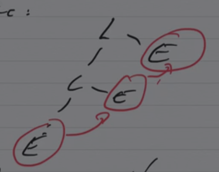
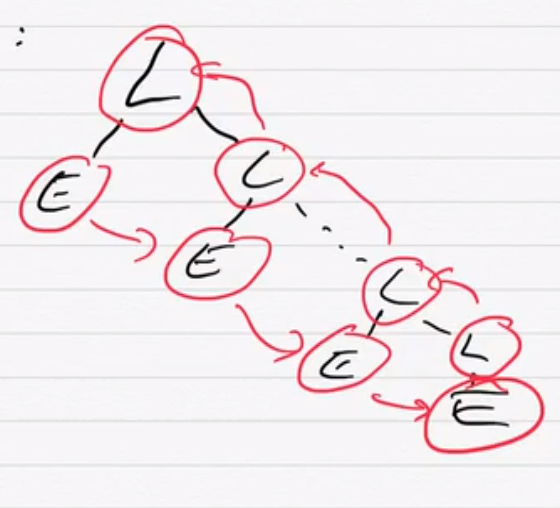

Notes inspirées du cours de David Janin.

## Outils et astuces pour l'analyse sémantique et la production de code

Comme vu en TD, avec un analyseur par décalage-réduction, on construit (ou
parcourt) les arbres de dérivation des feuilles vers la racine, de gauche à
droite.

L'analyse sémantique et la production de code sont réalisées dans les actions
sémantiques. Il existe deux types d'actions sémantiques :

1. Dans l'analyseur lexical (Lex) : à partir de la valeur lexicale d'un lexème
   (`yytext`), on produit la valeur d'attribut du lexème (`yylval`). On agit
   donc sur les terminaux de la grammaire.
2. Dans l'analyseur syntaxique (Yacc) : pour chaque règle, à partir des valeurs
   d'attributs des éléments à droite de la règle, on calcule l'attribut du
   non-terminal à gauche.

Remarque : on a la possibilité de transférer de l'information de la gauche
vers la droite de l'arbre via :

+ la pile d'analyse ;
+ des variables globales, accédées / modifiées dans les actions sémantiques par
  effet de bord : c'est ainsi qu'on gère la table des symboles (quelles entités
  sont visibles à chaque point du programme, avec quelles propriétés).

Attention : on préférera la récursion gauche pour que tous les symboles vus
« avant » aient déjà été traités. Autrement dit, la récursion gauche privilégie
un traitement de gauche à droite (sens de lecture).

Nœuds internes avec récursion gauche :

Dans le cas d'une récursion droite :

Ce cas est moins confortable pour le traitement des actions sémantiques, à
cause des appels récursifs.

Dans ces actions sémantiques, en s'aidant de la table des symboles, on peut
réaliser :

+ l'analyse de noms (associer chaque utilisation de variable à une définition /
  déclaration) ;
+ l'analyse de types (type = information statique, c'est-à-dire connue avant
  l'exécution, qu'on peut obtenir sur une entité, par exemple une variable).

Pour l'analyse de types, on peut :

+ vérifier les types (en C) ;
+ inférer le type le plus général (OCaml, Haskell).

Les types sont « ordonnés » en semi-treillis. Étant donnés deux types A et B, on
note A ∧ B le type le plus général « compatible » avec A et B ; on ajoute en
général un élément d'erreur (type incompatible) pour que cette borne existe
toujours.
