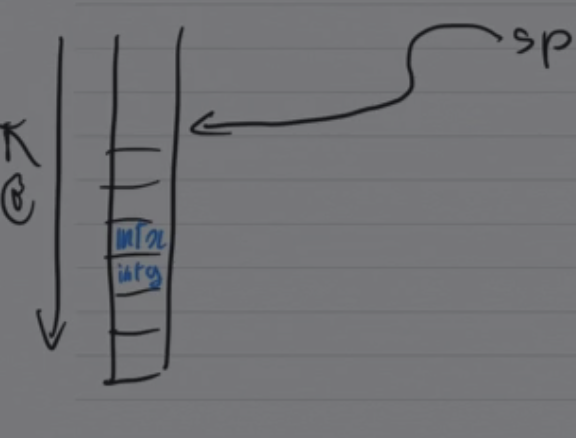

Notes inspirées du cours de David Janin.

## Production de code pour les sous-blocs et les appels de fonction

Question : où et comment stocker / adresser les variables locales à un
sous-bloc ?

Première solution : renommer les variables locales pour les traiter « comme »
des variables globales. Cette solution fonctionne, mais le nombre d'instances
simultanées d'un même bloc doit alors être borné et connu à la compilation, ce
qui interdit la compilation de fonctions récursives.

Une deuxième solution est d'utiliser la pile : on stocke les variables locales
dans la pile.



La question est : comment accéder (en lecture ou en écriture) à $x$ ou $g$ ?

La solution est d'utiliser un pointeur d'environnement (frame pointer) `fp`
qui désigne, dans la pile, un emplacement fixe pendant toute la durée de vie du
sous-bloc. À partir de là, on peut coder $x \rightarrow *(fp+4)$ et
$g \rightarrow *(fp+8)$. Comme la valeur de `fp` ne change pas pendant la durée
de vie du bloc, on a bien un codage de $x$ et $g$.

Entrée dans le bloc :

```text
empiler g (sp = sp - 4)
empiler x (sp = sp - 4)
fp = sp
```

Cependant, cela pose un problème : on perd la valeur précédente de `fp`. Pour
pallier ce problème, il faut sauvegarder `fp` dans la pile :

```text
empiler g (sp = sp - 4)
empiler x (sp = sp - 4)
empiler fp (sp = sp - 4 ; *sp = fp)
fp = sp
```

À la sortie du bloc :

```text
fp = *fp          // restauration de l'ancien fp
sp = sp + 12      // dépilement du fp sauvegardé et des variables locales
// éventuellement, une valeur de retour
```

On généralise ce principe aux appels de fonctions. Les ingrédients d'une
fonction :

```c
int inc(int x) {
    int y = 1;
    if (x < 0) return x;
    else return (x - y);
}
```

Ce sont les types qui indiquent la nécessité de réserver des emplacements
mémoire, et leur taille. Idée : stocker ces éléments sur la pile. Où ? En
prenant une convention de position par rapport à `fp`, qui désigne une adresse
fixe de la pile pendant toute l'exécution d'un appel de fonction.

La position, relative à `fp`, de chacun des éléments est fixée à la compilation.

Le contexte contient, a minima, une sauvegarde de `fp` lors de l'appel.
L'adressage des variables locales, des arguments et de la valeur de retour se
fait relativement au `fp` courant.

### Appel d'une fonction

```text
Sauvegarde du contexte courant (fp)
Empilement des arguments
Réservation de la place du résultat
Positionnement de fp
Empilement des variables locales
goto à l'adresse du code de la fonction
```

Question : comment terminer l'appel de fonction ? On a besoin d'un branchement
vers l'endroit de l'appel. Il faut donc stocker, lors de l'appel, un autre
pointeur : le compteur ordinal (co), qui désigne l'adresse de l'instruction à
exécuter après l'appel (adresse de retour). On termine l'appel par un `goto co`
après avoir « retrouvé » ce compteur ordinal. En code 3 adresses (et dans la
plupart des assembleurs), on n'utilise pas de `goto` mais une paire
d'instructions particulières (du type `call` / `return`). En général, ces
instructions sont chargées respectivement :

+ des branchements ;
+ de la sauvegarde / restauration du `fp` et du `co`.
