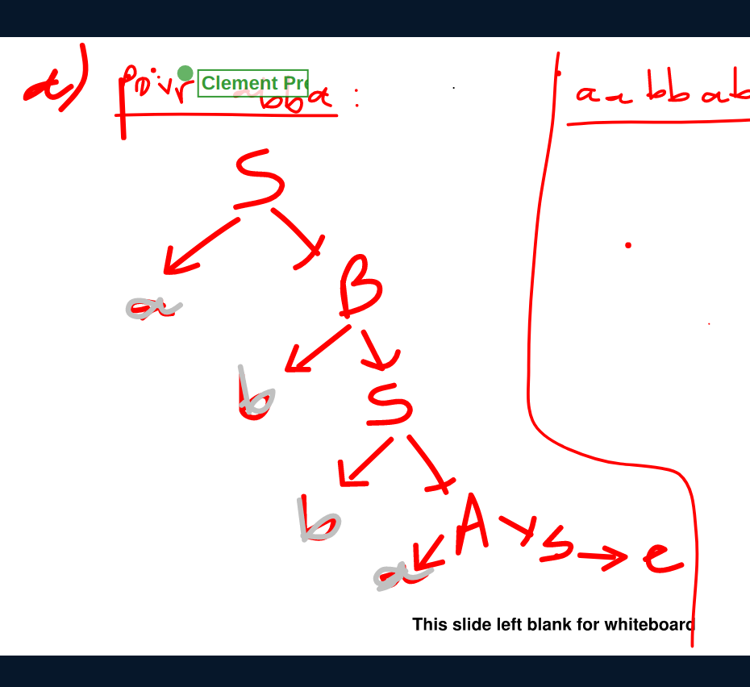
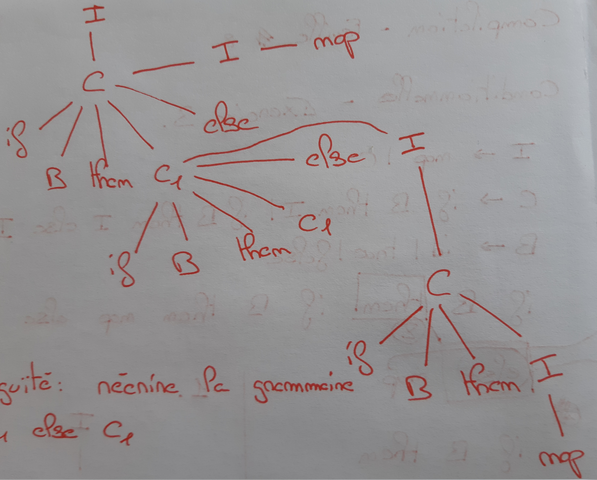
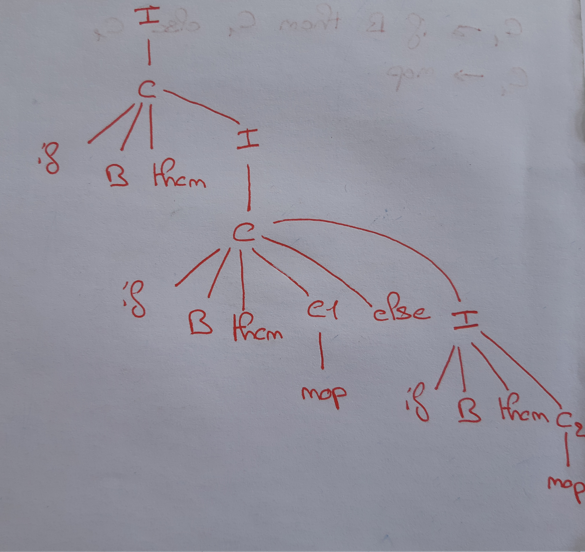
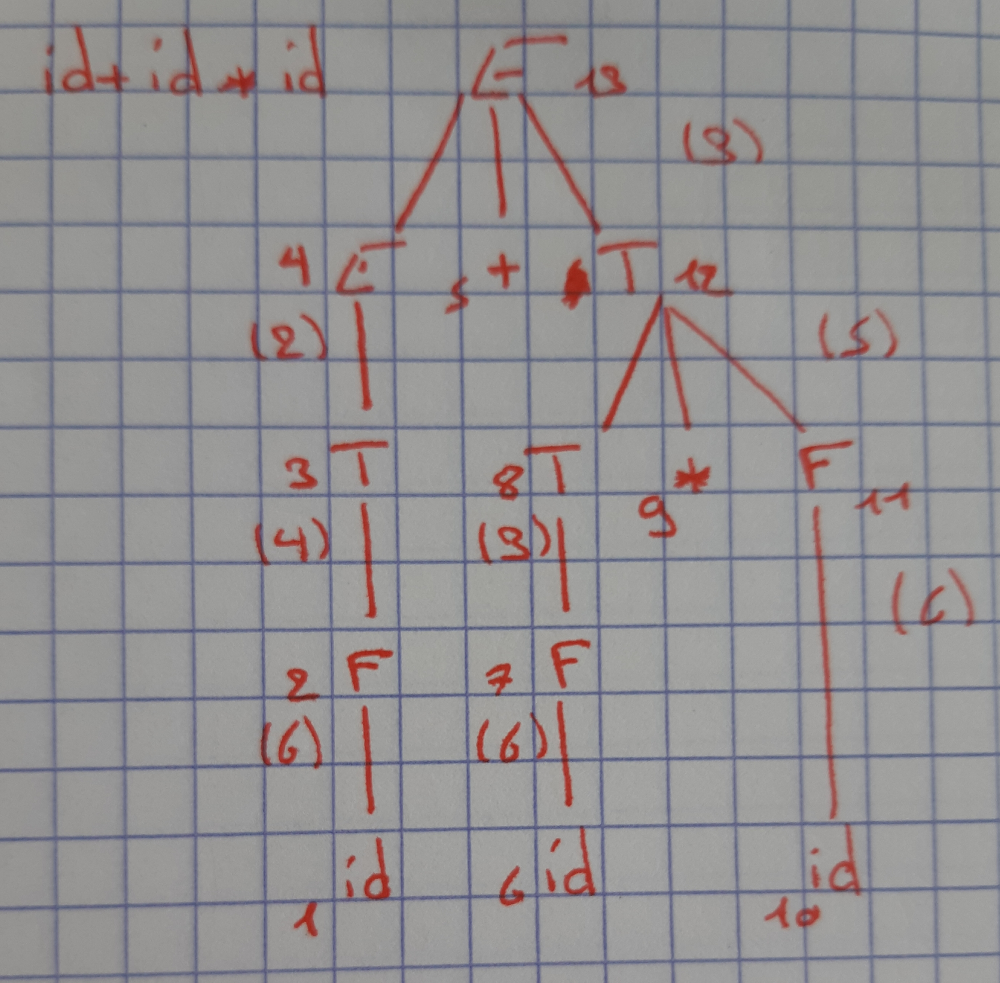
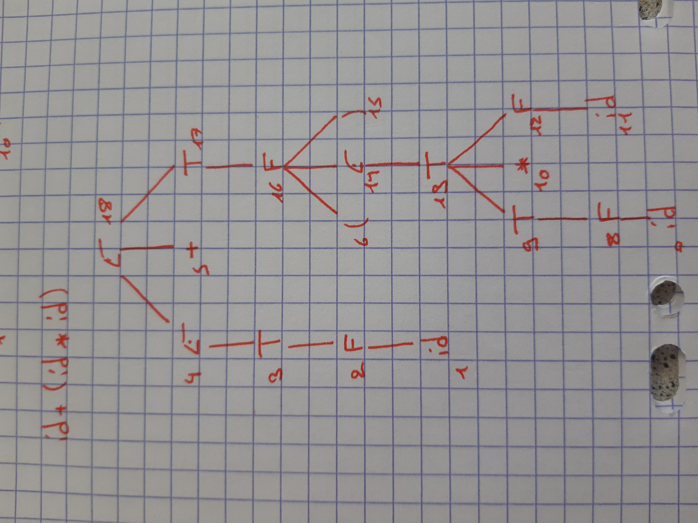

Notes inspirées du cours de David Janin et du [TD2](https://moodle.bordeaux-inp.fr/pluginfile.php/151721/mod_resource/content/1/td2.pdf) de Myriam Desainte-Catherine.

## Grammaires

*Étant donné une grammaire $G$ de non-terminal initial $S$ (start symbol) et
d'alphabet terminal $T$, on appelle langage défini par $S$ le langage*

$$L(G)=\{w \in T^\ast \mid S \Rightarrow^\ast w\}$$

*c'est-à-dire l'ensemble des mots de terminaux qui dérivent du non-terminal
initial.*

### Exercice 1

*Proposer une grammaire qui permet, sur l'alphabet de terminaux $\{a,b\}$, de
définir le langage des mots de la forme $a^n b^n$ avec $n \in \mathbb{N}$.
Votre grammaire est-elle ambiguë ?*

```text
S -> aSb
S -> ε
```

Elle n'est pas ambiguë : pour un mot $a^n b^n$, la seule dérivation possible
applique $n$ fois la première règle puis une fois la seconde.

### Exercice 2

*Soit la grammaire*

```text
(0) S -> ε           (mot vide)
(1) S -> aB          (2) S -> bA
(3) A -> aS          (4) A -> bAA
(5) B -> bS          (6) B -> aBB
```

*définie avec les terminaux $\{a,b\}$, les non-terminaux $\{S,A,B\}$ et le
start symbol $S$*

+ *Construire les arbres de dérivation de abba et aabb*



+ *Cette grammaire est-elle ambiguë ?*

Oui. Par exemple, le mot `ababb` admet deux arbres de dérivation à partir de
$B$, via la règle $B \rightarrow aBB$ :

- premier $B$ dérivant `b` ($B \rightarrow bS$, $S \rightarrow \varepsilon$) et
  second $B$ dérivant `abb` ;
- premier $B$ dérivant `bab` ($B \rightarrow bS$, $S \rightarrow aB$, ...) et
  second $B$ dérivant `b`.

Le mot `aababb`, obtenu par $S \rightarrow aB$, a donc deux arbres de
dérivation à partir de $S$.

+ *Quel langage définit-elle ?*

En notant $|w|_a$ le nombre de $a$ dans le mot $w$ :

$$L(S) = \{w \in \{a,b\}^\ast \mid |w|_a = |w|_b\} = \{\varepsilon, ab, ba, \dots\}$$
$$L(A) = \{w \in \{a,b\}^\ast \mid |w|_a = |w|_b + 1\} = \{a, aab, aba, \dots\}$$
$$L(B) = \{w \in \{a,b\}^\ast \mid |w|_b = |w|_a + 1\} = \{b, bab, bba, \dots\}$$

## Conditionnelles

On considère la grammaire COND définie par :

```text
I -> nop | C
C -> if B then I | if B then I else I
B -> id | true | false
```

avec les non-terminaux $I$ (instructions), $C$ (instructions
conditionnelles), $B$ (booléens) et les terminaux `id`, `true`, `false`,
`nop`, `if`, `then` et `else`.

### Exercice 3

*Quel est le langage défini par cette grammaire ? Construire un arbre de
dérivation pour `if id then if id then nop else nop`. En existe-t-il un autre ?
Qu'en déduire ?*

La grammaire est ambiguë : ce mot admet deux arbres de dérivation (le `else`
peut être rattaché à l'un ou l'autre des `if`, problème du « else pendant »).





### Exercice 4

*Proposer une grammaire non ambiguë permettant de définir le même langage. Votre
grammaire devra, comme dans le langage C, « forcer » l'association du « else »
avec le « if-then » qui précède le plus proche qui n'est pas déjà « fermé » par
un « else ».*

Pour éliminer l'ambiguïté, il faut réécrire la grammaire en distinguant les
instructions « fermées » (M, dont chaque `if` a son `else`) des instructions
« ouvertes » (U) :

```text
I -> M | U
M -> if B then M else M | nop
U -> if B then I | if B then M else U
B -> id | true | false
```

Entre un `then` et un `else`, seule une instruction fermée est autorisée : un
`else` est donc toujours associé au `if` non fermé le plus proche.

## Expressions arithmétiques

### Exercice 5

```text
1. A -> id = E
2. E -> T
3. E -> E + T
4. T -> F
5. T -> T * F
6. F -> id
7. F -> cst
8. F -> (E)
```

+ *Dessiner les arbres de dérivation et numéroter les nœuds de l'arbre de
  dérivation dans l'ordre du parcours de l'analyseur (postfixe)*





+ *Écrire les actions sémantiques associées à chaque règle qui permettent de
  traduire une expression arithmétique en code 3 adresses*

```text
1. A -> id = E    { printf("%s = r%d\n", $1, $3); }
2. E -> T         { $$ = $1; }
3. E -> E + T     { $$ = newreg(); printf("r%d = r%d + r%d\n", $$, $1, $3); }
4. T -> F         { $$ = $1; }
5. T -> T * F     { $$ = newreg(); printf("r%d = r%d * r%d\n", $$, $1, $3); }
6. F -> id        { $$ = newreg(); printf("r%d = %s\n", $$, $1); }
7. F -> cst       { $$ = newreg(); printf("r%d = %s\n", $$, $1); }
8. F -> (E)       { $$ = $2; }
```
