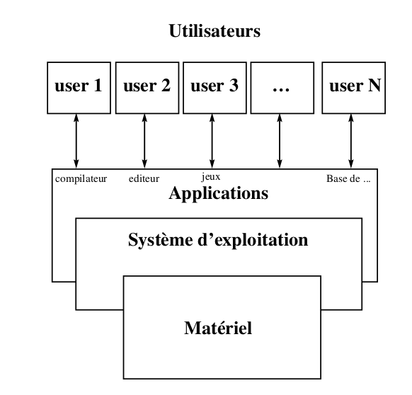
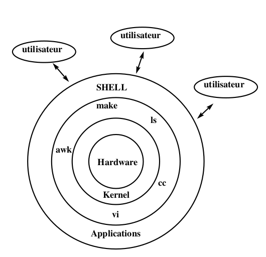
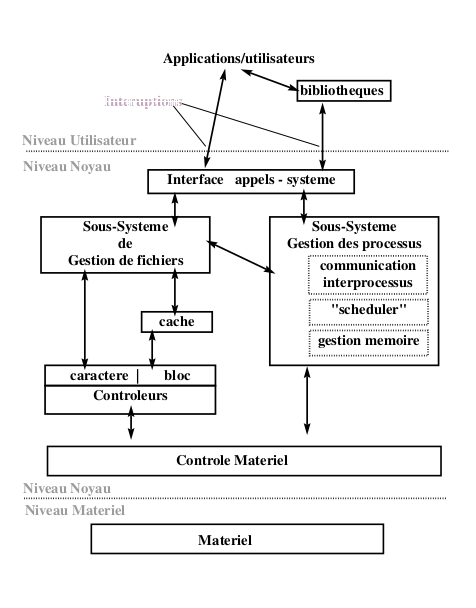
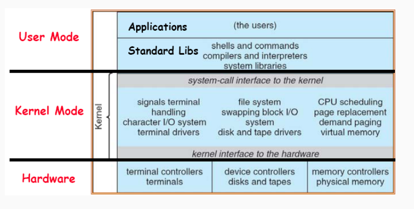

## Structure générale des systèmes d'exploitation

Un système d'exploitation est un programme qui sert d'interface entre un
utilisateur et un ordinateur. Un système d'exploitation est un ensemble de
procédures manuelles et automatiques qui permet à un groupe d'utilisateurs de
partager efficacement un ordinateur.

### L'architecture du système

L'architecture globale d'UNIX est une architecture par couches (coquilles)
successives. Les utilisateurs ordinaires communiquent avec la couche la plus
évoluée, celle des applications (en général aujourd'hui associée à une
interface graphique). Le programmeur, lui, va en fonction de ses besoins utiliser
des couches de plus en plus profondes, plus précises mais plus difficiles à
utiliser. Chaque couche est construite pour pouvoir être utilisée sans connaître
les couches inférieures (ni leur fonctionnement, ni leur interface). Cette
hiérarchie d'encapsulation permet d'écrire des applications plus portables. En
effet, si elles sont écrites dans les couches hautes, le travail de portage est
fait par le portage des couches inférieures. Pour des applications où le temps de
calcul prime sur la portabilité, les couches basses seront utilisées.

### L'architecture du noyau

L'autre approche architecturale est l'architecture interne du noyau (kernel).
C'est une architecture logicielle : elle permet aux développeurs de structurer le
travail de développement. Le but ici est de simplifier la compréhension et la
fabrication du système. Nous cherchons donc ici à décomposer le noyau en parties
disjointes (qui sont concevables et programmables de façon indépendante).

<!-- ## Principes des systèmes d'exploitation -->

<!-- ## Notion de processus -->

<!-- ## Modes d'exécution  -->

<!-- ## Appels système  -->

<!-- Certaines instructions machines autorisées (gestion de la mémoire et -->
<!-- interruptions) sont interdites en mode utilisateur. Le **noyau** est un -->
<!-- gestionnaire de processus mais ce n'est pas un processus. Il gère les ressources -->
<!-- et l'accès matériel. Il est fait pour être toujours en mémoire et est chargé au -->
<!-- boot de la machine. Un processus utilisateur passe en mode noyau pour utiliser -->
<!-- un service proposé par le noyau. -->

<!-- Les **appels système** sont situés à l'interface entre le mode utilisateur et le -->
<!-- mode noyau. Le changement de mode se fait par une instruction assembleur -->
<!-- d'interruption (ta, int,...). Le noyau possède un gestionnaire d'interruption, -->
<!-- en revanche les appels systèmes sont coûteux ! (plusieurs centaines de cycles).  -->
<!-- 
 -->
<!--  -->
<!-- 
 -->

<!-- En cas d'erreur, les appels système retournent en général `-1` et placent -->
<!-- le code d'erreur dans la variable `errno`. -->
<!-- L'affichage du texte d'erreur s'effectue avec `void perror(const char *s);`. -->
<!-- Finalement la trace des appels système d'un programme s'obtient avec `strace executable`. -->
