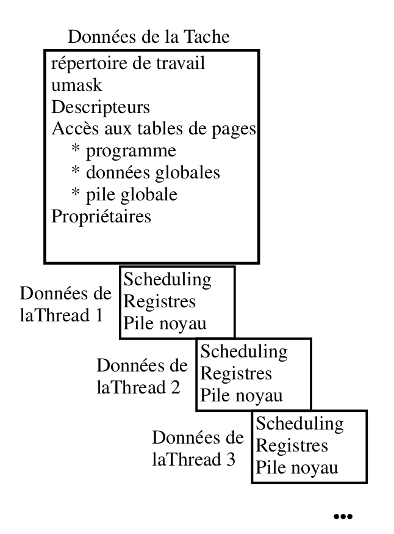

La programmation par threads (activités) est naturelle pour gérer des phénomènes
asynchrones. Les entrées utilisateur dans les interfaces graphiques (souris,
clavier) sont plus faciles à gérer si l'on peut séparer l'activité principale du
logiciel de la gestion des commandes utilisateur. Les entrées-sorties multiples
sont gérées plus simplement en utilisant des threads.

Les activités sont une nouvelle façon de voir les processus dans un système.
L'idée est de séparer en deux le concept de processus. La première partie est
l'environnement d'exécution : on y retrouve une très grande partie des éléments
constitutifs d'un processus, en particulier les informations sur le propriétaire,
la position dans l'arborescence, le masque de création de fichier, etc. La
deuxième partie est l'activité : c'est la partie dynamique, elle contient une
pile, un contexte processeur (pointeur d'instruction, etc.) et des données
d'ordonnancement.

L'idée de ce découpage est de pouvoir associer plusieurs activités au même
environnement d'exécution. L'organisation en mémoire d'un processus UNIX avec
plusieurs threads est présentée dans la figure ci-dessous.

<center>

</center>

On peut grâce aux threads gérer plusieurs phénomènes asynchrones dans le même
contexte, c'est-à-dire un espace d'adressage commun, ce qui est plus confortable
que de la mémoire partagée et moins coûteux en ressources que plusieurs processus
avec un segment de mémoire partagée. Un processus correspond à une instance d'un
programme en cours d'exécution. Un thread correspond à l'activité d'un
processeur dans le cadre d'un processus. Un thread ne peut pas exister sans
processus (la tâche englobante), mais il peut y avoir plusieurs threads par
processus ; dans le cas de Linux, il ne peut y avoir de tâche sans au moins une
activité.

## Description

Un processus est composé des parties suivantes : du code, des données, une pile,
des descripteurs de fichiers, des tables de signaux. Du point de vue du noyau,
transférer l'exécution à un autre processus revient à rediriger les bons
pointeurs et à recharger les registres du processeur depuis la pile. Les divers
threads d'un même processus partagent le code, les données, les descripteurs de
fichiers et la table des gestionnaires de signaux. Chaque thread possède en
propre au minimum sa pile, ses registres, son masque de signaux et sa variable
`errno`.

## `fork` et `exec`

Après un `fork`, le fils ne contient qu'une seule activité : la copie de celle
qui a exécuté le `fork`. Attention aux verrous d'exclusion mutuelle (qui font
partie de l'espace d'adressage copié) : ils sont conservés dans l'état où ils se
trouvaient au moment du `fork()`. Ainsi, si une autre activité avait pris un
mutex avant le `fork()`, l'activité du fils qui cherche à prendre ce mutex après
le `fork()` sera indéfiniment bloquée, puisque son propriétaire n'existe pas dans
le fils. C'est pourquoi, dans un programme multithread, le fils ne doit appeler
que des fonctions *async-signal-safe* jusqu'à un éventuel `exec` ; la fonction
`pthread_atfork` permet d'enregistrer des traitements à exécuter autour du
`fork`.

Après un `exec`, le processus ne contient plus que le thread qui a exécuté l'une
des fonctions de la famille `exec` (`execl`, `execlp`, `execle`, `execv`,
`execvp`, `execve`). Pas de problème avec les mutex, puisque l'espace
d'adressage a été remplacé.

## `clone`

Sous Linux (cet appel n'existe pas sous les autres systèmes UNIX), il existe un
appel système un peu spécial. Cet appel système réalise un dédoublement de
processus comme `fork`, d'où son nom de `clone`. Il permet de préciser
exactement ce que l'on entend partager entre le processus père et le processus
fils, au moyen de drapeaux `CLONE_*`. Éléments partageables :

+ **PARENT** : création d'un frère au lieu d'un fils (même processus père) ;
+ **FS** : partage de la structure d'information liée au système de fichiers
  (racine, répertoire courant, `umask`) ;
+ **FILES** : partage de la table des descripteurs ;
+ **SIGHAND** : partage de la table des gestionnaires de signaux, mais pas des
  masques de signaux ;
+ **PTRACE** : si le père est tracé, le fils l'est aussi (voir l'appel `ptrace`) ;
+ **VFORK** : le processus père est suspendu tant que le fils n'a pas libéré
  l'espace mémoire emprunté, par `execve` ou `_exit` ;
+ **VM** : partage de la mémoire virtuelle ; en particulier, les allocations et
  désallocations par `mmap` et `munmap` sont visibles par les deux processus ;
+ **PID** : les deux processus ont le même numéro (drapeau obsolète, retiré du
  noyau) ;
+ **THREAD** : le fils est placé dans le même groupe de threads que le père
  (même PID vu de l'espace utilisateur, identifiants de thread différents).

C'est avec `clone` et les drapeaux `CLONE_VM | CLONE_FS | CLONE_FILES |
CLONE_SIGHAND | CLONE_THREAD` que la bibliothèque NPTL de la glibc crée les
threads POSIX.

## Les noms de fonctions

`pthread[_objet]_operation[_np]` où :

+ **objet** désigne, s'il est présent, le type de l'objet auquel la fonction
  s'applique. Les valeurs possibles d'objet sont par exemple `cond` pour une
  variable de condition, `mutex` pour un verrou d'exclusion mutuelle ou `attr`
  pour un objet attribut ;
+ **operation** désigne l'opération à réaliser, par exemple `create`, `exit` ou
  `init`.

Le suffixe `_np` indique, s'il est présent, qu'il s'agit d'une fonction non
portable, c'est-à-dire hors norme (par exemple `pthread_setname_np`).

## Les noms de types

`pthread[_objet]_t`

avec objet prenant comme valeur `cond`, `mutex`, `attr`, etc., ou rien pour un
thread (`pthread_t`).

## Attributs d'une activité

L'identifiant d'un thread (TID) est de type `pthread_t` et s'obtient par un appel
à la primitive `pthread_t pthread_self(void);`. Le processus englobant s'obtient
avec `pid_t getpid(void);`. Le type `pthread_t` étant opaque, on teste l'égalité
de deux identifiants avec `int pthread_equal(pthread_t tid1, pthread_t tid2);`.
Si le thread principal retourne de `main` (ce qui équivaut à un appel à `exit`),
le processus et tous ses threads se terminent ; s'il appelle `pthread_exit`, les
autres threads continuent de s'exécuter.

## Création et terminaison des activités

### Création

```c
#include <pthread.h>
int pthread_create(pthread_t *restrict p_tid,
                   const pthread_attr_t *restrict attr,
                   void *(*fonction)(void *),
                   void *restrict arg);
```

La création et l'activation d'une activité retournent 0 en cas de succès et un
code d'erreur (par exemple `EAGAIN`) en cas d'échec. Comme les autres fonctions
`pthread_*`, `pthread_create` ne positionne pas `errno`.

+ l'identifiant du nouveau thread est placé à l'adresse `p_tid` ;
+ `attr` désigne les attributs de l'activité (ordonnancement, état détaché,
  taille de pile) ; `NULL` pour les attributs par défaut ;
+ le paramètre `fonction` correspond à la fonction exécutée par l'activité après
  sa création : il s'agit donc de son point d'entrée (comme la fonction `main`
  pour les processus). Un retour de cette fonction correspond à la terminaison
  de cette activité (appel implicite à `pthread_exit` avec la valeur retournée) ;
+ le paramètre `arg` est transmis à la fonction au lancement de l'activité.

### Terminaison

+ les appels UNIX `_exit` et donc `exit` terminent tous les threads du
  processus ;
+ terminaison d'un seul thread :

```c
void pthread_exit(void *retval);
```

`retval` est la valeur de retour du thread. Comme pour les processus UNIX, un
thread terminé reste dans un état comparable à celui de zombie tant que sa
valeur de retour n'a pas été récupérée par un autre thread avec `pthread_join`,
qui libère alors ses ressources. Si aucun thread ne doit attendre sa
terminaison, on le rend détaché : ses ressources seront alors libérées
automatiquement à sa terminaison, et il ne peut plus être attendu.

```c
int pthread_detach(pthread_t tid);
```

Si un tel appel a lieu alors que l'activité est en cours d'exécution, il indique
seulement qu'à sa terminaison les ressources seront restituées automatiquement.
Un thread peut aussi être créé directement dans l'état détaché grâce à
l'attribut `PTHREAD_CREATE_DETACHED` (`pthread_attr_setdetachstate`).

## Synchronisation

Trois mécanismes de synchronisation inter-activités :

+ la primitive `join` ;
+ les verrous d'exclusion mutuelle (mutex) ;
+ les variables de condition (événements).

### Le modèle fork/join

Les rendez-vous : `join`.

```c
int pthread_join(pthread_t tid, void **retval);
```

Cette primitive permet de suspendre l'exécution de l'activité courante jusqu'à
ce que l'activité `tid` se termine (appel implicite ou explicite à
`pthread_exit`). Si l'activité `tid` est déjà terminée, le retour est immédiat.
Si `retval` n'est pas `NULL`, la valeur de retour de l'activité visée est
stockée dans `*retval`. La primitive retourne 0 en cas de succès et un code
d'erreur sinon (par exemple `EDEADLK` si un thread tente de s'attendre lui-même,
`EINVAL` si le thread est détaché). Plusieurs appels simultanés à
`pthread_join` sur le même thread ont un comportement indéfini.

Exemple minimal :

```c
#include <pthread.h>
#include <stdio.h>
#include <string.h>

static void *travail(void *arg)
{
    int n = *(int *)arg;
    printf("thread %d\n", n);
    return NULL;
}

int main(void)
{
    pthread_t t[4];
    int ids[4];
    for (int i = 0; i < 4; i++) {
        ids[i] = i;
        int err = pthread_create(&t[i], NULL, travail, &ids[i]);
        if (err != 0) {
            fprintf(stderr, "pthread_create : %s\n", strerror(err));
            return 1;
        }
    }
    for (int i = 0; i < 4; i++)
        pthread_join(t[i], NULL);
    return 0;
}
```

(compilation avec `gcc -pthread`).

### Le problème de l'exclusion mutuelle sur les variables gérées par le noyau

Il est nécessaire d'avoir plusieurs variables `errno`, une par activité. En
effet, cette variable globale pourrait être changée par une autre activité. Voir
plus loin comment définir des variables globales locales à chaque activité.

### Les verrous d'exclusion mutuelle

Ces verrous (mutex), proches de sémaphores binaires, permettent d'assurer
l'exclusion mutuelle. Contrairement à un sémaphore, un mutex a un propriétaire :
seul le thread qui l'a verrouillé doit le déverrouiller.

+ Il faut définir un objet de type `pthread_mutex_t`, éventuellement paramétré
  par un objet attribut de type `pthread_mutexattr_t`.
+ Initialiser la variable, soit statiquement avec
  `pthread_mutex_t m = PTHREAD_MUTEX_INITIALIZER;`, soit par un appel à la
  fonction :

```c
int pthread_mutex_init(pthread_mutex_t *restrict p_mutex,
                       const pthread_mutexattr_t *restrict attr);
```

+ On pourra détruire le mutex par un appel à la fonction
  `int pthread_mutex_destroy(pthread_mutex_t *p_mutex);`.

### Utilisation des mutex

Opération P : un appel à la fonction
`int pthread_mutex_lock(pthread_mutex_t *pmutex);` permet à une activité de
réaliser une opération P sur le mutex. Si le mutex est déjà verrouillé,
l'activité est bloquée jusqu'à la réalisation de l'opération V (par l'activité
propriétaire) qui libérera le mutex.

Opération P non bloquante : `int pthread_mutex_trylock(pthread_mutex_t *pmutex);`
renvoie 0 si le mutex était libre (il est alors acquis), `EBUSY` s'il est déjà
verrouillé, et un autre code d'erreur en cas d'erreur.

Opération V : un appel à la fonction
`int pthread_mutex_unlock(pthread_mutex_t *pmutex);` réalise la libération du
mutex désigné.

### Les conditions (événements)

Les variables de condition permettent de bloquer une activité en attente d'un
événement. Pour cela, l'activité doit posséder un mutex ; elle peut alors
libérer le mutex en attendant l'événement, c'est-à-dire : elle libère le mutex,
se bloque en attente de l'événement et, à la réception de l'événement, reprend
le mutex. L'initialisation d'une variable de type `pthread_cond_t` se fait avec
`PTHREAD_COND_INITIALIZER` ou avec la fonction :

```c
int pthread_cond_init(pthread_cond_t *restrict p_cond,
                      const pthread_condattr_t *restrict attr);
```

L'attente sur une condition se fait via la fonction suivante :

```c
int pthread_cond_wait(pthread_cond_t *restrict p_cond,
                      pthread_mutex_t *restrict p_mutex);
```

1. libération du mutex `*p_mutex` et mise en sommeil sur l'événement, de façon
   atomique ;
2. réception de l'événement (`pthread_cond_signal` réveille au moins un thread
   en attente, `pthread_cond_broadcast` les réveille tous) ;
3. reprise du mutex avant le retour de la fonction.

La variable de condition est indépendante du prédicat attendu : au réveil, le
prédicat n'est pas nécessairement vrai (autre thread plus rapide, réveil
intempestif, dit *spurious wakeup*). L'attente doit donc toujours se faire dans
une boucle qui reteste le prédicat :

```c
pthread_mutex_lock(&m);
while (!pret)                 /* toujours un while, jamais un if */
    pthread_cond_wait(&c, &m);
/* ... utilisation de la donnée protégée ... */
pthread_mutex_unlock(&m);

/* côté producteur */
pthread_mutex_lock(&m);
pret = 1;
pthread_cond_signal(&c);
pthread_mutex_unlock(&m);
```

## Ordonnancement des activités

### L'ordonnancement POSIX des activités

L'ordonnancement des activités POSIX (et avant lui celui des threads DCE) est
très similaire à l'ordonnancement des activités sous Mach. Deux valeurs
permettent de définir le mode d'ordonnancement d'une activité : la politique et
la priorité. Pour manipuler ces deux valeurs, il faut créer un objet attribut
d'activité en appelant `pthread_attr_init()`, changer les valeurs par défaut
avec les fonctions ci-dessous (et demander leur prise en compte avec
`pthread_attr_setinheritsched(&attr, PTHREAD_EXPLICIT_SCHED)`), puis créer le
thread avec cet objet attribut. Un thread peut aussi changer lui-même sa
politique et sa priorité avec `pthread_setschedparam`. Les fonctions sont :

```c
#include <pthread.h>
#include <sched.h>
int pthread_attr_setschedpolicy(pthread_attr_t *attr, int politique);
int pthread_attr_setschedparam(pthread_attr_t *restrict attr,
                               const struct sched_param *restrict param);
/* param->sched_priority contient la priorité */
```

(les anciennes fonctions `pthread_attr_create`, `pthread_attr_setsched` et
`pthread_attr_setprio` sont celles des brouillons DCE, antérieurs à la norme
POSIX.1c).

Les différentes politiques possibles sont :

+ `SCHED_FIFO` : le thread le plus prioritaire s'exécute jusqu'à ce qu'il
  bloque ou cède le processeur. S'il y a plus d'un thread de priorité maximale,
  le premier qui obtient le CPU s'exécute jusqu'à ce qu'il bloque ;
+ `SCHED_RR` (*Round Robin*) : le thread le plus prioritaire s'exécute jusqu'à
  ce qu'il bloque. Les threads de même priorité maximale sont organisés selon le
  principe du tourniquet, c'est-à-dire qu'il existe un quantum de temps au bout
  duquel le CPU est préempté au profit d'un autre thread ;
+ `SCHED_OTHER` : comportement par défaut, en temps partagé. Tous les threads
  ont la même priorité statique (0) et se partagent le processeur selon les
  règles de l'ordonnanceur du système (sous Linux, pondération par la valeur
  `nice`), ce qui évite la famine entre eux. Mais les threads de politique
  `SCHED_FIFO` ou `SCHED_RR` sont toujours prioritaires et peuvent placer les
  threads `SCHED_OTHER` en situation de famine.

Les politiques temps réel `SCHED_FIFO` et `SCHED_RR` nécessitent en général des
privilèges (sous Linux, la capacité `CAP_SYS_NICE`).

### Les variables spécifiques à un thread

Avec un processus multithread, nous sommes dans une situation de partage de
données. Toutes les données du processus sont a priori manipulables par tous
les threads. Or certaines données sont critiques et difficilement partageables.
Ce sont d'abord les données de la bibliothèque standard. Pour les fonctions
de la bibliothèque standard, on peut résoudre le problème en utilisant un
verrou d'exclusion mutuelle `pthread_mutex_t`.

Mais certaines variables ne peuvent être protégées ainsi. C'est le cas de la
variable `errno`, comme nous l'avons vu précédemment. Pour cette variable, la
solution est d'avoir une variable par thread. Ainsi, le fichier `<errno.h>`
de la glibc contient (sous une forme simplifiée) :

```c
extern int *__errno_location(void);
#define errno (*__errno_location())
```

La valeur de `errno` est obtenue par une fonction qui retourne l'adresse de la
variable `errno` associée au thread qui fait l'appel. Le nom de cette fonction
dépend de l'implémentation.

### Principe général des données spécifiques, POSIX

L'idée des données spécifiques est de créer un vecteur pour chaque donnée
spécifique : ainsi, pour une donnée spécifique statique, chaque thread possède
son propre exemplaire. Les données spécifiques sont identifiées par des clés de
type `pthread_key_t`. Depuis C11, le mot-clé `_Thread_local` (ou l'extension
`__thread` de GCC) offre un moyen plus simple de déclarer des variables propres
à chaque thread.

### Création de clés

La création d'une clé est liée à la création d'un tableau (conceptuellement une
variable globale), initialisé à `NULL` pour chaque thread. La fonction :

```c
#include <pthread.h>
int pthread_key_create(pthread_key_t *p_cle,
                       void (*destructeur)(void *valeur));
```

permet la création de la clé ; elle retourne 0 en cas de succès et un code
d'erreur sinon. La clé stockée à l'adresse `p_cle` permettra d'accéder aux
valeurs stockées ; elle est évidemment la même pour tous les threads. Le
paramètre `destructeur`, de type pointeur sur fonction prenant un pointeur sur
`void` en paramètre et renvoyant `void`, donne l'adresse d'une fonction qui est
exécutée à la terminaison de chaque thread dont la valeur associée à la clé
n'est pas `NULL` (ce qui permet de faire le ménage). Si ce pointeur est nul,
l'information n'est pas détruite à la terminaison de l'activité.

### Lecture / écriture d'une variable spécifique

La fonction :

```c
#include <pthread.h>
void *pthread_getspecific(pthread_key_t cle);
```

retourne la valeur associée à la clé pour le thread appelant (`NULL` si aucune
valeur n'a été associée). La fonction :

```c
#include <pthread.h>
int pthread_setspecific(pthread_key_t cle, const void *valeur);
```

associe la valeur `valeur` à la clé pour le thread appelant ; elle retourne 0
en cas de succès et un code d'erreur sinon.

## Les fonctions standards utilisant des zones statiques

Certaines fonctions standards, comme `ttyname()`, `strtok()` ou `localtime()`,
retournent l'adresse d'une zone statique. Plusieurs threads en concurrence
peuvent donc nous amener à des situations incohérentes. La solution des verrous
d'exclusion mutuelle étant coûteuse, POSIX définit des variantes réentrantes,
suffixées par `_r` (`ttyname_r`, `strtok_r`, `localtime_r`…), auxquelles
l'appelant fournit le tampon de résultat. (`readdir_r` est en revanche obsolète :
`readdir` est sûr tant que chaque flux de répertoire n'est utilisé que par un
seul thread.)

Attention : les problèmes de réentrance peuvent aussi survenir sans utiliser de
threads, en appelant dans les gestionnaires de signaux des fonctions qui ne sont
pas *async-signal-safe* (`printf`, `malloc`…). Seules les fonctions listées dans
`signal-safety(7)` peuvent y être appelées sans risque.
